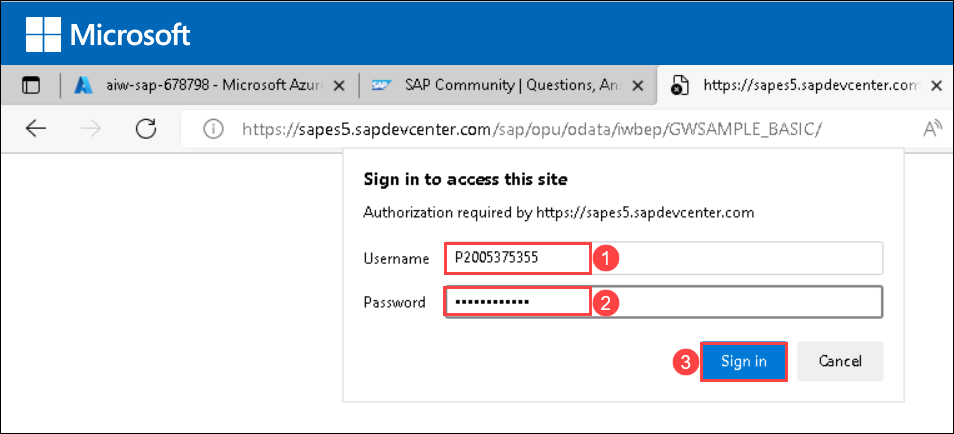
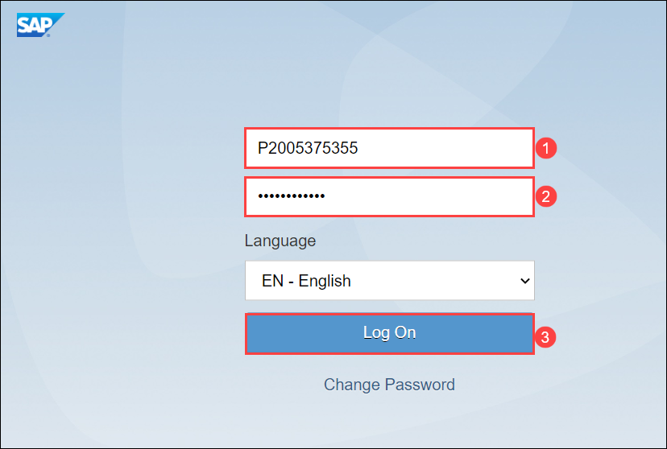

# Module 2: Data Insights

# Exercise 2: Access SAP Systems

Duration: 10 mins

## Overview

In this exercise, you will access the SAP Gateway demo system and review the data of the sales order dataset.

This exercise includes the following tasks:

* Get familiar with GWSampleBasic Odata Service

You will access the public SAP System using the existing SAP ES5 Gateway Demo Account that exposes OData Services.


## Task 1: Get familiar with GWSampleBasic OData Service

OData is an **open data access protocol** that provides access to a data source on a website. It is a **REST-based** protocol for querying and updating data. It provides a uniform way for both creating data and data models. OData also provides guidance for tracking changes, defining actions for reusable procedures, and sending batch requests. You can find more references about OData from here: `https://developers.sap.com/tutorials/odata-01-intro-origins.html`.

In this task, you will access the Sample service GWSAMPLE_BASIC which contains a list of collections such as ProductSet, SalesOrderSet, items of a sales order from the Enterprise Procurement demo, and view the sample data within the collection. 


1. Within the Virtual Machine, open a new browser tab and navigate to the following URL to connect to the GWSample_Basic Service which is an OData Service and view the collections.

    ```
    https://sapes5.sapdevcenter.com/sap/opu/odata/iwbep/GWSAMPLE_BASIC/
    ```
   
2. You will be prompted with the pop-up to login into SAP ES5 Demo Account. Enter the below mentioned credentials and click on **Sign in(3)**.

    **Username** : Enter this value <inject key="SapUserID" /> **(1)**
   
   **Password** : Enter this value <inject key="SapPassword" /> **(2)**
   
   


3. You can see that the dataset returns all the different collections like **ProductSet (1)** and **SalesOrderSet (2)**. After reviewing the data, click on **X** to close the tab.

   

4. Now, navigate to the following URL to view the sales order dataset which you will later connect to and retrieve the information.

    ```
    https://sapes5.sapdevcenter.com/sap/opu/odata/iwbep/GWSAMPLE_BASIC/SalesOrderSet?(%270500000001%27)/ToLineItems
    ```
    
5. You can see the data that is displayed and review the data available in the sales order dataset. After reviewing the sales order data, click on **X** to close the tab.

   
   
6. Now, navigate to the following URL to view the ProductSet dataset which you will later connect to, and retrieve the information regarding a product and add a new product.

    ```
    https://sapes5.sapdevcenter.com/sap/opu/odata/iwbep/GWSAMPLE_BASIC/ProductSet
    ```

7. From the data that is displayed, you can find different products that already exist within the dataset.

   

8. Now, we will connect to the Fiori Launch Pad Interface in the SAP developer system where already four applications are deployed by navigating to the below URL:

   ```
   https://sapes5.sapdevcenter.com/sap/bc/ui5_ui5/ui2/ushell/shells/abap/FioriLaunchpad.html#Shell-home
   ```
   
9. Login into the SAP ES5 Demo Account using the below mentioned credentials and click on **Log On (3)**

   **SAPUsername** : Enter this value <inject key="SapUserID" /> **(1)**
   
   **Password** : Enter this value <inject key="SapPassword" /> **(2)**
   
    
  
10. Then, click on **Manage Products** tile and you will be redirected to a new view.

     
   
     > Info: SAP Fiori is based on HTML JavaScript

11. On the page that loads up, you can click on **Go** button provided on the right side of the page.

    

    > Info: Once you click on Go, it will display a list of products within the ProductSet Dataset and it uses OData to connect to the underlying SAP System which contains the ProductSet DataSet.
   
    
      

## Summary
   
In this exercise, you have accessed the SAP Gateway demo system and reviewed the data of the sales order dataset.
