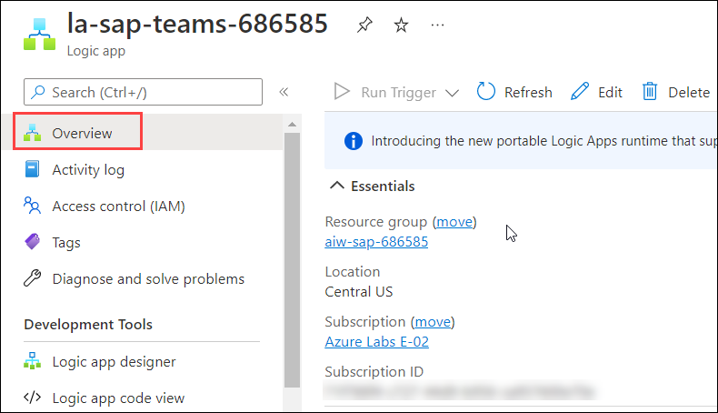
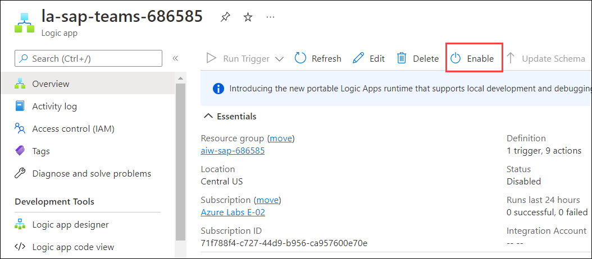

# Module 2: Productivity

# Exercise 6: Extending Productivity using Teams and Outlook

Duration: 25 mins

## Scenario

Contoso wants to integrate the SAP system and Microsoft Azure to view the Sales Order data in a Teams channel or through an e-mail in Outlook. 

To achieve these requirements, you will be configuring a Logic App to display the SAP ERP data in Teams and send an email of the latest sales order data to Outlook at regular intervals.

## Overview

In this exercise, you will review the existing Logic App and configure a Logic App to display the SAP ERP data in Teams and send an email of the SAP data to Outlook. Then, you will run the Logic App and review the data triggered by it in Teams and Outlook.

This exercise includes the following tasks:

* Review the Pre-configured Logic App to display SAP ERP data in Teams.
* Run the Logic App and review the Logic App run. 
* Review the messages in Microsoft Teams.
* Review the generated e-mail in Outlook.

### Task 1: Review the Pre-configured Logic App to display SAP ERP data in Teams.

In this task you will renew the authorization to Teams and Office365 to use the pre-configured Logic App and trigger the Logic App flow.

1. Navigate to the **aiw-sap-<inject key="DeploymentID" enableCopy="false" />** resource group and select the Logic App named **la-sap-teams-<inject key="DeploymentID" enableCopy="false" />**.

1. Select **Overview** from the left-hand side menu of the Logic App. 

   

1. On the **Overview** pane toolbar, click on **Enable** to enable the Logic App and trigger it manually.

   

1. Select **Logic app designer** from the left-hand side menu of the Logic App.
 
   

1. Review all the triggers and actions in the flow.

   

1. Now, expand the **Teams** Connection and notice that it shows an invalid connection. 

   > This is because the session to the Teams connection is expired, you will have to re-establish the session to the **Teams** connection.
   
   

1. To establish the connection, navigate back to the aiw-sap-iothub- resource group and select the API Connection named **teams**.

   

1. Select **Edit API connection** from the left-hand side menu to edit the connection.

   

1. On the **Edit API connection** blade, click on **Authorize** to renew the authorization and establish the session.

   

1. You will be prompted to enter the credentials, use the below credentials to complete the Sign-in process.

   * Email/Username: <inject key="AzureAdUserEmail"></inject>
   * Password: <inject key="AzureAdUserPassword"></inject>

1. Once authorization is complete, click on **Save** to save the changes.

   

1. Navigate back to the **sap-teams-demo-<inject key="DeploymentID" />** Logic App, select **Logic app designer** from the left-hand side menu.

   

1. Now, review the **Post a message V(3) (Preview)** action on the **Logic app designer** blade.

   

1. Next, expand the **Outlook** Connection and notice that it shows an invalid connection. 
   
   > This is due to the session to Office365 Connection is expired, you will have to re-establish the session to the **Outlook** connection.

   

1. To establish the connection, navigate back to the aiw-sap-iothub- resource group and select the API Connection named **Office365**.

   

1. Select **Edit API connection** from the left-hand side menu to edit the connection.

   

1. On the **Edit API connection** blade, click on **Authorize** to renew the authorization and establish the session.

   

1. You will be prompted to enter the credentials, use the below credentials to complete the Sign-in process.

   * Email/Username: <inject key="AzureAdUserEmail"></inject>
   * Password: <inject key="AzureAdUserPassword"></inject>

1. Once authorization is complete, click on **Save** to save the changes.

   

1. Navigate back to the **sap-teams-demo-<inject key="DeploymentID" />** Logic App, select **Logic app designer** from the left-hand side menu.

   

1. Now, review the **Send an email (V2)** action on the **Logic app designer** blade.

   

1. After configuring the required actions, your flow will look like the below screenshot.

   

## Task 2: Run the Logic App and review the Logic App run. 

In this task, you will run the Logic App by triggering it manually and review the Logic App run.

1. Navigate back to the aiw-sap-iothub-<inject key="DeploymentID" /> resource group and select la-sap-teams-<inject key="DeploymentID" />. 

1. Select **Logic app designer** under **Development Tools** from the left-hand side menu.

   
   
1. On the **Logic app designer** blade, click on **Run** to run the workflow.  

   

1. Once you click on **Run**, the Logic App will be triggered and will start its run.

1. Now, select **overview** from the left-hand side menu then scroll down and select **Run history** tab.

   

1. Select the most recent run and review the Logic App run details then, minimize the Azure Portal window.

   
   
   > **Note**: If you are not able to see the Logic App run under **Run history**, click on **Refresh** on the **Overview** pane toolbar to fetch the recent results.

   

## Task 3: Review the messages in Microsoft Teams

In this task, you will review the SAP ERP data that is being sent to Microsoft Teams by the Logic App at regular intervals.

1. Launch the **Microsoft Teams** application by clicking on the Microsoft Teams shortcut on the virtual machine desktop.

1. You can use the below credentials to sign into the Teams account.

   * Email/Username: <inject key="AzureAdUserEmail"></inject>
   * Password: <inject key="AzureAdUserPassword"></inject>

1. On the **Stay Signed in to all your Apps** pop-up, uncheck the **Allow my organization to manage my device** option.

   

1. Now, click on **No, sign in to this app only** to sign in to **Microsoft Teams** application.

   

1. Select **Teams** from the left-hand side menu to view the available teams.

1. Review the messages which are being sent as a part of the Logic App run into the **SAP on Azure-<inject key="DeploymentID" />** teams channel.

   

1. Note the interval between the messages, it is 1 hour as we added 1 hour as the trigger interval in the recurrence trigger.

   

## Task 4: Review the Logic App Run generated e-mail in Outlook

In this task, you will review the SAP ERP data that is being sent to you by the Logic App via mail.

1. Return to the browser tab in which outlook was open. If you have closed the tab, navigate to this URL `https://outlook.live.com/owa/` and click on **sign in** to sign in to your account.

1. You can use the below credentials to sign in to your account.

   * Email/Username: <inject key="AzureAdUserEmail"></inject>
   * Password: <inject key="AzureAdUserPassword"></inject>

1. Now, open the mail that is being triggered by the Logic App and review the sales data.

   
      
1. Navigate back to the browser tab in which Azure Portal is open and select the Logic App named la-sap-teams-<inject key="DeploymentID" /> .

   > Since, you are done with this exercise, you will go ahead and disable the Logic App in the following steps.

1. Select **Overview** from the left-hand side menu of the Logic App. 

   

1. On the **Overview** pane toolbar, click on **Disable** to disable the Logic App.

   
   
## Summary

In this exercise, you have covered the following:

* Reviewed the existing Logic App and configured it to display SAP ERP data in Teams and send an email to Outlook.
 * Reviewed the Logic App run.
 * Reviewed the messages in the teams channel which are being sent as a part of the Logic App run.
 * Reviewed the generated e-mail in Outlook.
