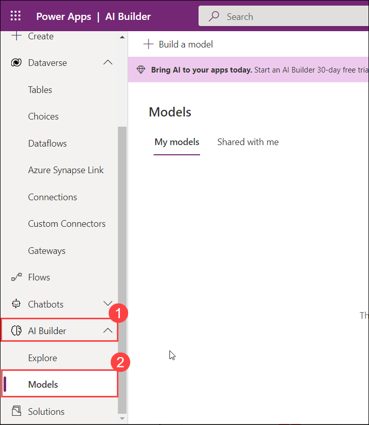
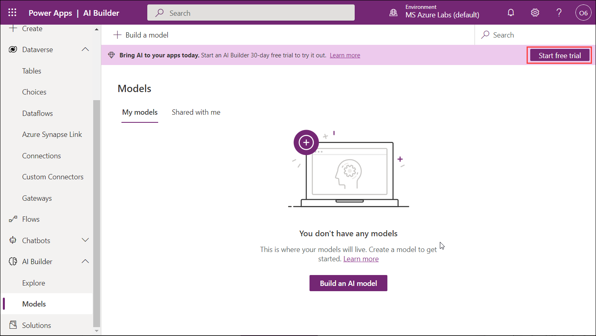
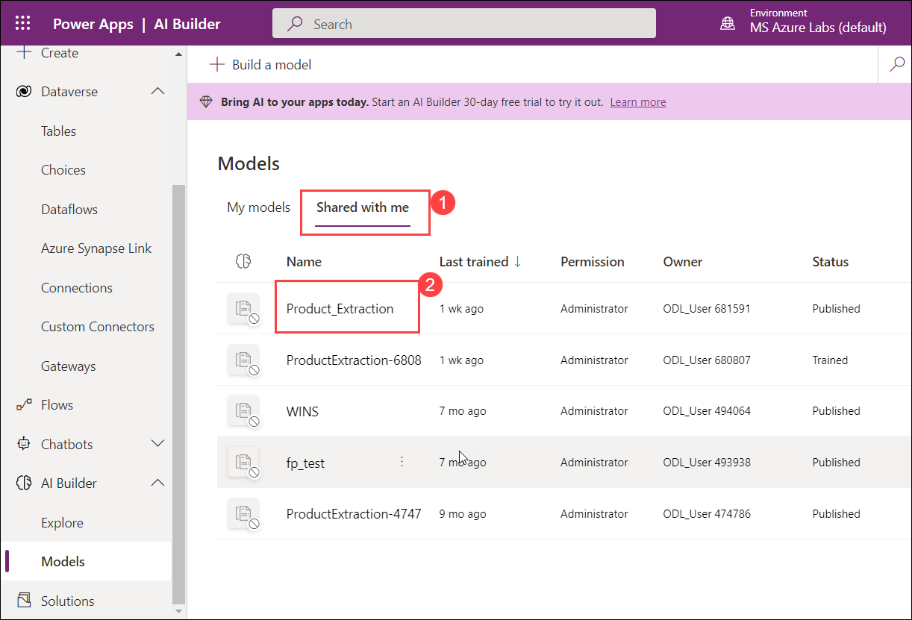

# Module 3: App innovation

# Exercise 2: Use AI Builder to Create a collection and train the model

Duration: 10 minutes

## Overview

AI Builder is a Microsoft Power Platform capability that provides AI models that are designed to optimize your business processes. AI Builder enables your business to use AI to automate processes and glean insights from your data in Power Apps and Power Automate. With AI Builder, you can build custom models tailored to your needs, or choose a prebuilt model that is ready to use for many common business scenarios.

  > You can find complete information about AI Builder here: `https://docs.microsoft.com/en-us/ai-builder/overview`.

In this exercise, you will review the traied and published model using AI Builder. Then, you will test the model manually to observe the behavior of it.

This exercise includes the following tasks:

* Review the pre-built AI Model and test  it.
 


## Task 1: Review the pre-built AI Model and test it  (Read-Only)

In this task, you will review the pre-built and trained model which extracts the data from the documents using AI Builder from the Power Apps portal.

1. Open a new browser tab and navigate to the below URL to open the Power Apps portal.

   ```
   https://make.powerapps.com/
   ```

2. Select **AI Builder (1)** from the left-hand side menu and click on **Models (2)** to build a new model.

   
   
3. Click on **Start free trail**

    
   
4. Navigate to **Shared with me (1)** and review the pre-created model named **Product_Extrction (2)** then select it.

   

5. From the model's page, click on **Quick test** under **Training document** to test the model manually.

   

6. On the **Quick test** blade, select **Upload from my device** to upload the test document.

   

7. Now, to add the file navigate to this path **C:\LabFiles\Products**, select the pdf file **Contoso-Product-06 (1)** from the list, and click on **Open (2)**.

   

8. Once the model analyzes the document, review the 4 columns that the model has analyzed and click on **Close**.

   


## Summary

In this exercise, you have covered the following:

*  Review the pre-built AI Model and tested  it.


