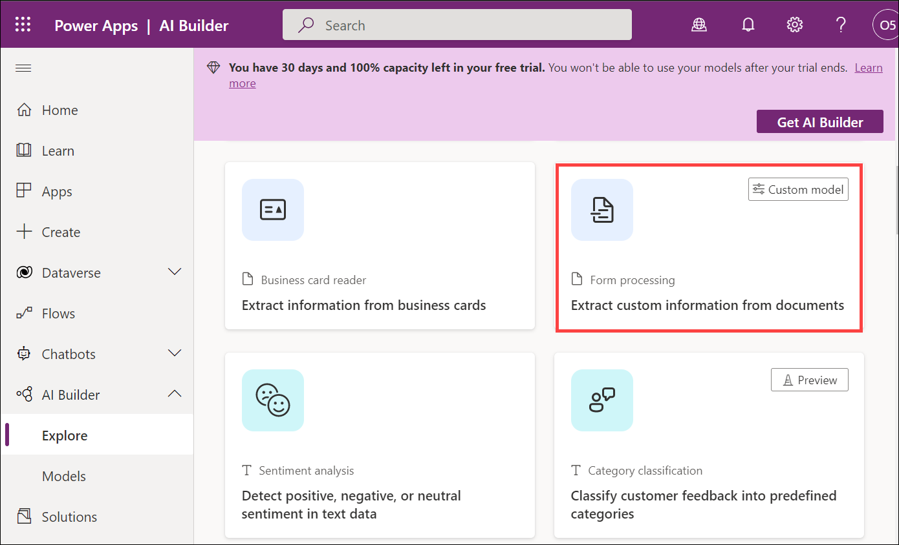
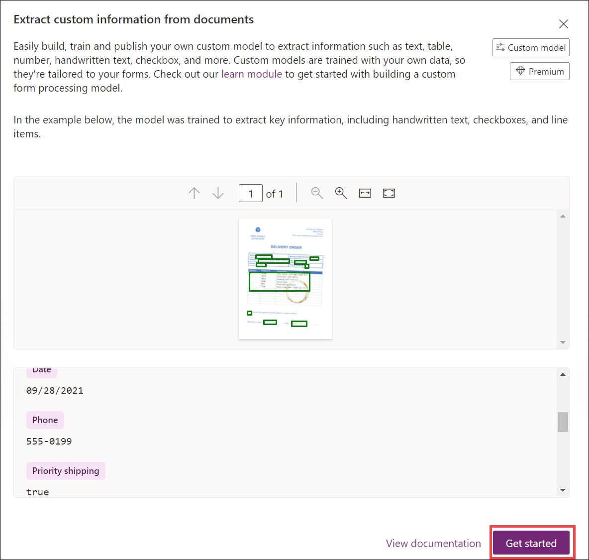
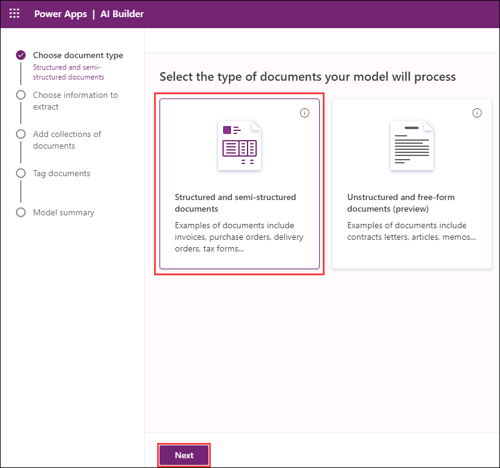
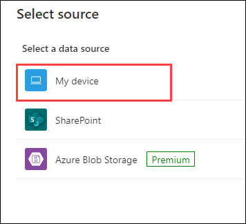
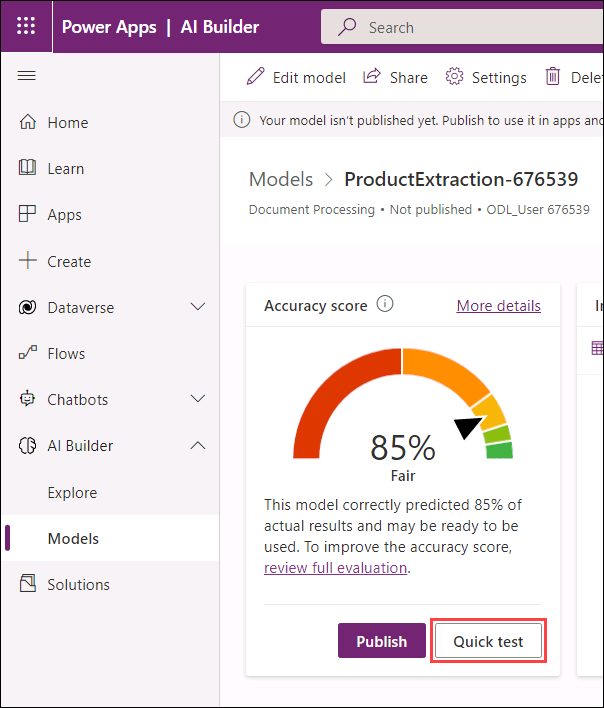
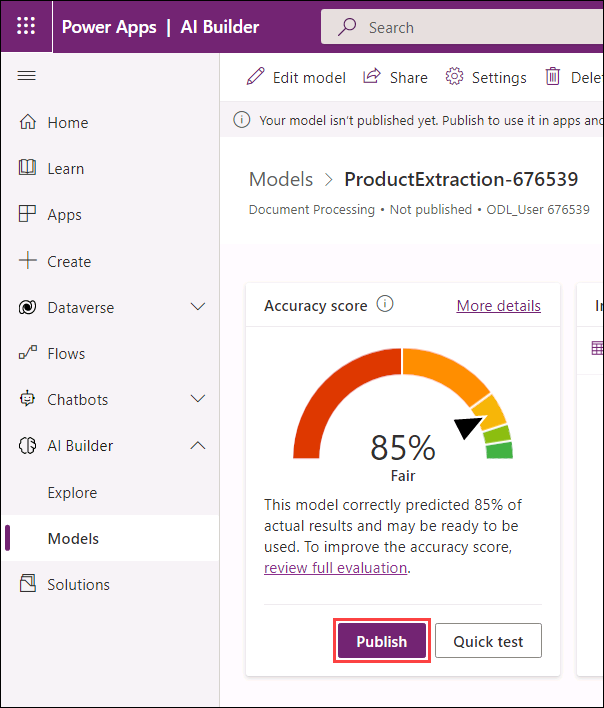

# Module 3: App innovation

# Exercise 2: Use AI Builder to Create a collection and train the model

Duration: 45 minutes

## Overview

AI Builder is a Microsoft Power Platform capability that provides AI models that are designed to optimize your business processes. AI Builder enables your business to use AI to automate processes and glean insights from your data in Power Apps and Power Automate. With AI Builder, you can build custom models tailored to your needs, or choose a prebuilt model that is ready to use for many common business scenarios.

  > You can find complete information about AI Builder here: `https://docs.microsoft.com/en-us/ai-builder/overview`.

In this exercise, you will create, test, and train the model using AI Builder. Then, you will publish the model to make it available in the Power Apps environment.

This exercise includes the following tasks:

* Create and train a model using AI Builder
* Review and test the model
* Publish the model
 
## Task 1: Create and train a model using AI Builder

In this task, you will create a model using AI Builder from the Power Apps portal and train the model with sample documents.

1. Open a new browser tab and navigate to the below URL to open the Power Apps portal.

   ```
   https://make.powerapps.com/
   ```

1. Select **AI Builder (1)** from the left-hand side menu and click on **Explore (2)** to build a new model.

   

   > On the **Add Intelligence to your business** blade, you can find the built-in models. Scroll down and review the available models.

1. Now, under **Try out AI capabilities for each data type**, scroll down and select the **Extract custom information from documents** model.

   

1. On the **Getting Started** blade of the Extract custom information from documents model, review the model information and select **Get Started** to build a custom form processing model.

   

4. Click on the **Form Processing (1)** model to rename it, then provide a name for the model as <inject key="AIModelName" /> **(2)** and click on **Rename (3)** to rename it.

   
   
   
   
   > After renaming the model your screen will look like below screenshot.

    
    
1. On the **Choose document type** blade, select **Structured and semi-structured documents** and click on **Next**.

    

1. On the **Choose information to extract** blade, click on **+Add**.

   
   
1. On the **Add** blade, select **Single page table (1)** from the left-hand side menu and click on **Next (2)**.

   

1. On the **Single page table** blade, leave the table name as default (Table 1) and click on **column1**.

1. Now, select **Rename column** to rename the column.

   

3. On the **Rename column** blade, enter the below value as the column name and click on **Rename**.

   ```
   Product ID
   ```
   
   

1. Click on **+** which is next to **Product ID** to add a new column. 

   

1. On the **Add column** blade, enter the below value as the column name and click on **Add** to add a new column to **Table 1**.

   ```
   Description
   ```
   
   

1. Click on **+** which is next to **Description** to add a new column. 

   

1. On the **Add column** blade, enter the below value as the column name and click on **Add** to add a new column to **Table 1**.

   ```
   Name
   ```

   

1. Click on **+** which is next to **Name** to add a new column. 

   

1. On the **Add column** blade, enter the below value as the column name and click on **Add** to add a new column to **Table 1**.

   ```
   Pricing
   ```

   

1. After adding all the columns, your screen will look like the below screenshot:
   
   
 
1. Now, click on **Done** after reviewing the added columns.
   
   

1. Click on **Next** to add a collection of documents.

   

1. On the **Add collections of documents** blade, click on **New Collection**  to add a new collection.

   
   
   > Info: A collection is a group of documents that shares the same layout.

1. Now, select the **+** icon which is under **Add documents** to add a group of documents.

   

1. You will be presented with a page to add documents, click on **Add documents** on the **Collection 1** blade to add documents.

   

1. On the **Select source** blade, select **My device** to add the files that are available in the Virtual Machine.

    

1. Navigate to this path **C:\LabFiles\Products** and select the first 5 documents **(1)** and click on **Open (2)** to add the documents.

   

1. On the **Upload documents** blade, click on **Upload 5 documents** to upload previously selected 5 documents.

   
   
   > Once all documents are uploaded, you will receive a message saying that documents are uploaded successfully

1. Click on **Close** to close the Upload documents blade.

   

1. On the **Add collections of documents** blade, click on **Next** to analyze the uploaded documents.

   

1. Once the model analyzes all the documents, you will be presented with the below page. 

   
   
   > **Note**: If you face any screen resolution issues, you can click on **Zoom in** icon to get a better view.
   
    

1. Now, place your cursor inside the document, drag it and select the **table** present in the document.

   

1. Select **Table 1** from the list of tables.

   

1. On the **Table 1** blade, set the **Advanced tagging mode** parameter to **On** to add contents to the table.

   

1. On the **Table 1** blade, select the box which is under **Product ID** to tag the Product ID value from the table which is inside the document.

   

1. Now, place your cursor inside the document and select the first cell under the **Product ID** column. 

   

1. Notice that the **Product ID** value is being tagged to the **Product ID** column of **Table 1**.

   

1. On the **Table 1** blade, select the box which is under **Description** to tag the description value from the table which is inside the document.

   

1. Now, place your cursor inside the table near the **Description** column, drag it and select the first cell under the **Description** column. 

   > Since there is space between the words when you select the cell, only the first word of the description will be tagged to the **Description** column of **Table 1**. To select the whole value, drag your cursor and select the first cell under the **Description** column. 

   

1. Notice that the **Description** value is being tagged to the **Description** column of **Table 1**.

   

1. On the **Table 1** blade, select the box which is under **Name** to tag the name value from the table which is inside the document.

   

1. Now, place your cursor inside the document and select the first cell under the **Name** column. 

   

1. Notice that the **Name** value is being tagged to the **Name** column of **Table 1**.

   

1. On the **Table 1** blade, select the box which is under **Pricing** to tag the pricing value from the table which is inside the document.

   

1. Now, place your cursor inside the document and select the first cell under the **Pricing** column. 

   

1. Notice that the **Pricing** value is being tagged to the **Pricing** column of **Table 1**.

   
   
1. After tagging all contents to **Table 1** from the first row of document 1, your screen will look like the below screenshot.

   

1. Notice that a new row is added to the table **Table 1**, repeat steps 28-42 to add the second row.

1. After tagging all contents to **Table 1** from document 1, your screen will look like the below screenshot.

   

1. Click on **Done**, to proceed with the next document.

   

1. Next, select the second document from the collections and repeat steps 28-44 to add contents to **Table 1**.

   

1. After tagging all contents to **Table 1** from document 2, your screen will look like the below screenshot.

   

1. Click on **Done** to proceed with the next document.

1. Select the third document from the collections and repeat steps 28-44 to add contents to **Table 1**.

   

1. After tagging all contents to **Table 1** from document 3, your screen will look like the below screenshot.

   
   
1. Click on **Done** to proceed with the next document.

1. Select the fourth document from the collections and repeat steps 28-42 to add contents to **Table 1**.

   

1. After tagging all contents to **Table 1** from document 4, your screen will look like the below screenshot.

   

1. Click on **Done**, to proceed with the next document.

1. Select the fifth document from the collections and repeat steps 28-42 to add contents to **Table 1**.

   

1. After tagging all contents to **Table 1** from document 5, your screen will look like the below screenshot.

   
   
1. Now, click on **Done**.   
   
1. After tagging all the documents, click on **Next** to view **Model Summary**.

   

1. On the **Model Summary** blade, review the model details and click on **Train** to train the model.

   

1. Once training of the model is completed, you will be presented with the below pop-up. Click on **Click on Details Page** to view the model details.

   

## Task 2: Review and test the model

In this task, you will review the model which you created and trained in the previous task. You will also test the model manually to observe its behavior.

1. From the model's page, review the model which you created previously and click on **Quick test** under **Training document** to test the model manually.

    

1. On the **Quick test** blade, select **Upload from my device** to upload the test document.

   

1. Now, to add the file navigate to this path **C:\LabFiles\Products**, select the pdf file **Contoso-Product-06 (1)** from the list, and click on **Open (2)**.

   

1. Once the model analyzes the document, review the 4 columns that the model has analyzed and click on **Close**.

   

## Task 3: Publish the model

After training the model, you have to publish it to make it available. In this task, you will publish the model to make it available and use in the next exercise.

1. From the model's page, under the model **ProductExtraction-<inject key="DeploymentID" />**, click on **Publish** under **Training document** to publish the model.

    

## Summary

In this exercise, you have covered the following:

* Created the model using AI Builder.
* Trained the model with sample documents.
* Tested the model.
* Published the model to make it available in the Power Apps environment.
