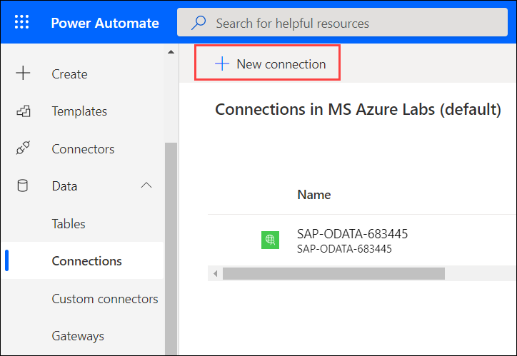
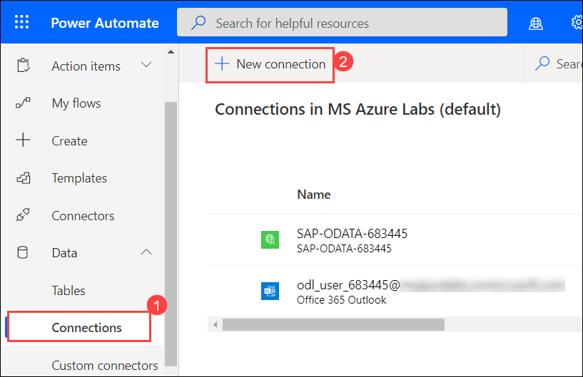
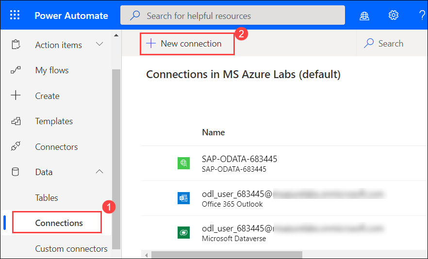
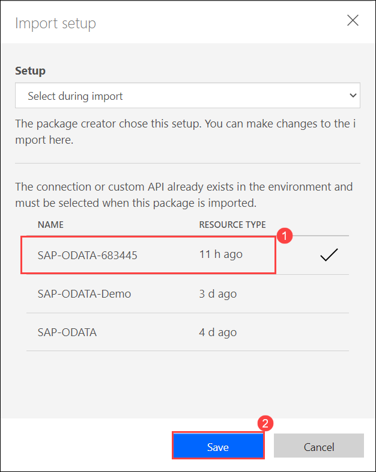
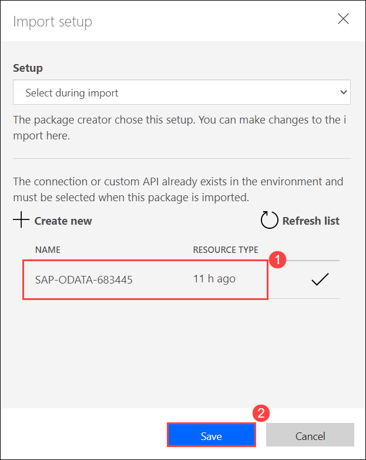

# Exercise 3: Create Flow to automate the process

Duration: 25 minutes

## Overview

Power Automate is a tool that helps users create workflows between desired applications to synchronize files, get notifications, and collect data. This intelligent cloud-based solution uses triggers and actions to create chain reactions within a workflow so that repetitive, manual, and time-consuming tasks are accomplished without human intervention.

> You can find complete information about Power Automate here: `https://docs.microsoft.com/en-us/power-automate/`.

In this exercise, you will import a workflow to process information from the form using an AI model and add products to the catalog. The workflow execution is described below.

1. Whenever a new mail arrives in the inbox, the workflow will be triggered and perform the below actions.
2. The flow will use an AI model to process the information from the document attached in the mail.
3. Next, the flow will trigger an action to send the Product Information to the Manager over email for approval.
4. Then, the flow will send an adaptive card to teams about adding a new product into the catalog.
5. You can either approve or reject the add new product request.

      -  If you **Approve** the request, the condition you have added in the flow will be true and a new product will be added to the catalog.  
      -  If you **Reject** the request, the condition will not be met and the product will not be added to the catalog.


## Task 1: Create Connections in Power Automate

Power Automate uses connections to make it easy for you to access your data while building flows. Power Automate includes commonly used connections, including SharePoint, SQL Server, Microsoft 365, OneDrive for Business, Salesforce, Excel, Dropbox, Twitter, and more. 

In this task, you will create connections in Power Automate and use them in the next task while building workflow.

1. Open a new browser tab and navigate to the below URL to open the Power Automate Portal.

   ```
   https://flow.microsoft.com/en-us/
   ```
   
1. Click on the **Menu** icon which is present at the top left corner as highlighted below.

   
   
1. Now, select the **Sign in** option from the list to sign in to the Power Automate Portal.

   

1. On the **Welcome to Power Automate** window, choose your **Country/Region** and click on **Get Started** to agree with the terms and conditions.

   


1. Select **Data (1)** from the left-hand side menu and click on **Connections (2)** from the dropdown list.

   

1. You will be presented with the Connections page, click on **+New connection** to create a connection.

   

1. Now, type **Office 365 Outlook (1)** in the search bar available at the top right corner and select **Office 365 Outlook (2)**.

   

1. On the **Office 365 Outlook** pop-up, click on **Create** and use the below credentials to complete the **Sign-in** process and create the connection.

      * Email/Username: <inject key="AzureAdUserEmail"></inject>
      * Password: <inject key="AzureAdUserPassword"></inject>

   

1. Select **Connections (1)** under **Data** from the left-hand side menu and click on **+New connection** to create a new connection.

   

1. Type **Microsoft Dataverse (1)** in the search bar available at the top right corner and select **Microsoft Dataverse (2)** from the list.

   

1. On the **Microsoft Dataverse** window, click on **Create** and use the below credentials to complete the **Sign-in** process and create the connection.
  
      * Email/Username: <inject key="AzureAdUserEmail"></inject>
      * Password: <inject key="AzureAdUserPassword"></inject>
      
   

1. Select **Connections (1)** under **Data** from the left-hand side menu and click on **+New connection** to create a new connection.

   

1. Type **Microsoft Teams (1)** in the search bar available at the top right corner and select **Microsoft Teams (2)** from the list.

   

1. On the **Microsoft Teams** window, click on **Create** and use the below credentials to complete the **Sign-in** process and create the connection.

      * Email/Username: <inject key="AzureAdUserEmail"></inject>
      * Password: <inject key="AzureAdUserPassword"></inject>
      
   

     
## Task 2: Import the workflow in Power Automate

In this task, you will import a workflow that processes information from the document by using an AI model, send the Product Information to the Manager over email for approval and add products to the catalog once the request is approved. This workflow will be used in the next exercise to send Product Information to the Manager.

> The workflow configuration file that will be imported has all triggers and actions pre-configured and provided in the lab environment. 

> If you wish to view how to configure the workflow from scratch then you can refer to the below link for detailed instructions on the configuration.
  
  `https://github.com/CloudLabsAI-Azure/AVW-SAP-on-Azure/blob/main/Module3-App-innovation/3.md`


1. Select **My Flows (1)** from the left-hand side menu, click on **Import (2)** and Click on **Import package (3)**.

   
   
1. On the **Import package** blade, click on **Upload** to choose the package file to import.

   

1. Inside the Virtual Machine, navigate to this path **C:\LabFiles** and select the **CreateSAPProductFromEmail.zip (1)** file and click on **Open (2)** to select the file.

   

1. Once the zip file is uploaded, you will be presented with the below page that provides information about the package and its related resources.

   

1. Now, select **Update** that is next to **CreateSAPProductFromEmail** flow under **Review Package Content** to import the flow.

   

1. On the **Import setup** blade, enter the following information.

      1. **Setup**: Select **Create as new (1)** from the dropdown.
      2. **Resource name (2)**: Enter `CreateSAPProductFromEmail`
      3. Click on **Save (3)**

   

1. Then, click on **Select during import** that is next to **SAP-ODATA-Demo** connector under **Related resources** to select the connector that you created in Exercise 1.

   

1. On the **Import setup** blade, select the **SAP-ODATA-<inject key="DeploymentID" enableCopy="false" /> (1)** connector and click on **Save (2)**.

   

1. Next, click on **Select during import** that is next to **Office 365 Outlook** connection under **Related resources** to select the connection.

   

1. On the **Import setup** blade, select the **Office 365 Outlook (1)** connection that you created in the previous task and click on **Save (2)**.

   

1. Now, click on **Select during import** that is next to **Microsoft Dataverse Connection** under **Related resources** to select the connection.

   

1. On the **Import setup** blade, select the **Microsoft Dataverse (1)** connection that you created in the previous task and click on **Save (2)**.

   

1. Click on **Select during import** that is next to **Microsoft Teams Connection** under **Related resources** to select the connection.

   

1. On the **Import setup** blade, select the **Microsoft Teams Connection (1)** that you created in the previous task and click on **Save (2)**.

   

1. Click on **Select during import** that is next to **SAP-ODATA-Demo** connection under **Related resources** to select the connection.

   

1. On the **Import setup** blade, select the **SAP-ODATA-<inject key="DeploymentID" enableCopy="false" /> (1)** connection that you created in the previous task and click on **Save (2)**.

   

1. After providing all the information, your screen will look like the below screenshot.

   

1. Now, click on **Import** to import the workflow.

   

1. Once the flow is imported, you will be presented with the below page. Click on **Open flow**.

   

1. Notice that workflow is opened in a new browser tab, review all triggers and actions present in the flow.

1. Next, expand the **Initialize variable** action in the flow and replace the value of the variable with this value <inject key="DeploymentID" />. 

   

1. Then, expand the **Extract information from forms** action that is present under **Apply to each** control, click on **X** under **AI model** field to select the model that you created in the previous exercise.

   

1. Select **ProductExtraction-<inject key="DeploymentID" enableCopy="false" />** model from the dropdown for **AI model** field.

   

1. Expand the **Send an email (V2)** action that is present under **Apply to each (2)** control, remove the existing email/username present in the **To** field and enter the below username to send an email of the Product Details to you via Outlook.

      * Email/Username: <inject key="AzureAdUserEmail"></inject>

   

1. Expand the **Post adaptive card and wait for a response Action** that is present under **Apply to each (2)** control, remove the existing email/username present in the **Recipient** field and enter the below username to send a message to you on Teams asking for approval to add a new product to the catalog.

      * Email/Username: <inject key="AzureAdUserEmail"></inject>

   

1. Now, click on **Save** to save the flow.
  
   
   
1. Select **My Flows (1)** from the left-hand side menu and select the **CreateSAPProductromEmail (2)** flow you created in the previous steps.

   

1. Select the **ellipsis icon (1)** option and then click on **Turn on (2)** to make the flow available to use.

      

## Summary

In this exercise, you have imported a workflow in the Power Automate which will process the information using an AI model. Send Product Information to the Manager over email for approval and add products to the catalog once the request is approved.   
