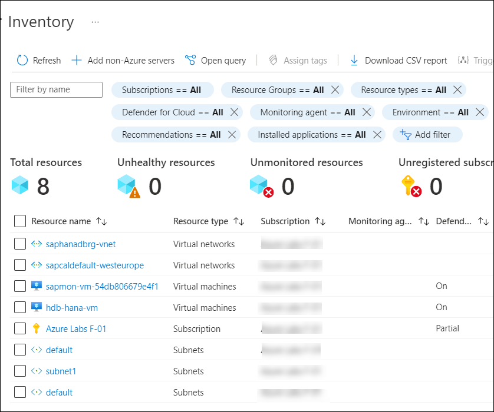
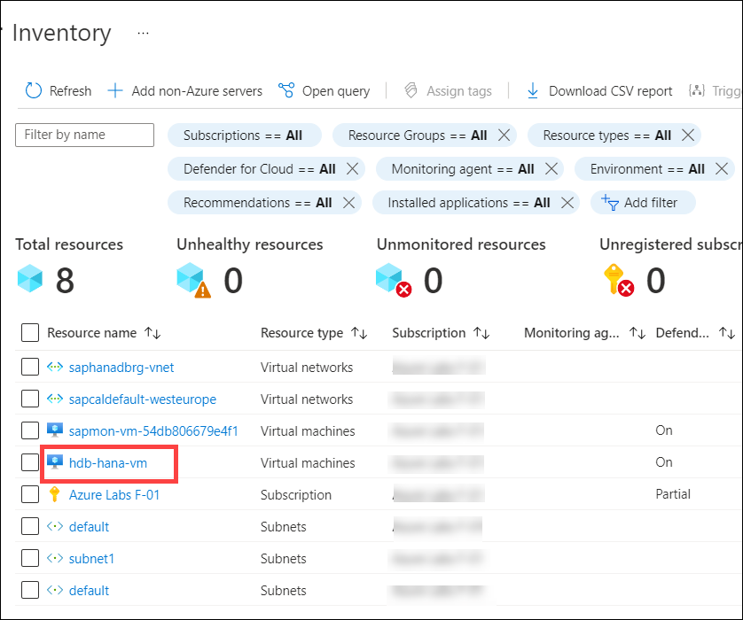
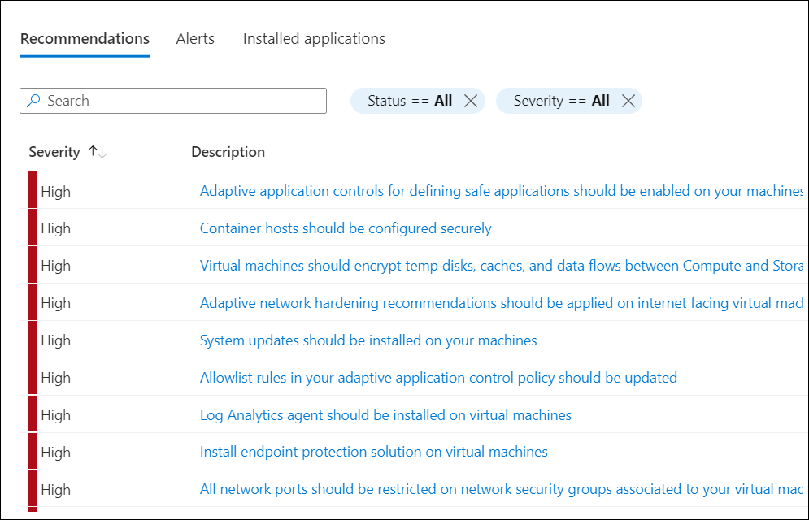
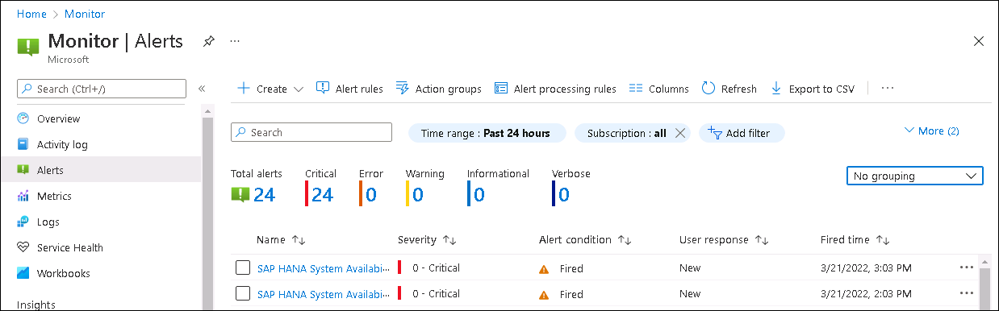
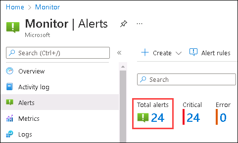
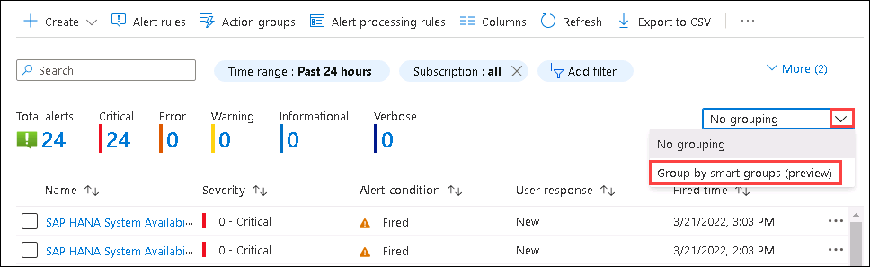
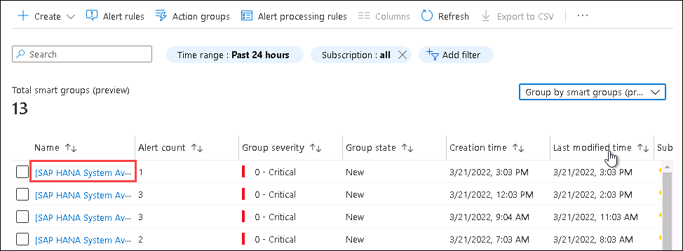

# Module 3: Cloud Operations, Governance, Security

# Exercise 3: Azure Security Center for SAP 

## Overview

Azure Defender is a built-in tool that provides threat protection for workloads running in Azure, on-premises, and other clouds. Integrated with Azure Security Center, Azure Defender protects your hybrid data, cloud-native services, and servers and integrates with your existing security workflows, such as SIEM solutions and vast Microsoft threat intelligence, to streamline threat mitigation.

> You can find more references about **Azure Defender** from here: `https://docs.microsoft.com/en-us/azure/security-center/azure-defender`

In this exercise, you will enable Azure Defender for SAP HANA VM's and review the alerts fired by Azure Monitor and details of the alert.

## Task 1: Enable Azure Defender for Hana VMs 

> **Note**: This task is **read-only**, as **Azure Defender** is already enabled for the resources provided in the environment.

In this, you will enable the **Azure Defender** for SAP HANA VM's and review the dashboard.

1. From the Azure portal, search for **Microsoft Defender for Cloud** and select it from the list.

   

1. On the **Overview** blade, review the subscriptions listed.

   

1. Review the total number of resources and type of services on the **Overview** blade.

   
   
1. Click on the **Subscription** in the Overview page.

   
   
1. Expand and the select the **Subscription**.

   

1. Select the **Enable all Microsoft Defender for Cloud plans** to upgrade the Azure Defender plan and **save** it.

   
   
1. Navigate to **Microsoft Defender for Cloud** page, click on **Inventory** from the side blade.

   

1. Review the assessed resources on the **Inventory** blade.

   

1. Select **hdb-hana-vm** VM from the list of resources.

   

1. On the **Resource health (Preview)** blade,  review the listed recommendations for the SAP HANA VM.

   

1. Select any recommendation from the list to view a detailed description of it.

   

1. Review the Severity level, description, and Remediation steps for the recommendation.

   

1. Navigate back to **Microsoft Defender for Cloud** page.
 
1. Select **Active recommendation** on the **Overview** blade.

   

1. On the **Recommendations** blade, review the Secure Score, Recommendations status, and health of the resources.

   

1. Scroll down on the **Recommendations** blade and review the security controls.

   

## Task 2: Review Alerts

1. Navigate back to **Monitor** and select **Alerts** from the left-hand side menu of the Monitor.

   

1. From the **Alerts** overview blade, review the **Total alerts**.

   

1. Select **Total alerts** from the overview pane to review the fired alerts.

   
   
1. On the **All alerts** blade, review the fired alerts and select the recent alert that has been fired.

   

1. Review the details of the alert such as **Severity** of the alert, alert fired time, and other details.

    

1. Now, select the **History** tab on the **Alert details** blade to review the history of the alert.

   

1. Notice that after firing the alert, **Monitor** executed the actions specified in the action group.

   

1. Navigate back to **Monitor** and select **Alerts** from the left-hand side menu of the Monitor.

1. Select **Group by Smart groups (preview)** from the drop down next to **No grouping** at the right top corner to review the alerts that are grouped.

   

   > Info: Smart groups contain alerts that were grouped together either based on similarity, or historical patterns, or both.

1. From the **All alerts** blade, select the first group from the list.

   

1. Review the smart group id and other details on the **Smart group name** pane.

   

## Summary

In this exercise, you have enabled the Azure Defender and reviewed the alerts fired by the Azure Monitor and details of the alerts.
