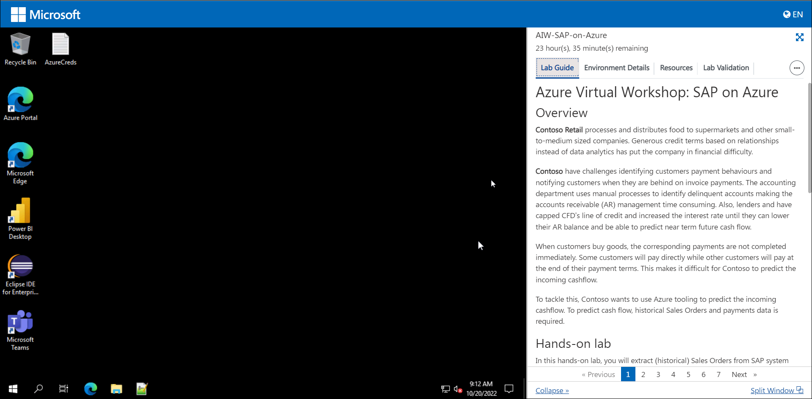
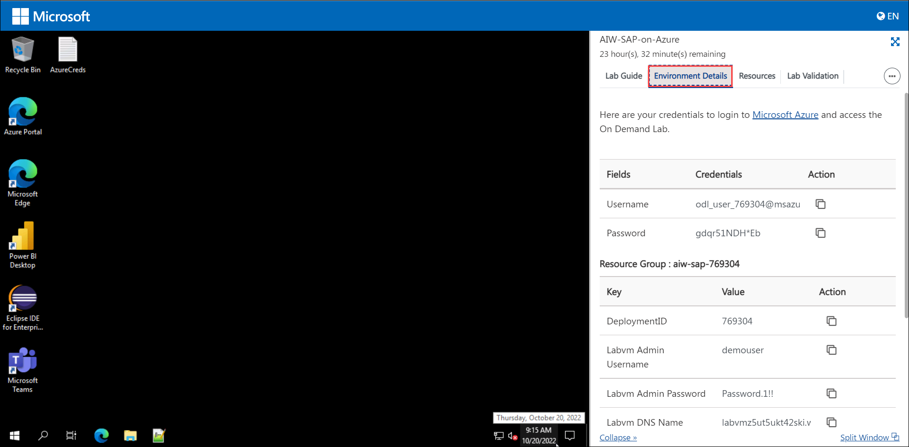
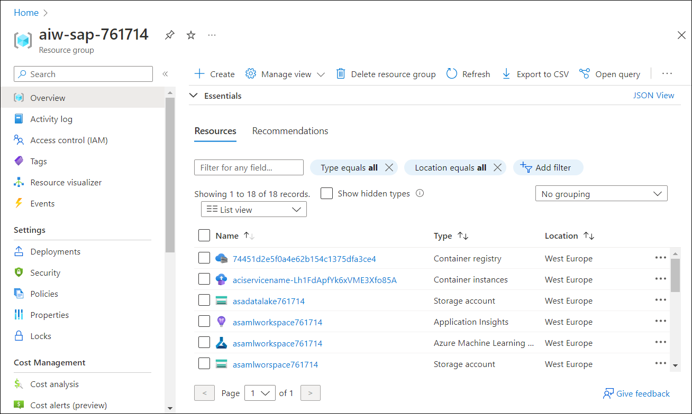

# Exercise 1: Getting Started with Azure

## Overview

In this exercise, you will log in to the Azure Portal and review the pre-deployed resources as part of the lab environment.

### Getting Started with Lab

1. Once the environment is provisioned, a virtual machine and lab guide will get loaded in your browser. Use this virtual machine throughout the workshop to perform the lab.

    

1. To get the lab environment details, you can select the **Environment Details** tab. Additionally, the credentials will also be emailed to your email address provided at registration.

    
    
1. You can also open the Lab Guide in a separate full window by selecting the **Split Window** icon at the bottom right corner.

     
    
    
## Task 1: Log in to Azure Portal and verify the pre-deployed resources

1. Open Azure Portal from the desktop by double-clicking on it.
    
   
   
2. On the **Sign into Microsoft Azure** tab, you will see the login screen, enter the following username, and, then click on **Next**.

   * Email/Username: <inject key="AzureAdUserEmail"></inject>

   

3. Now enter the following password and click on **Sign in**. 

   * Password: <inject key="AzureAdUserPassword"></inject>

   

4. If you see the pop-up **Stay Signed in?**, click on **No**.

   

5. If you see the pop-up **You have free Azure Advisor recommendations!**, close the window to continue the lab.

6. If a **Welcome to Microsoft Azure** popup window appears, click **Maybe Later** to skip the tour.

1. Now you can see Azure Portal Dashboard, click on **Resource groups** from the Navigate panel to see the resource groups.

   

1. Click on the **aiw-sap-<inject key="DeploymentID" enableCopy="false" />** Resource group and go through with the pre-deployed resources.

   * In the Resource group we have one **Virtual Machine**, **Service Bus**, **IoT Hub**, **Synapse Workspace**, **Azure Machine Learning workspace**, **Storage Account**, **Azure Cosmos Database**, **Container Registry**, **Key Vault** and **Application Insights** deployed.

   * **Virtual Machine**: You will be using the Virtual Machine which is already open on the left side of the page to perform all the lab exercises.

   * **IoT Hub**: Using the existing IoT hub you will review the pre-deployed IoT hub devices and Message routing rules. 

   * **Synapse Workspace**: You will be using Synapse Workspace to run the SQL scripts and verify the data. You will also review the pre-deployed Linked services, Integration Datasets, and Pipelines. 

   * **Azure Machine Learning workspace**: You will be using the Machine Learning Workspace to review the pre-deployed Automated ML run and the Best Model. By entering the data in the endpoint's JSON editor, you can also test the machine learning model.

    * **Storage Account**: 
       - You will be using the Azure Data Lake Storage Gen2 Storage Account to store the Sales Order Headers, Sales Order Items, and Payments in the container and also you will store the IoT data generated by the IoT hub device in the container.

    * **Azure Cosmos Database**: You will be using the Cosmos Database to store the raw Payment data. After the Pipeline is successfully deployed, the Payment data will be transferred from Azure Data Lake Storage Gen2 Storage Account to Cosmos Database.

    * **Key Vault**: You will be using the Key Vault to store secrets and other sensitive information that is needed by the Azure Machine Learning workspace.

    * **Application Insights**: You will be using the Application Insights to store monitoring information about the deployed models in the Azure Machine Learning workspace.

    * **Container Registry**: You will be using the Container Registry to register the docker images which are being used in training the models in the Azure Machine Learning workspace.
    
    

## Summary

* In this exercise, you signed into the Azure Portal and reviewed the pre-deployed resources.
