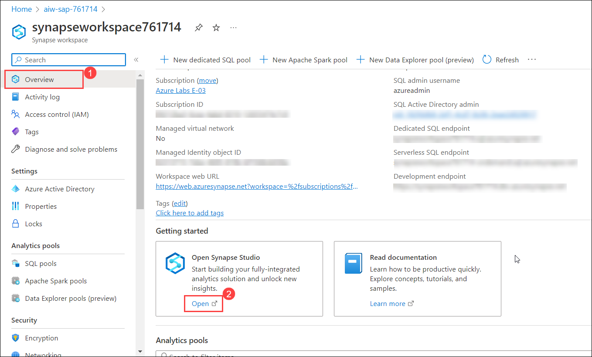
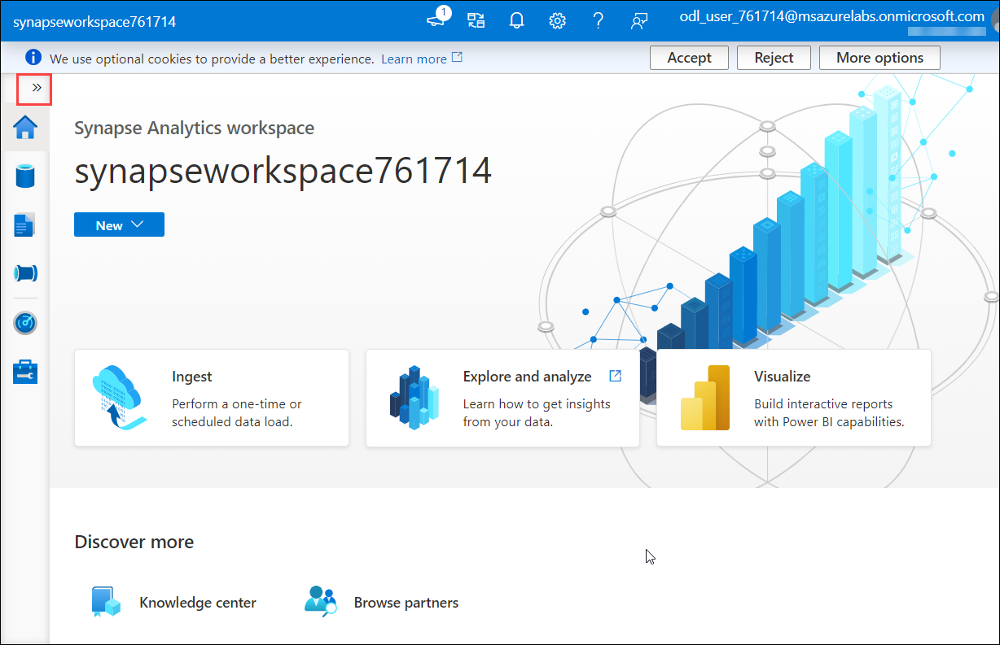

# Exercise 2: Combine and streamline SAP and non-SAP Data Flow 

## Overview

In this exercise, you will review the pre-deployed Pipelines and will run the SQL scripts to get the data for the tables SalesOrderHeaders, SalesOrderItems, Payments, IoTdata.

## Task 1 :  Review the pre-deployed Pipelines

1. Navigate to the **aiw-sap-<inject key="DeploymentID" enableCopy="false"/>** **(1)** resource group and open Synapse workspace with the name **synapseworkspace<inject key="DeploymentID" enableCopy="false"/>** **(2)**.

   
   
2. From the Overview **(1)** pane of Synapse workspace, scroll-down to Getting started and click on **Open** **(2)** to Open Synapse Studio.

   
   
3. In Synapse Analytics Studio, from the left panel click on the expand icon.

   
   
4. Now, navigate to **Integrate** hub **(1)** and click on **Pipelines** **(2)**.

    

5. You can observe the pre-deployed Pipelines for SalesOrderHeaders, SalesOrderItems, Payments and IoT Data.

6. Click on **ExtractSalesOrderHeaders (1)** under Pipelines and select **ExtractSalesOrderHeaders (2)** from the canvas.

    

7. Navigate to **Source (1)** tab and observe **HanaIDHeaders (2)** is selected as Source dataset.

    
    
    >Info : A source transformation configures the data source for the data flow. When you design data flows, your first step is always configuring a source transformation. Each source transformation is associated with exactly one dataset or linked service
