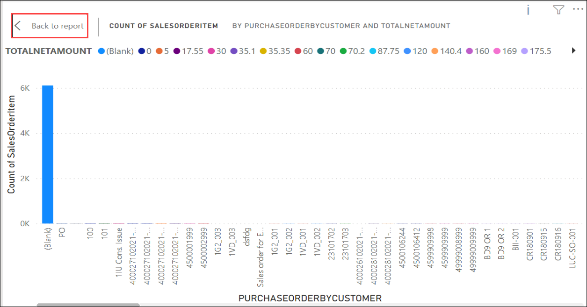

# Exercise 4: Integrate Azure Machine Learning and PowerBI

In this exercise, you will be reviewing the integrated data visualization of Azure Machine Learning Model within PowerBI.

### Task 1: Review the Tables, Sales and Payment Forecast report

1. In the **File Explorer**, navigate to `C:\PowerBI Reports` directory **(1)**. Double-click on **SalesOrderPayments** **(2)** file to open the Power BI Report.

   
   
1. You can start reviewing the visualization from the report canvas of Power BI. Select the visualization of **Sales and Payment Forecast report** **(1)** and click on **Focus mode** **(2)**.

   

1. Take a look at the **Sales and Payment Forecast report** by **Year** for the various **Sales and Payment Forecast**. Select the Year **2022** **(1)** and review the **Sales at BillingDate** **(2)** by placing the cursor over it as shown in the below image.

   > **Info**: You can also review the **Payments at Predection Date** and **Payments at Actual Date** by placing the cursor over it for various year by selecting the appropriate **Year**.

   

1. Once you finished reviewing the visualization, click on **Back to report** at the left-top of the Focus mode to navigate back to report canvas.

   > **Info**: This graph represents the relationship of Date, Payment at Actual Date, Payment at pred Date and Sales at BillingDate of Date data.

   
   
1. Select the visualization of **Sales Per CustomerGroup, MaterialGroup and NetAmount** **(1)** and click on **Focus mode** **(2)**.

   

1. Take a look at the **Sales Per CustomerGroup, MaterialGroup and NetAmount** by **Year** for the various **CustomerGroups (Z1 and Z2)**. Select the CustomerGroup **Z1** **(1)** for the year **2020** **(2)** and review the sum of **TotalNetAmount** **(3)**.

   > **Info**: You can also review the sum of **TotalNetAmount** for various **CustomerGroups** in the different year by selecting the appropriate  **CustomerGroup** and **Year**.

   

1. Once you finished reviewing the visualization, click on **Back to report** at the left-top of the Focus mode to navigate back to report canvas.

   > **Info**: This graph represents the relationship of CustomerGroup, MaterialGroup and NetAmount of SalesOrderHeaders and SalesOrderItems data.
   
6. Select the visualization of **Payments per SalesOrder by CustomerName** **(1)** and click on **Focus mode** **(2)**.

   
   
7. Review the **Payments per SalesOrder by CustomerName** visualization. Once you finished reviewing the visualization, click on **Back to report** at the left-top of the Focus mode to navigate back to report canvas.

   > **Info**: This graph represents the relationship of SalesOrder and CustomerName of SalesOrderItems and Payments data.

      
   
8. Select the visualization of **Sales per SalesOrderItem by PurchareOrderbyCustomer** **(1)** and click on **Focus mode** **(2)**.

   
   
9. Review the **Sales per SalesOrderItem by PurchareOrderbyCustomer** visualization. Once you finished reviewing the visualization, click on **Back to report** at the left-top of the Focus mode to navigate back to report canvas.

   > **Info**: This graph represents the relationship of SalesOrderItem, NetAmount and PurchareOrderbyCustomer of SalesOrderHeaders and SalesOrderItems data.

   
   
10. Select the visualization of **Sales per RequestedDeliveryDate by IoTData** **(1)** and click on **Focus mode** **(2)**.

    
   
11. Review the **Sales per RequestedDelivery by IoTData** visualization. Once you finished reviewing the visualization, click on **Back to report** at the left-top of the Focus mode to navigate back to report canvas.

    > **Info**: This graph represents the relationship of RequestedDeliveryDate and connectionAuthMethod of SalesOrderItems and IoTData data.

    
   
12. Select the visualization of **Sales per CITYNAME by IoTData** **(1)** and click on **Focus mode** **(2)**.

    
   
13. Review the **Sales per CITYNAME by IoTData** visualization. Once you finished reviewing the visualization, click on **Back to report** at the left-top of the Focus mode to navigate back to report canvas.

    > **Info**: This graph represents the relationship of CITYNAME and temperatureAlert of SalesOrderHeaders and IoTData data.

    
   
   
   
   
