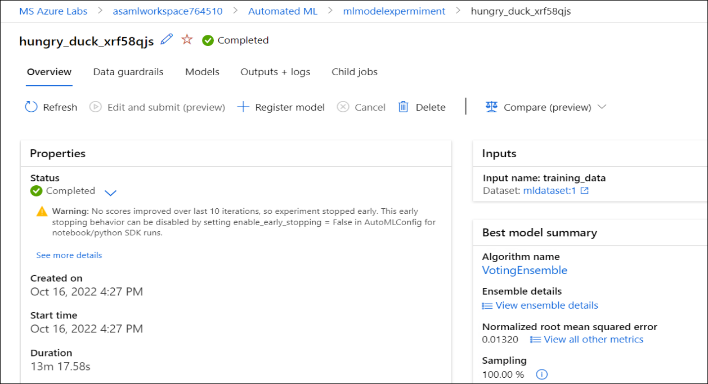
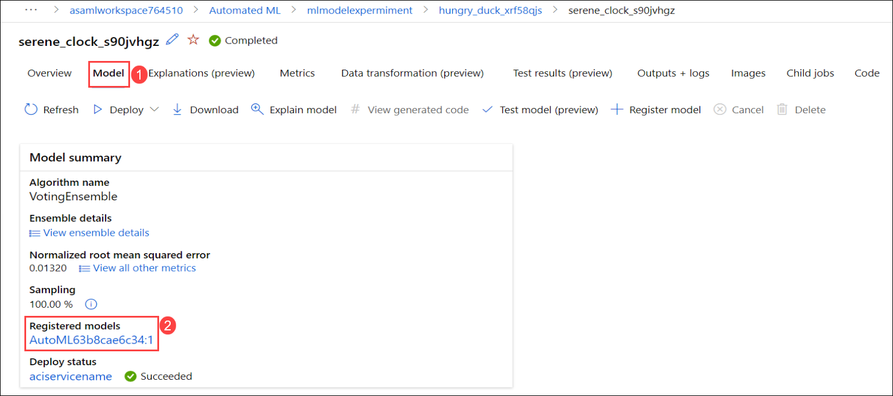

# Exercise 5: Predict Incoming Cashflow

In this exercise you will be reviewing the Automated ML Run and best trained Model. Also you will be testing the Payment Delay/Offset Prediction.

### Task 1: Review the Automated ML Run and best trained Model

1. Navigate to the **aiw-sap-<inject key="DeploymentID" enableCopy="false"/>** resource group in the Azure portal and open the Azure Machine Learning workspace named **asamlworkspace<inject key="DeploymentID" enableCopy="false"/>** from the resources list.

   
   
2. In the Overview of **asamlworkspace<inject key="DeploymentID" enableCopy="false"/>** Azure Machine Learning workspace, click on **Launch studio**. You will be to navigated to Microsoft Azure Machine Learning Studio.

   
   
3. Select **Automated ML** **(1)** from the left-menu of AML studio and then click on **Pre-deployed Automated ML job** **(2)** available under recent automated ml jobs.

   
   
4. Review the Automated ML job details such as Status, Inputs and Best Model. 

   

5. From **Best model summary** card on the **Overview** **(1)** tab, select the hyperlink beneath the **Algorithm name** **(2)** which will take you to the model deatils blade.

   
   
6. From the **Model** **(1)** tab, select the hyperlink beneath the **Registered models** **(2)** under to review the best trained model.

   
   
7. Now, you can review the best trained model from the **Details** tab.

     

### Task 2: Test the Payment Delay/Offset Prediction

1. Navigate to **Endpoints** **(1)** section from left-menu, under **Real-time endpoints** **(2)** select **sap-data-ml-model** **(3)**.

   
   
2. On the **sap-data-ml-model** endpoint screen, select the **Test** **(1)** tab. Replace the contents of the input data with the below given code **(2)** and select **Test** **(3)**. Verify the **Test result** **(4)**.

   ```json
    {
        "Inputs": {
            "data": [
            { 
                "CUSTOMERNAME": "Westend Cycles",
                "CUSTOMERGROUP": "Z1",
                "BILLINGCOMPANYCODE": 1710,
                "CUSTOMERACCOUNTGROUP": "KUNA",
                "CREDITCONTROLAREA": "A000",
                "DISTRIBUTIONCHANNEL": 10,
                "ORGANIZATIONDIVISION": 0,
                "SALESDISTRICT": "US0003",
                "SALESORGANIZATION": 1710,
                "SDDOCUMENTCATEGORY": "C",
                "CITYNAME": "RALEIGH",
                "POSTALCODE": "27603"
            },
            { 
                "CUSTOMERNAME": "Skymart Corp",
                "CUSTOMERGROUP": "Z2",
                "BILLINGCOMPANYCODE": 1710,
                "CUSTOMERACCOUNTGROUP": "KUNA",
                "CREDITCONTROLAREA": "A000",
                "DISTRIBUTIONCHANNEL": 10,
                "ORGANIZATIONDIVISION": 0,
                "SALESDISTRICT": "US0004",
                "SALESORGANIZATION": 1710,
                "SDDOCUMENTCATEGORY": "C",
                "CITYNAME": "New York",
                "POSTALCODE": "10007"
            }
            ]
        },
        "GlobalParameters": 1.0
   }
   ```
   
   
