# Exercise 1: Deploying the Microhack environment with Terraform

In this Exercise, you will use Terraform to deploy the azure resources.

## Task 1: Getting started with Resource deployment using Terraform in Azure cloud shell

1. Open Azure Portal from the desktop by double-clicking on it.
    
   
   
2. On the **Sign in** tab, enter the following **Username** and, then click on **Next**. 

   * Email/Username: <inject key="AzureAdUserEmail"></inject>

   

3. Enter the following password and click on **Sign in**.

   * Password: <inject key="AzureAdUserPassword"></inject>

   

4. If you see the pop-up **Stay Signed in?**, click on No

5. If you see the pop-up **You have free Azure Advisor recommendations!**, close the window to continue the lab.

6. If a **Welcome to Microsoft Azure** popup window appears, click **Maybe Later** to skip the tour.

7. On the Home page of the Azure portal, open **Cloud shell** from the top menu bar.

   

8. In the Welcome to Azure Cloud Shell pane, click on **Bash**.

   

9. Click on Advanced settings and select the existing Resource group **aiw-sap-<inject key="DeploymentID" enableCopy="false"/>**. Create a new Storage account with the name **sapstorage<inject key="DeploymentID" enableCopy="false"/>** and create a File share with the name **blob**. Click on **Create storage**.

   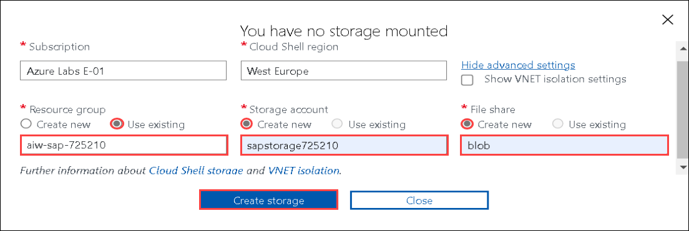

10. Run the below command to view the subscription you are using for Microhack deployment.

    ```bash
    az account show
    ```
    
    
    
11. Run the below command to clone the GitHub repository with the Terraform scripts.

    ```bash
    git clone -b prod https://github.com/CloudLabsAI-Azure/AVW-SAP-on-Azure
    ```
    
    
    
12. Change Directory into the terraform folder by running the below mentioned command.

    ```bash
    cd AVW-SAP-on-Azure/Sap-on-AzureV2/Implementors/terraform
    ```
    
13. You need to Check the default values defined in variables.tf, by running the below mentioned command.

    ```bash
    code variables.tf
    ```
    
        

14. You need to update the variable location default value with "**<inject key="Region" />**" region.

    
    
15. After updating the default value for location , move the cursor to the top right corner to get **More** **(1)** options menu and select **Save** **(2)**.

    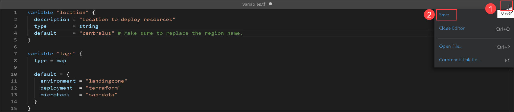
    
16. To close the code editor window, move the cursor to the top right corner to get **More** **(1)** options menu and select **Close Editor** **(2)**.

    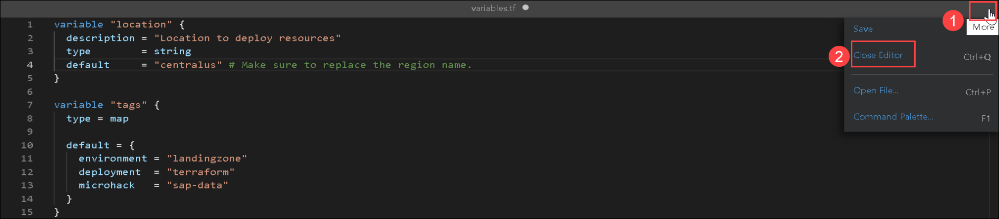    

17. You need to update the **Deployment_ID** and **User Object_ID** in the ```main.tf``` file. Run the below mentined command to get into the code editor window.
    
    ```bash
    code main.tf
    ```
    
    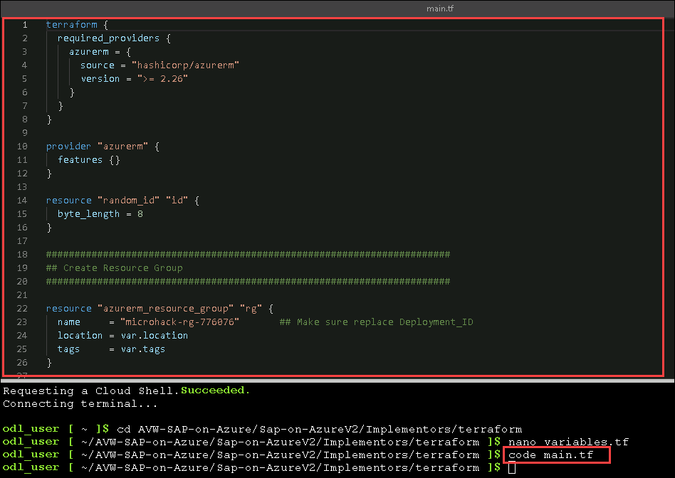
    
18. In the Create Resource Group part, make sure to replace the Deployment_ID in the resource group name as **microhack-rg-<inject key="DeploymentID" />**.

    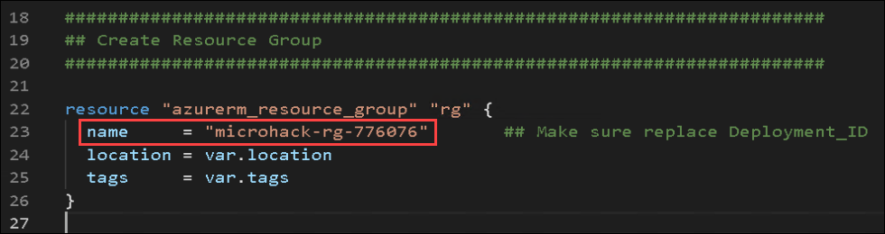
        
19. Scroll-down to Assign Storage role to user part and make sure to replace the User Object_ID with "**<inject key="ObjectID" />**" in the principal_id.

    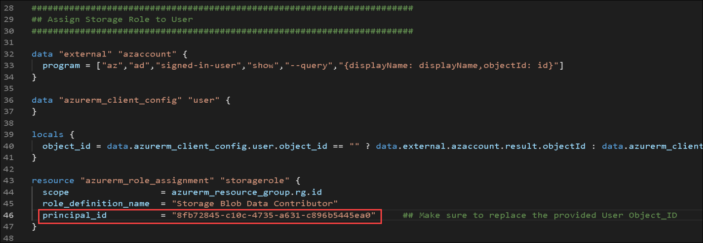
    
20. Scroll-down to Create Key Vault part and make sure to replace the User Object_ID with "**<inject key="ObjectID" />**" in the object_id.

    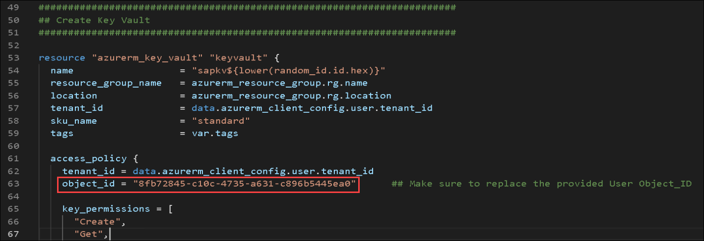
    
21. After updating the Deployment_ID and User Object_ID, move the cursor to the top right corner to get **More** **(1)** options menu and select **Save** **(2)**.

    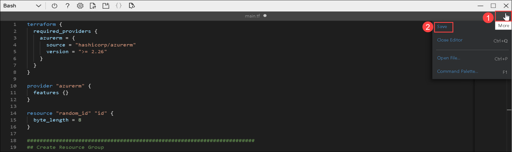
    
22. To close the code editor window, move the cursor to the top right corner to get **More** **(1)** options menu and select **Close Editor** **(2)**.

    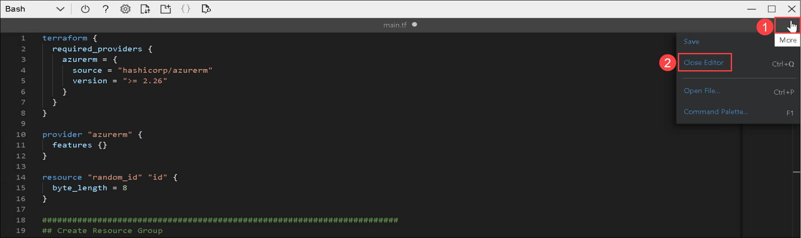   

23. Run the below mentioned command to initialize a working directory containing Terraform configuration files.

    ```bash
    terraform init
    ```
    
    

24. Replace the Subscription ID with "**<inject key="Subscription ID" />**" and replace Deployment ID in the Resource group name with "**microhack-rg-<inject key="DeploymentID" />**" in the below command, then run the below command to import the resource group.

    > **Info**: You will be running below command to import the existing resource group for deploying the required resources.

    ```bash
    terraform import azurerm_resource_group.rg /subscriptions/{SUBSCRIPTION_ID}/resourceGroups/microhack-rg-{DEPLOYMENT_ID}
    ```
    
    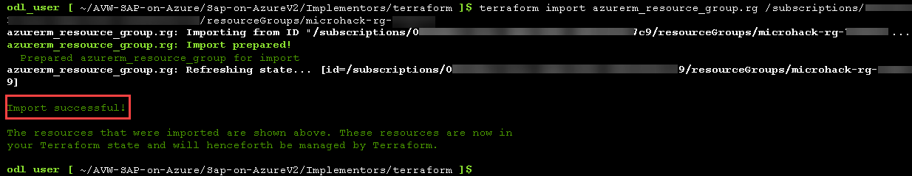
    
25. Run the below mentioned command to execute the actions proposed in a terraform deployment, and choose ```yes``` once prompted to deploy the script.

    ```bash
    terraform apply
    ```
  
    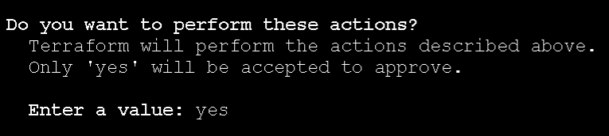
    
26. Once the script execution is finished you will get output as shown in the below image.

    
    
27. Navigate to the **microhack-rg-<inject key="DeploymentID" enableCopy="false"/>** resource group and go through the resources deployed in the resource group.

    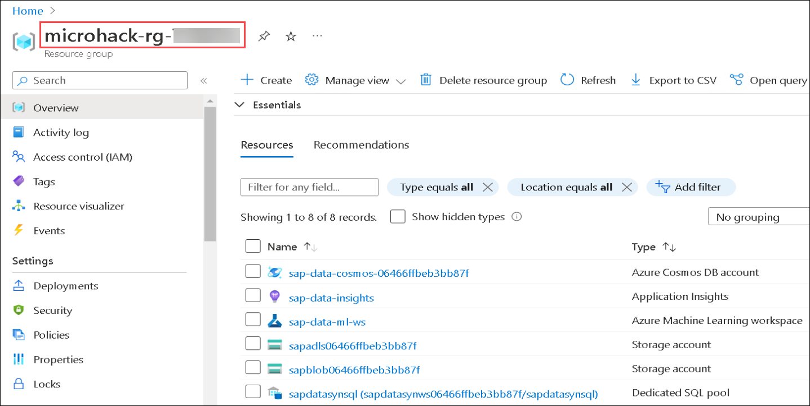
    
In this exercise, you have completed resource deployment using terraform.
   
