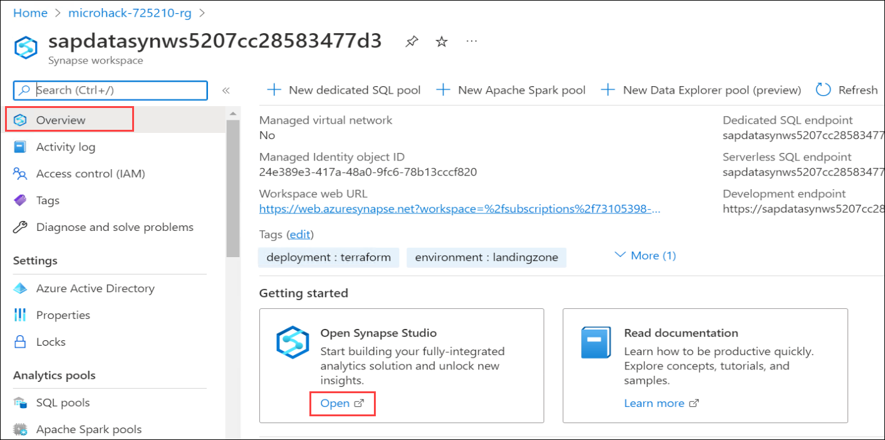

# Exercise 2: Configure Synapse Workspace

In this Exercise, you will be registring an integration runtime in Synapse Workspace.

## Task 1: Register Integration Runtime

1. Navigate to the **microhack-<inject key="DeploymentID" enableCopy="false"/>-rg** resource group and open Synapse workspace with the name **sapdatasynwsSUFFIX**.

   
   
2. From the Overview pane of Synapse workspace, scroll-down to Getting started and click on **Open** to Open Synapse Studio.

   

3. You will see that Synapse studio opened in the new tab. Click on **Manage** from the left-menu to register the integration runtime.

   
   
4. Under Integration, select **Integration runtimes** **(1)** and click on **+ New** **(2)**.

   
   
5. In the Integration runtime setup pane, choose **Azure, Self-Hosted** and click on **Continue**.

   
   
6. Choose **Self-Hosted** as the Network enviornment and click on **Continue**.

   
   
7.    
