# Exercise 2: Configure Synapse Workspace

In this Exercise, you will be registering an integration runtime in Synapse Workspace.

## Task 1: Register Integration Runtime

1. Navigate to the **microhack-rg-<inject key="DeploymentID" enableCopy="false"/>** resource group and open Synapse workspace with the name **sapdatasynwsSUFFIX**.

   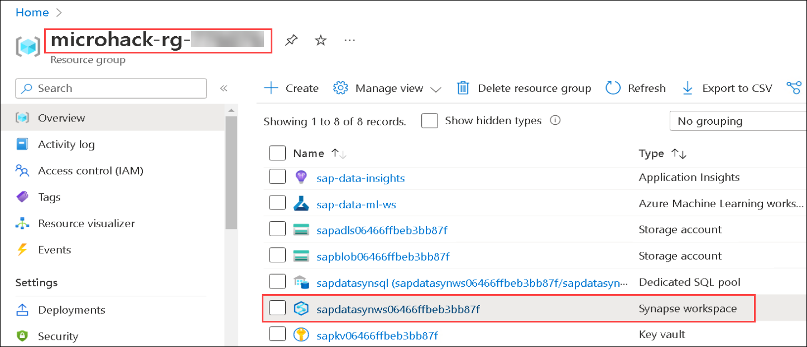
   
2. From the Overview pane of Synapse workspace, scroll-down to Getting started and click on **Open** to Open Synapse Studio.

   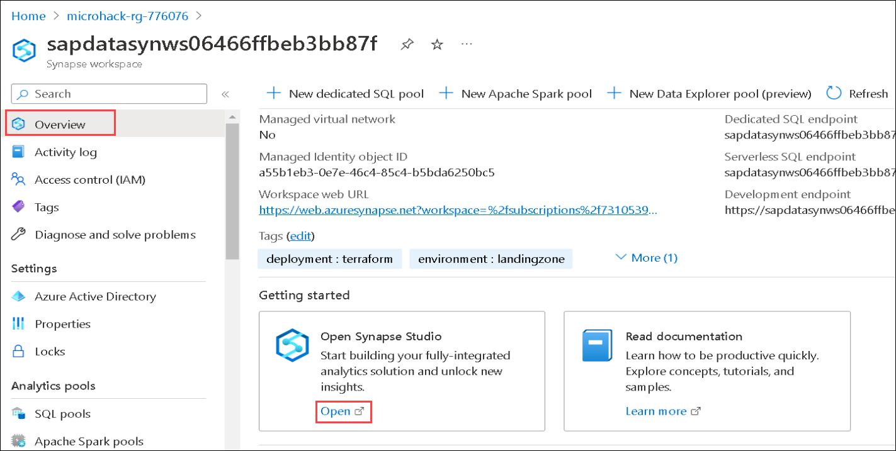

3. You will see that Synapse studio opened in the new tab. Click on **Manage** from the left-menu to register the integration runtime.

   
   
4. Under Integration, select **Integration runtimes** **(1)** and click on **+ New** **(2)**.

   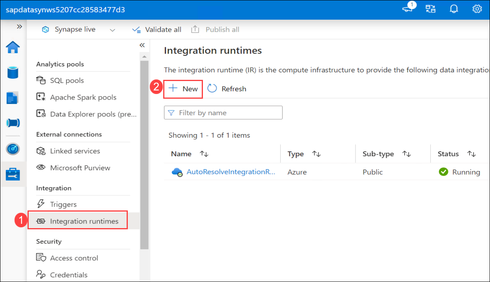
   
5. In the Integration runtime setup pane, choose **Azure, Self-Hosted** and click on **Continue**.

   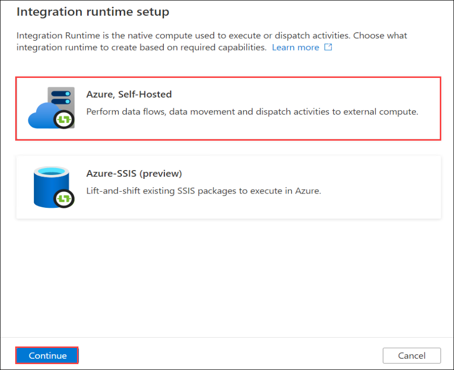
   
6. Choose **Self-Hosted** as the Network environment and click on **Continue**.

   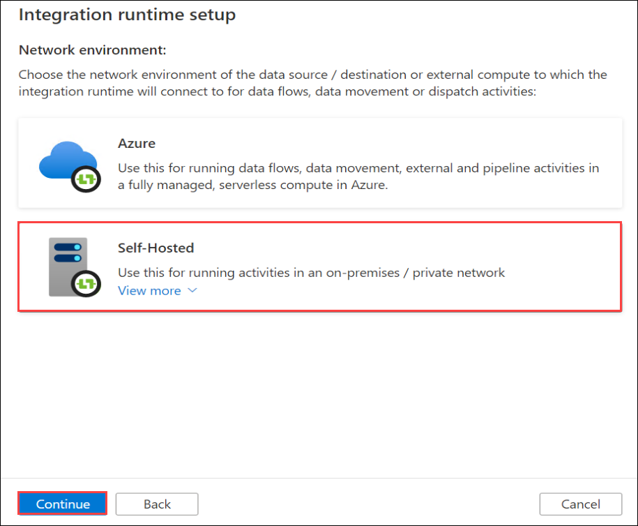
   
7. Enter the Name for integration runtime as **sap-intrun-<inject key="DeploymentID" enableCopy="false"/>** and click on **Create**.  

   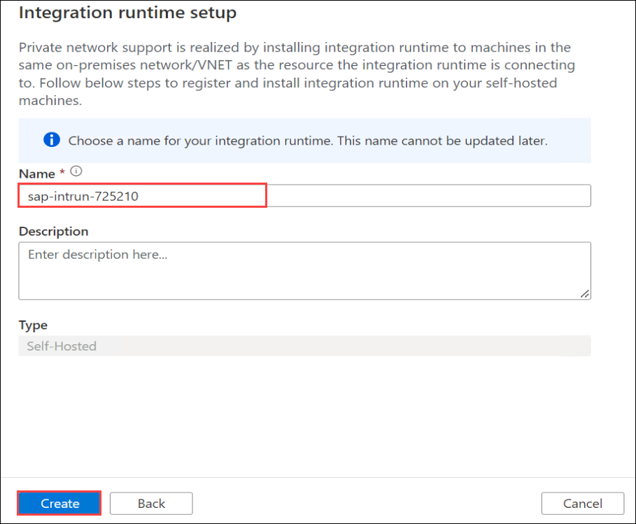
   
8. Once the integration runtime is created, Authentication keys under Option 2: Manual setup will appear. **Copy** **(1)** those keys to notepad, as you will need one of these keys in the next step.

   
   
9. In Option 2: Manual setup, download the integration runtime via Step 1. Click on **Download and install integration runtime**.

   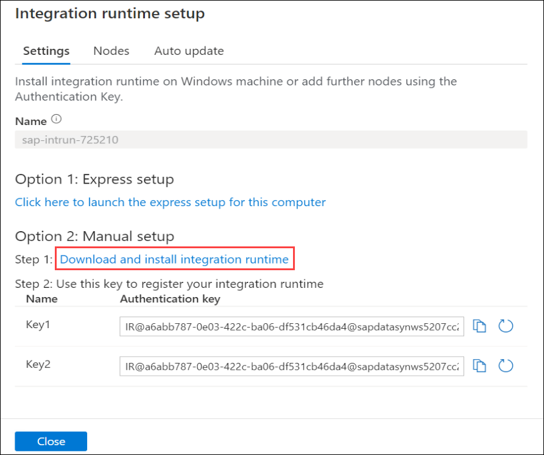
 
10. A new tab to Download Microsoft Integration Runtime will appear, scroll-down and click on **Download**.

    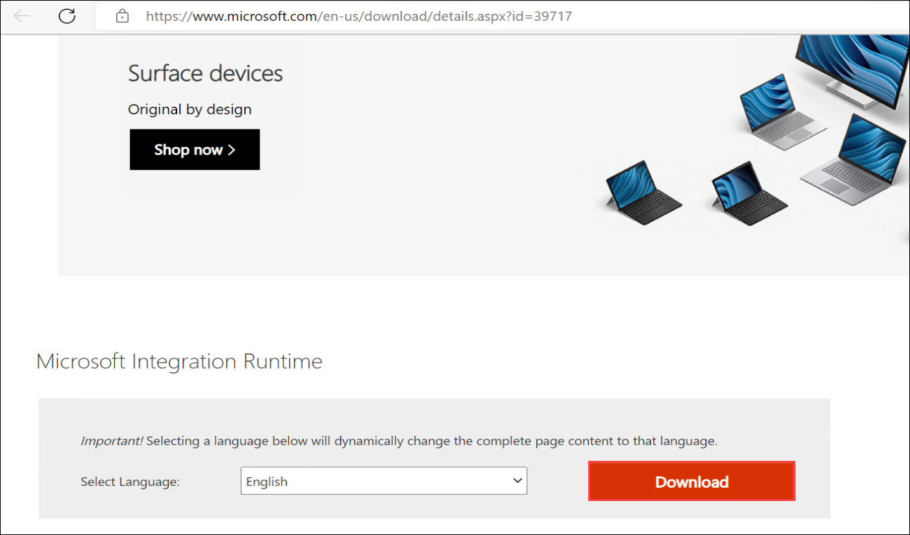
    
11. Select the latest version of integration runtime and click on **Next**. You will see the download started.

    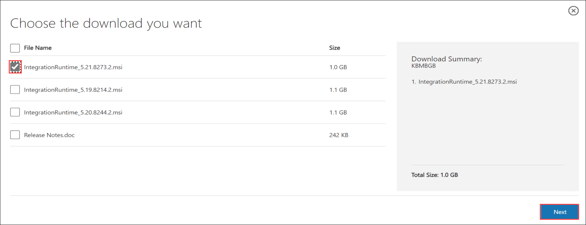
    
12. Once the downloading is complete, click on **Open file** of the downloaded integration runtime from Downloads.

    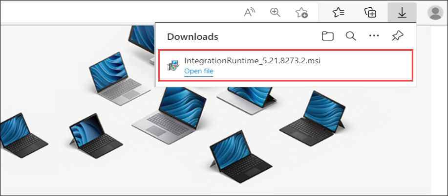
    
13. In Welcome to the Microsoft Integration Runtime Setup Wizard pane, leave default English language selected and click on **Next**.

    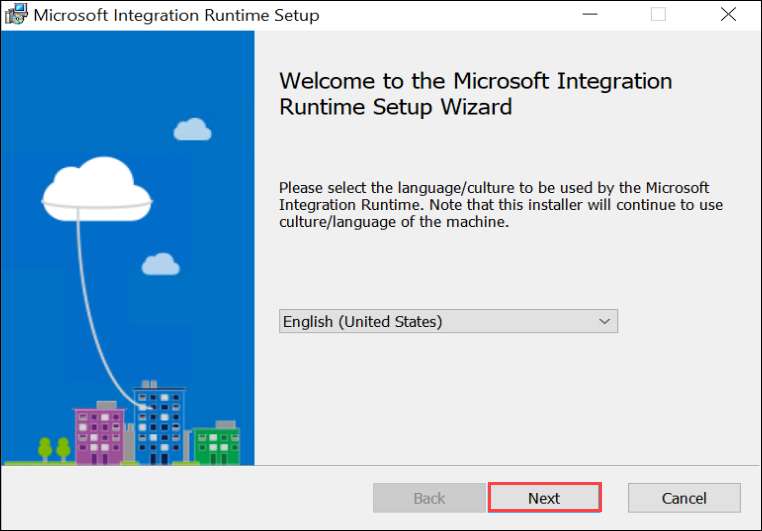

14. Check the box to accept the End-User license agreement and click on **Next**.

    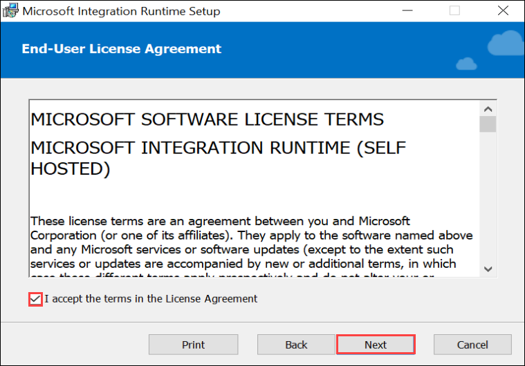
    
15. Leave default for the Destination Folder and click on **Next**.

    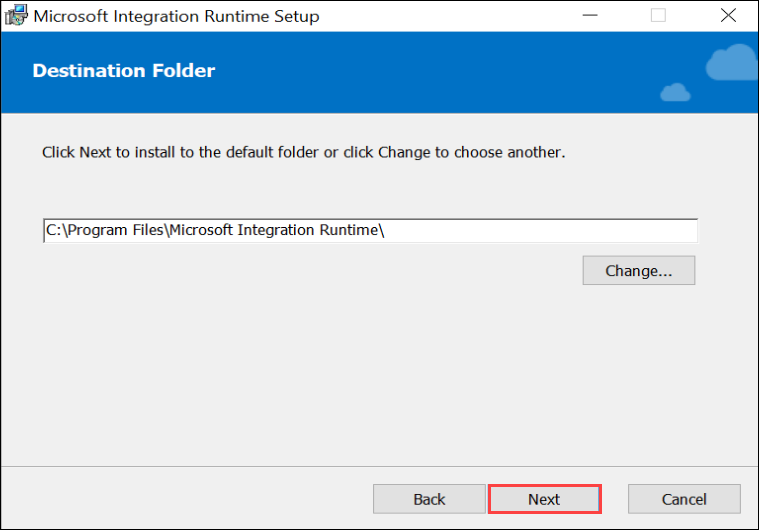
    
16. Click on **Install** in Ready to install Microsoft Integration Runtime. Installation will take around 5 minutes to complete.

    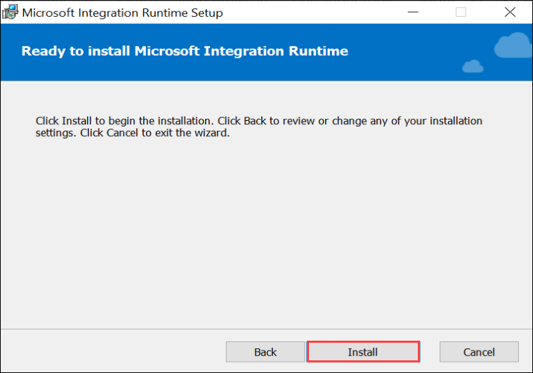
    
17. Once you click on **Finish**, you will see the Register Integration Runtime (Self-Hosted) pane. Enter **one of the keys** **(1)** you noted down earlier from the integration runtime setup and choose **Register** **(2)**.

    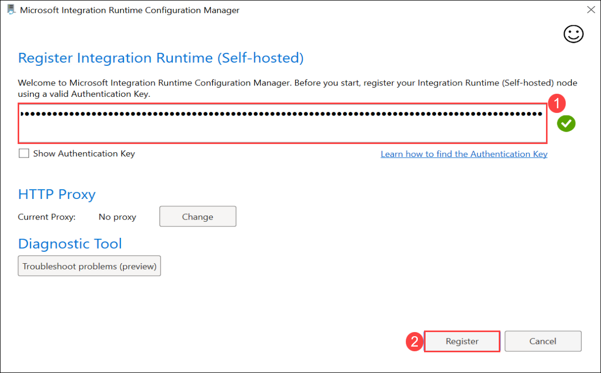
    
18. In the New Integration Runtime (Self-Hosted) Node pane, leave default and click on **Finish**. This can take a few minutes.

    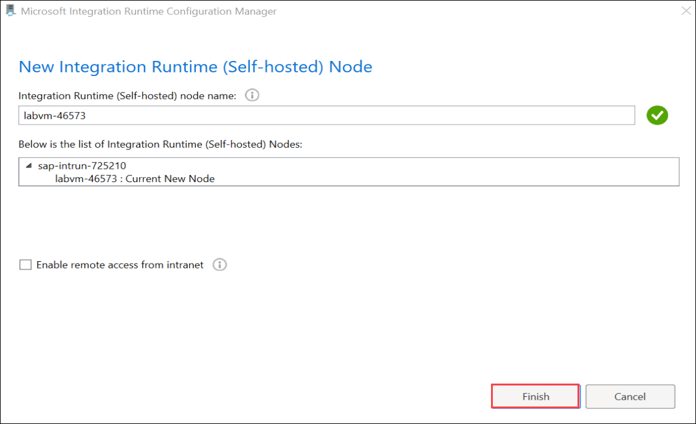
    
19. Once the Integration Runtime (Self-Hosted) node has been registered successfully, click on **Launch Configuration Manager**.

    
    
20. The Self-hosted node is connected to the cloud service.

    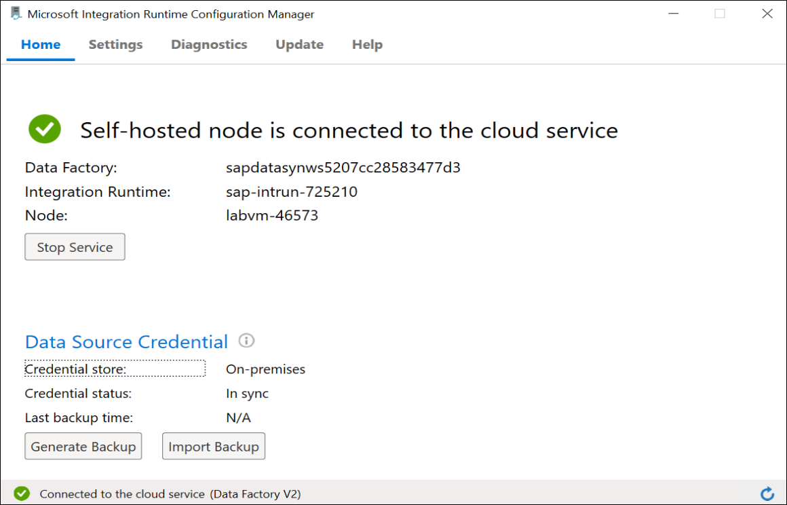

21. Navigate back to Synapse studio, click on **Close** in Integration runtime setup.

    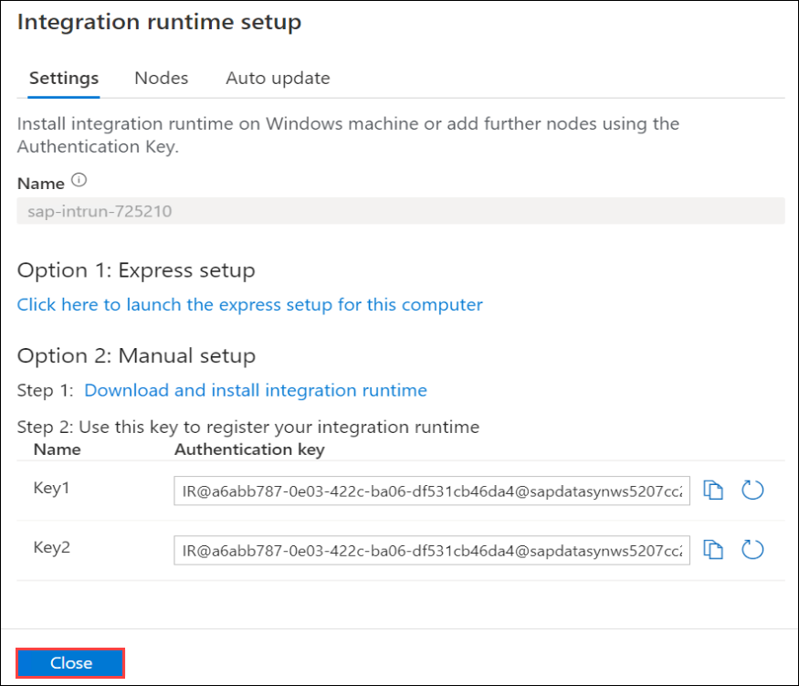
    
22. Click on **Refresh** to see the registered **sap-intrun-<inject key="DeploymentID" enableCopy="false"/>** self-hosted Integration runtime with status **Running**.

    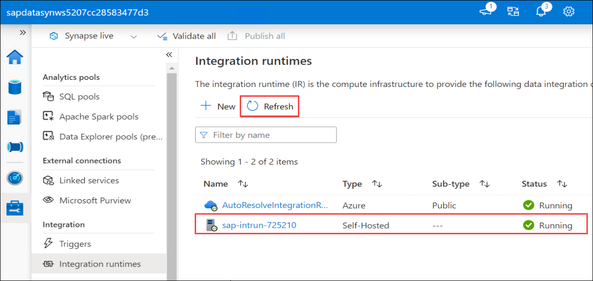     
    
In this Exercise, you have registered and installed the Integration Runtime and the self-hosted node is connected. You can proceed with the next exercise. 
    
