# Exercise 3: Configure the DataFlow

## Introduction

In this step we'll setup the dataflow from the SAP System and Cosmos DB towards the Synapse DB. Sales OrderHeaders will be extracted via the first Synapse pipeline 
using the SAP Table connector, Sales Order Items will be extracted via a second Synapse Pipeline using the SAP ECC (oData) connector. Payment data will be extracted
from CosmosDB using a third pipeline.

   
   
### Task 1: Synapse Table Setup

1. From the Synapse Studio, click on **Develop** from the left-menu.

   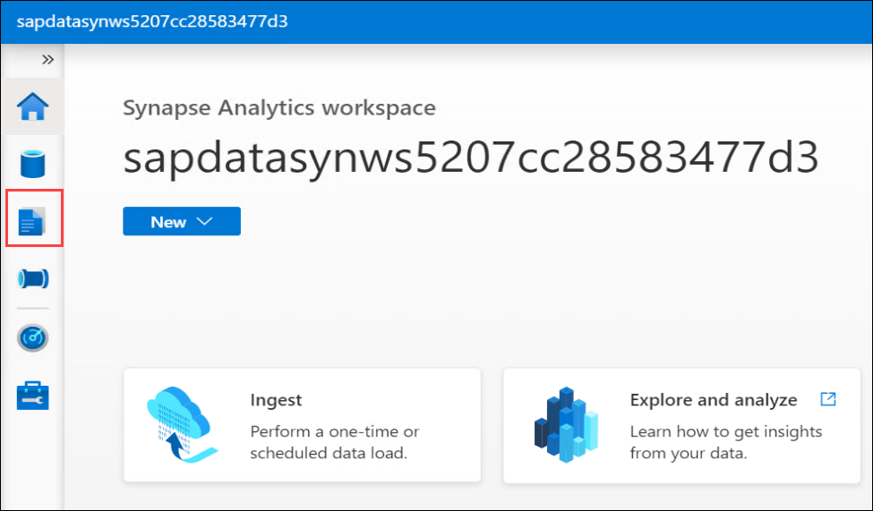
   
2. From the **Develop** pane, click on ```+``` **(1)** and select **SQL script** **(2)** to add table for SalesOrderHeaders.

   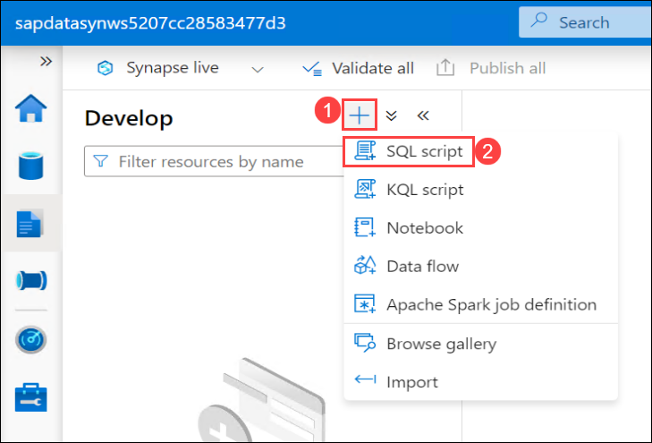
   
3. In the Properties, enter the Name as **CreateSalesOrderHeaders** **(1)** and change the SQL pool ```Connect to``` **sapdatasynsql** **(2)**. Then copy the below code and paste it in the codespace **(3)** and click on **Run** **(4)**.

   ```sql
   CREATE TABLE SalesOrderHeaders(
	        BILLINGCOMPANYCODE nvarchar(4),
	        BILLINGDOCUMENTDATE date,
	        COUNTRY nvarchar(3),
	        CREATIONDATE date,
	        CREATIONTIME time,
	        CREDITCONTROLAREA nvarchar(4),
	        CUSTOMERACCOUNTGROUP nvarchar(4),
	        CUSTOMERGROUP nvarchar(2),
	        CUSTOMERNAME nvarchar(80),
	        DISTRIBUTIONCHANNEL nvarchar(2),
	        LASTCHANGEDATE date,
	        LASTCHANGEDATETIME decimal(21,0),
	        MANDT int,
	        ORGANIZATIONDIVISION nvarchar(2),
	        PRICINGDATE date,
	        PURCHASEORDERBYCUSTOMER nvarchar(35),
	        SALESDISTRICT nvarchar(6),
	        SALESDOCUMENT nvarchar(10) NOT NULL,
	        SALESDOCUMENTPROCESSINGTYPE nvarchar(1),
	        SALESDOCUMENTTYPE nvarchar(4),
	        SALESGROUP nvarchar(3),
	        SALESOFFICE nvarchar(4),
	        SALESORGANIZATION nvarchar(4),
	        SDDOCUMENTCATEGORY nvarchar(4),
	        SOLDTOPARTY nvarchar(10),
	        TOTALNETAMOUNT decimal(15, 2),
	        TRANSACTIONCURRENCY nvarchar(5),
	        CITYNAME nvarchar(35),
	        POSTALCODE nvarchar(10)
   )
   ```
   
   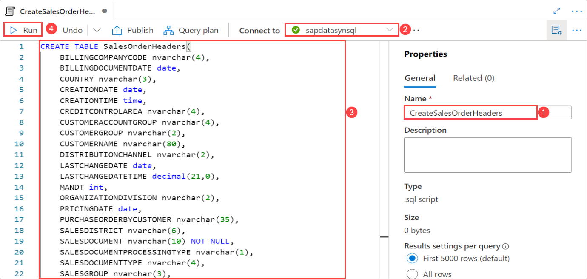
   
4. From the **Develop** pane, click on ```+``` **(1)** and select **SQL script** **(2)** to add table for SalesOrderItems.

   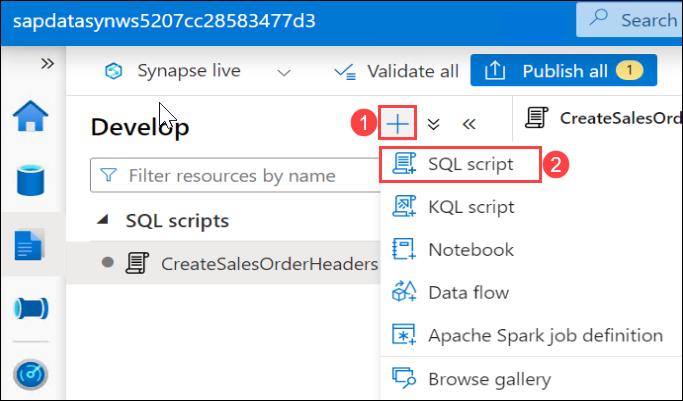 
   
5. In the Properties, enter the Name as **CreateSalesOrderItems** **(1)** and change the SQL pool ```Connect to``` **sapdatasynsql** **(2)**. Then copy the below code and paste it in the codespace **(3)** and click on **Run** **(4)**.

   ```sql
   CREATE TABLE SalesOrderItems(
           SalesOrder nvarchar(10),
           SalesOrderItem nvarchar(6),
           SalesOrderItemText nvarchar(40),
           SoldToParty nvarchar(10),
           MaterialByCustomer nvarchar(35),
           MaterialName nvarchar(40),
           Material nvarchar(40),
           ShipToParty nvarchar(10),
           FullName nvarchar(80),
           SDProcessStatus nvarchar(1),
           DeliveryStatus nvarchar(1),
           SDDocumentRejectionStatus nvarchar(1),
           SalesDocumentRjcnReason nvarchar(2),
           RequestedQuantity decimal(15,3),
           RequestedQuantityUnit nvarchar(3),
           TransactionCurrency nvarchar(5),
           NetAmount decimal(16, 3),
           MaterialGroup nvarchar(9),
           Batch nvarchar(10),
           ProductionPlant nvarchar(4),
           StorageLocation nvarchar(4),
           ShippingPointName nvarchar(30),
           ShippingPoint nvarchar(4),
           SalesOrderItemCategory nvarchar(4),
           BillingBlockCriticality tinyint,
           ItemBillingBlockReason nvarchar(2),
           OrderRelatedBillingStatus nvarchar(1),
           RequestedDeliveryDate date,
           HigherLevelItem nvarchar(6),
           SalesOrderProcessingType nvarchar(1),
           RequirementSegment nvarchar(40)
   )
   ```
   
   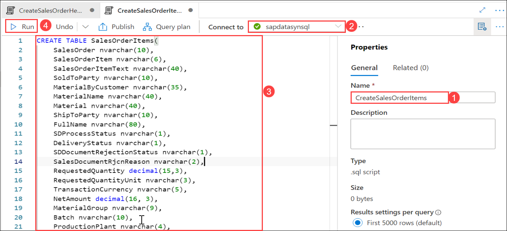
   
6. From the **Develop** pane, click on ```+``` **(1)** and select **SQL script** **(2)** to add table for Payments.

   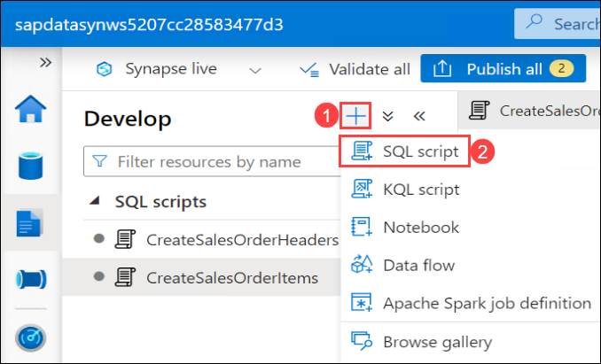 
   
7. In the Properties, enter the Name as **CreatePayments** **(1)** and change the SQL pool ```Connect to``` **sapdatasynsql** **(2)**. Then copy the below code and paste it in the codespace **(3)** and click on **Run** **(4)**.

   ```sql
   CREATE TABLE Payments(
	   PaymentNr nvarchar(10),
	   SalesOrderNr nvarchar(10),
	   CustomerNr nvarchar(10),
	   CustomerName nvarchar(80),
	   PaymentDate date,
	   PaymentValue decimal(15,2),
	   Currency nvarchar(5)
   )
   ```
   
   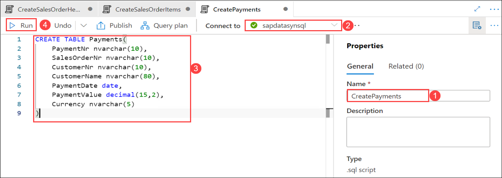
   
8. After running all the 3 SQL Scripts (CreateSalesOrderHeaders, CreateSalesOrderItems, CreatePayments), click on **Publish all**.

   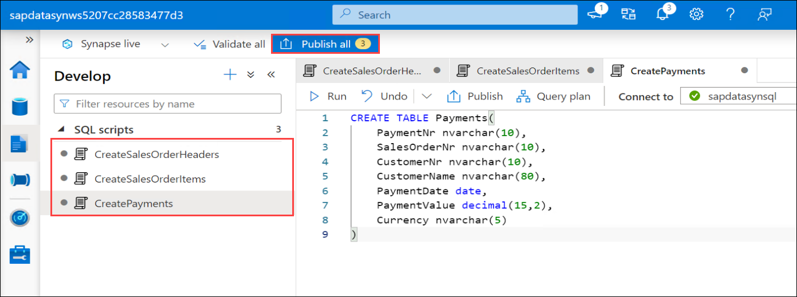
   
9. In the Publish all conformation page, click on **Publish**.

   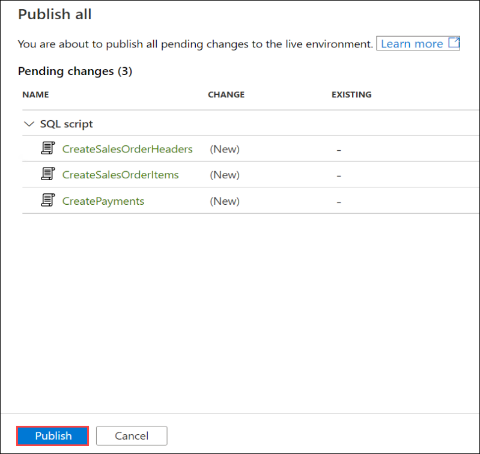
   
10. You will see the notification pop-up as Publishing completed.

    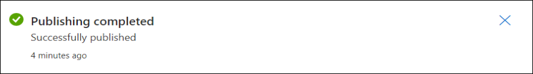    

### Task 2: Create a Linked Service to the SAP System

1. From the left-menu of Synapse Studio, click on **Manage** to create linked service.

   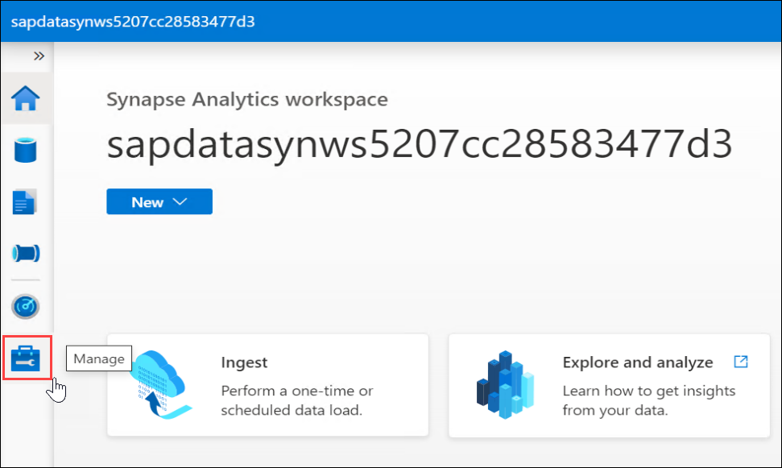
   
2. Under External connections, select **Linked services** **(1)** and click on **+ New** **(2)**.

   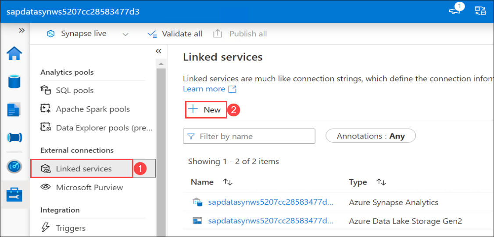
   
3. In New linked service pane, search for **SAP** **(1)** and select **SAP HANA** **(2)**. Then click on **Continue** **(3)**.

   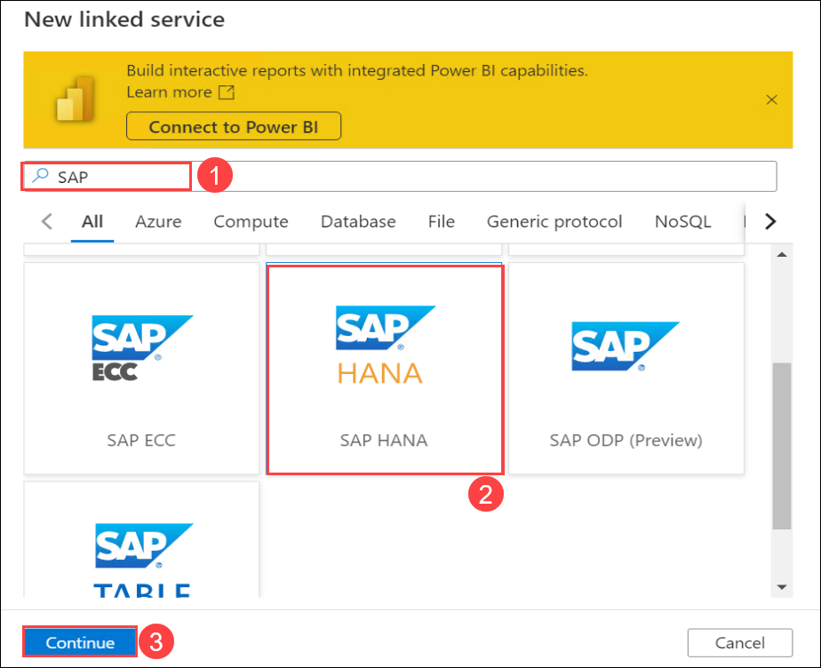
   
4. Now, enter the below values in New linked service pane:
   
    | Parameter                                  | Value                                                           |
    | -----------------------------------------  | --------------------------------------------------------------- |
    |  Name **(1)**                              |  **SapHanaLS<inject key="DeploymentID" enableCopy="false"/>**   |
    |  Connecte via integration runtime **(2)**  |  **sap-intrun-<inject key="DeploymentID" enableCopy="false"/>** |
    |  Server name **(3)**                       |  **10.0.1.6:30213**                                             |
    |  Authentication type **(4)**               |  **Basic authentication**                                       |
    |  User name **(5)**                         |  **SYSTEM**                                                     |
    |  Password **(6)**                          |  **Password#1219**                                              |
   
   After adding all the above values, click on **Test connection** **(7)** to ensure that connection is successful and then click on **Create** **(8)**.
   
   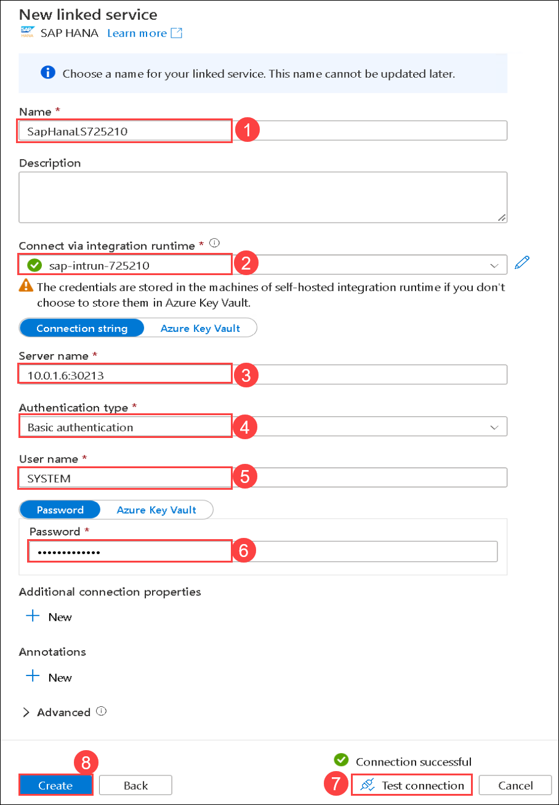
   
### Task 3: Create a Integration Dataset for the SAP Hana Linked Service

1. Now, click on **Data** from the left-menu of Synapse studio and select **Linked**.

   
   
2. To create a new integration dataset, click on ```+``` **(1)** and select **Integration dataset** **(2)**.

   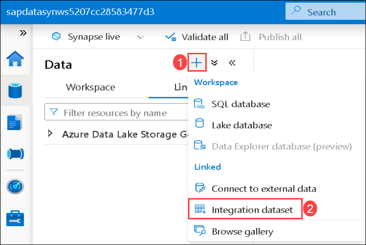
   
3. Search for **SAP** **(1)** and select **SAP HANA** **(2)**. Then click on **Continue** **(3)** in New integration dataset pane. 

   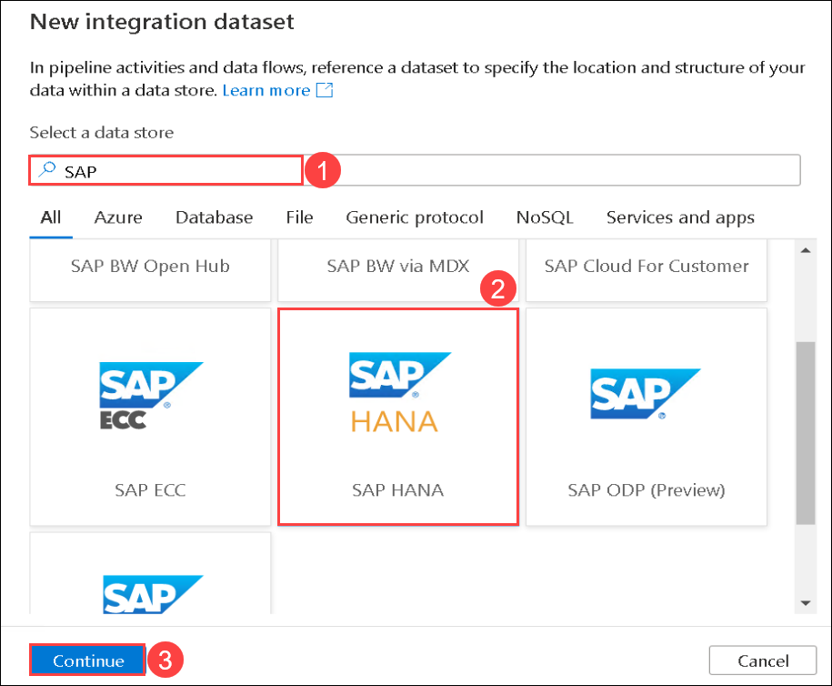
   
4. In Set properties pane, enter Name as **SapHanaTable<inject key="DeploymentID" enableCopy="false"/>** **(1)** and select **SapHanaLS<inject key="DeploymentID" enableCopy="false"/>** **(2)** for linked service from the drop-down which you have created earlier. Wait for few seconds to load the tables, search for  **SALES.Sales_Orders_Headers** **(3)** table and select it from the drop-down. Then click on **Ok** **(4)**.

   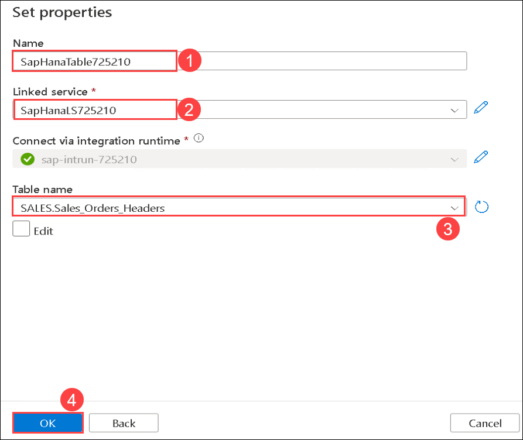
   
5. Once the Integration dataset is created, click on **Preview data** to see the data for the selected table is the previous step.

   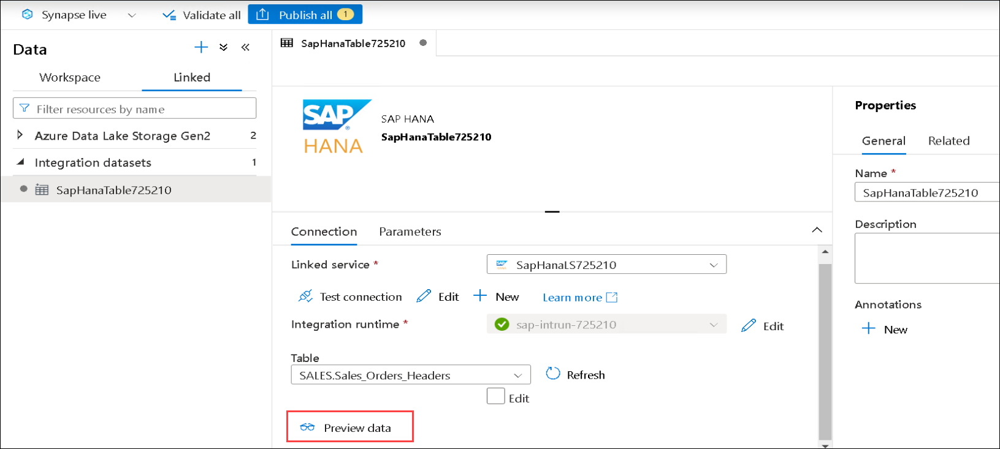 
   
### Task 4: Create a Linked Service to the Synapse SQL Pool

1. From the left-menu of Synapse Studio, click on **Manage** to create linked service.

   
   
2. Under External connections, select **Linked services** **(1)** and click on **+ New** **(2)**.

   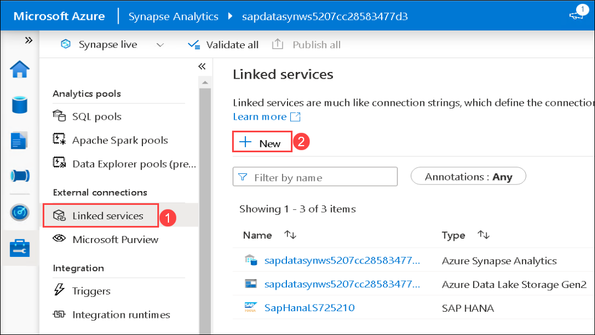
   
3. In New linked service pane, search for **Synapse** **(1)** and select **Azure Synapse Analytics** **(2)**. Then click on **Continue** **(3)**.

   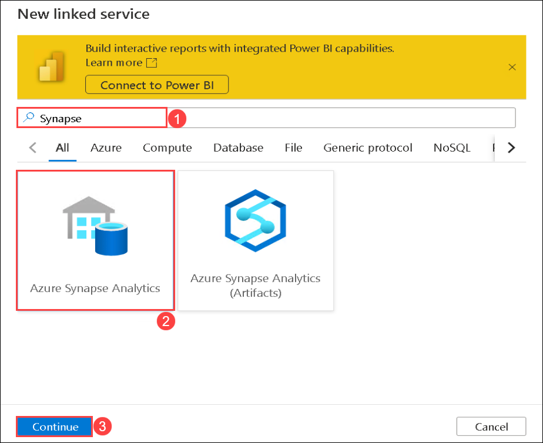

4. Now, enter the below values in New linked service pane:
   
    | Parameter                                  | Value                                                           |
    | ----------------------------------------   | --------------------------------------------------------------- |
    |  Name **(1)**                              |  **SynapseLS<inject key="DeploymentID" enableCopy="false"/>**   |
    |  Connecte via integration runtime **(2)**  |  **AutoResolveIntegrationRuntime**                              |
    |  Azure subscription **(3)**                |  **Select the available subscription in which Synapse workspace is deployed** |
    |  Server name **(4)**                       |  **sapdatasynwsSUFFIX**                                         |
    |  Database name **(5)**                     |  **sapdatasynsql**                                              |
    |  Authentication type **(6)**               |  **SQL authentication**                                         |
    |  User name **(7)**                         |  **azureadmin**                                                 |
    |  Password **(8)**                          |  **Sapdata!pass123**                                            |
    
   After adding all the above values, click on **Test connection** **(9)** to ensure that connection is successful and then click on **Create** **(10)**.
   
   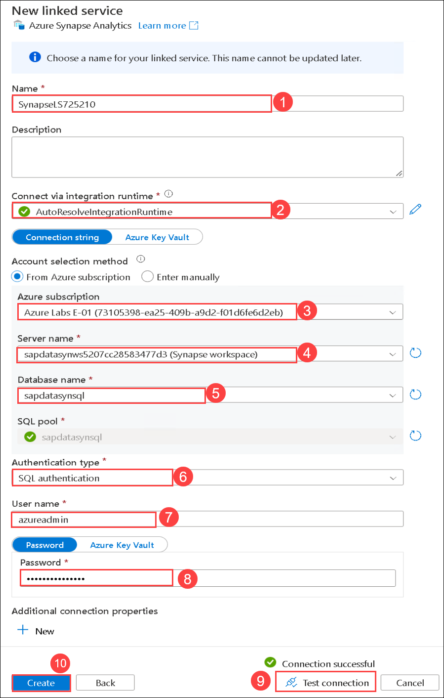
   
### Task 5: Create an Integration DataSet for the Synapse Sales Orders

1. Now, click on **Data** from the left-menu of Synapse studio and select **Linked**.

   
   
2. To create a new integration dataset, click on ```+``` **(1)** and select **Integration dataset** **(2)**.

   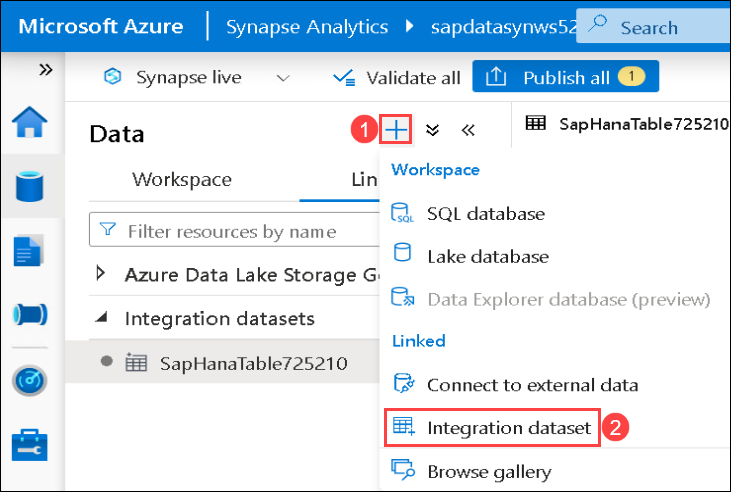
   
3. Search for **Synapse** **(1)** and select **Azure Synapse Analytics** **(2)**. Then click on **Continue** **(3)** in New integration dataset pane. 

   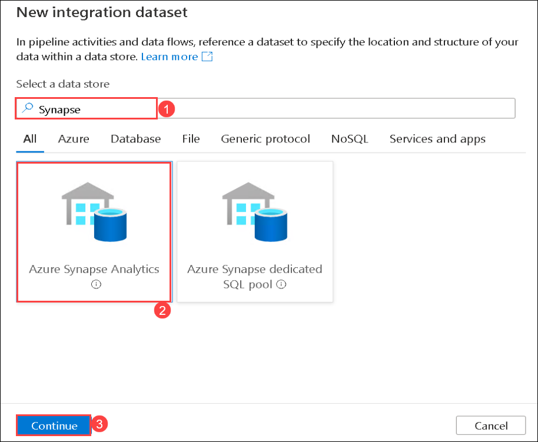
   
4. In Set properties pane, enter Name as **SynapseTable<inject key="DeploymentID" enableCopy="false"/>** **(1)** and select **SynapseLS<inject key="DeploymentID" enableCopy="false"/>** **(2)** for linked service from the drop-down which you have created earlier. Wait for few seconds to load the tables, search for  **dbo.SalesOrderHeaders** **(3)** table and select it from the drop-down. Then click on **Ok** **(4)**.

   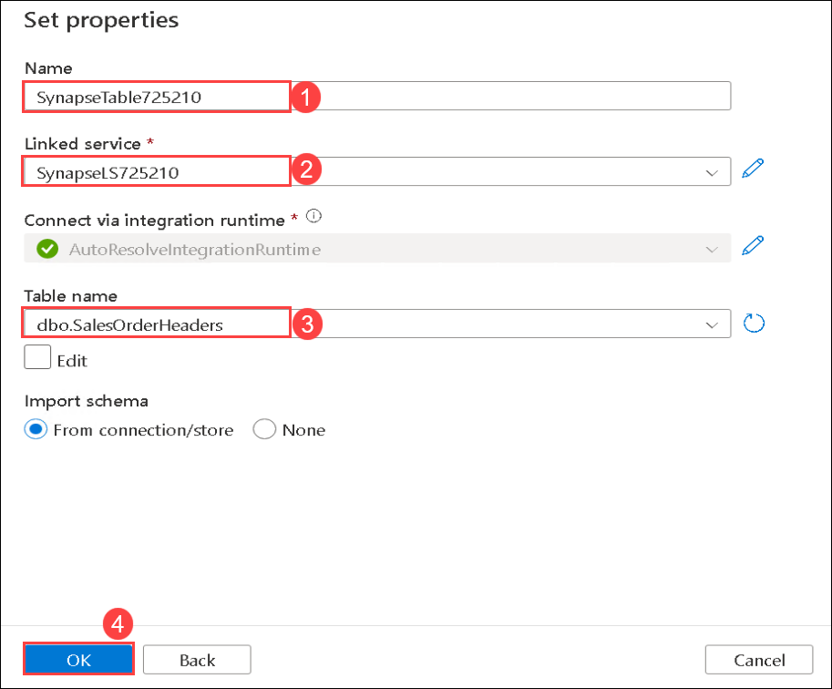
   
5. Once the Integration dataset is created, click on **Preview data** to see the column names for the selected table is the previous step.

   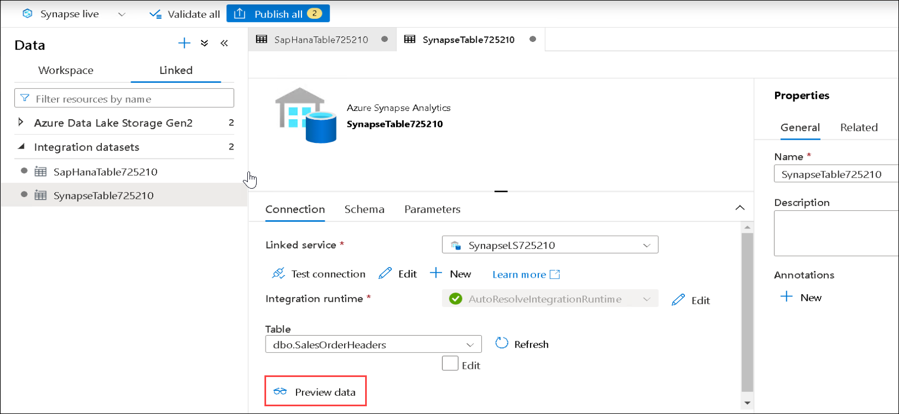

### Task 6: Create an Integration pipeline

1. Now, click on **Integrate** from the left-menu of Synapse studio.

   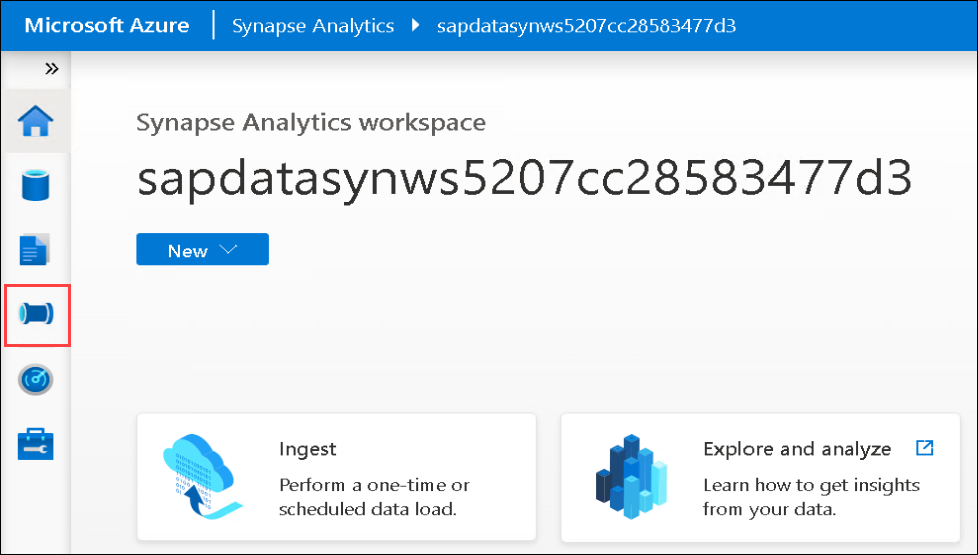
   
2. To create a new Pipeline, click on ```+``` **(1)** and select **Pipeline** **(2)**.

   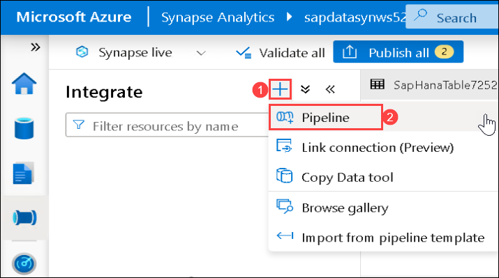
   
3. In Properties, under General enter the name as **ExtractSalesOrderHeaders** **(1)**. Under Move & transform from Activities menu, drag and drop the **Copy data** **(2)** option to the pipeline canvas. Then enter the name as **ExtractSalesOrderHeaders** **(3)** under General.

   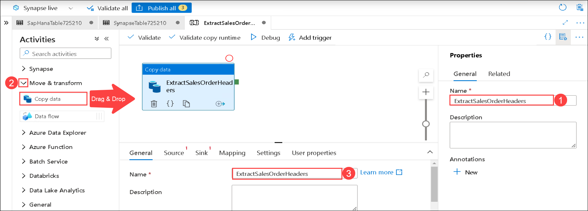
   
4. In the **Source** **(1)** tab, select **SapHanaTable<inject key="DeploymentID" enableCopy="false"/>** **(2)** Dataset as the source.

   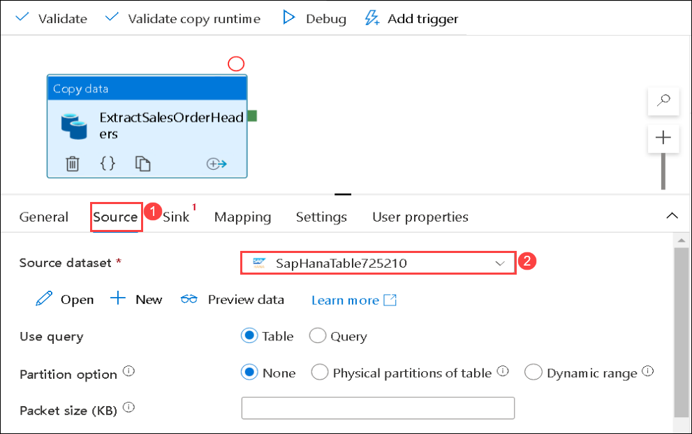

5. In the **Sink** **(1)** tab, select the **SynapseTable<inject key="DeploymentID" enableCopy="false"/>** **(2)** Dataset as the sink. Under Copy method ensure to select **PolyBase** **(3)**.

   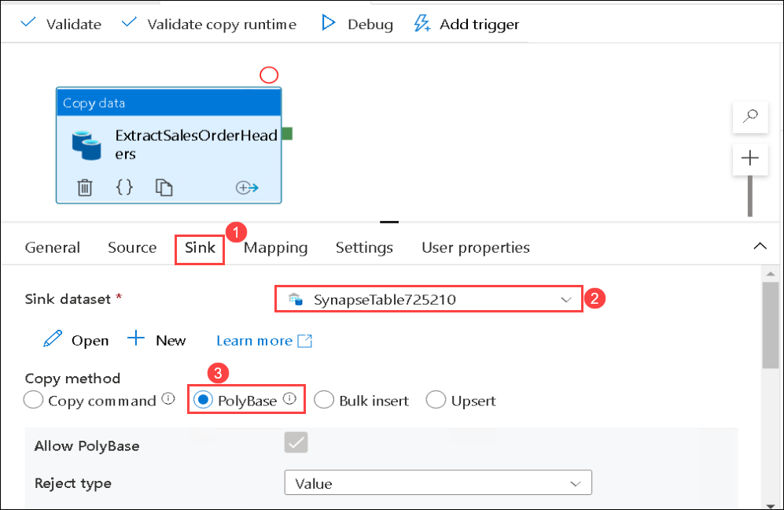

6. In the **Mapping** **(1)** tab, choose **Import schemas** (2). Since source and target fields have the same name, the system can auto-generate the mapping.

   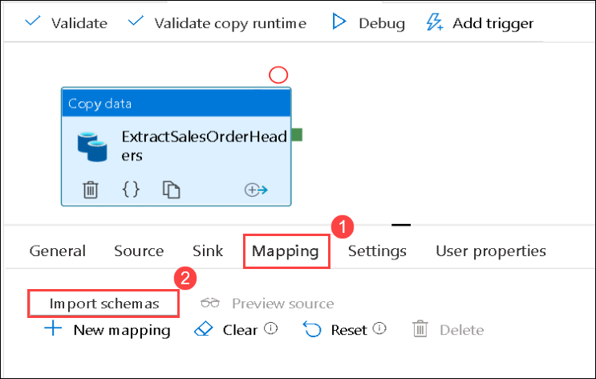

7. Once the Import schemas is completed, you will be able to see the Mapping tab as shown below.

   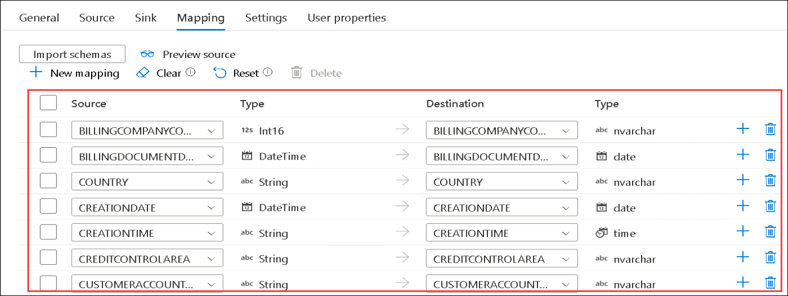

8. For the prediction model we will calculate the offset between the billing document date and the actual payment data. For this we need to have these date fields mapped to SQL Date fields. Therefore, go to the **View JSON Code** **{}** for the pipeline.

   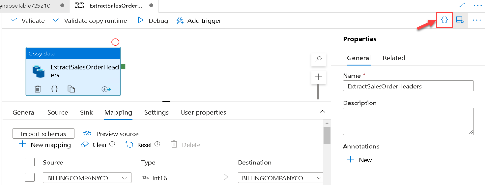

9. Add the parameters **convertDateToDatetime** and **convertTimeToTimespan** at the existing **typeproperties > source** element. The resulting document should looks as follows :

   ```bash
     "typeProperties": {
             "source": {
                   "type": "SapTableSource",
                   "partitionOption": "None",
                   "convertDateToDatetime": true,
                    "convertTimeToTimespan": true
              },
              "sink": { 
                        ...
    ```

    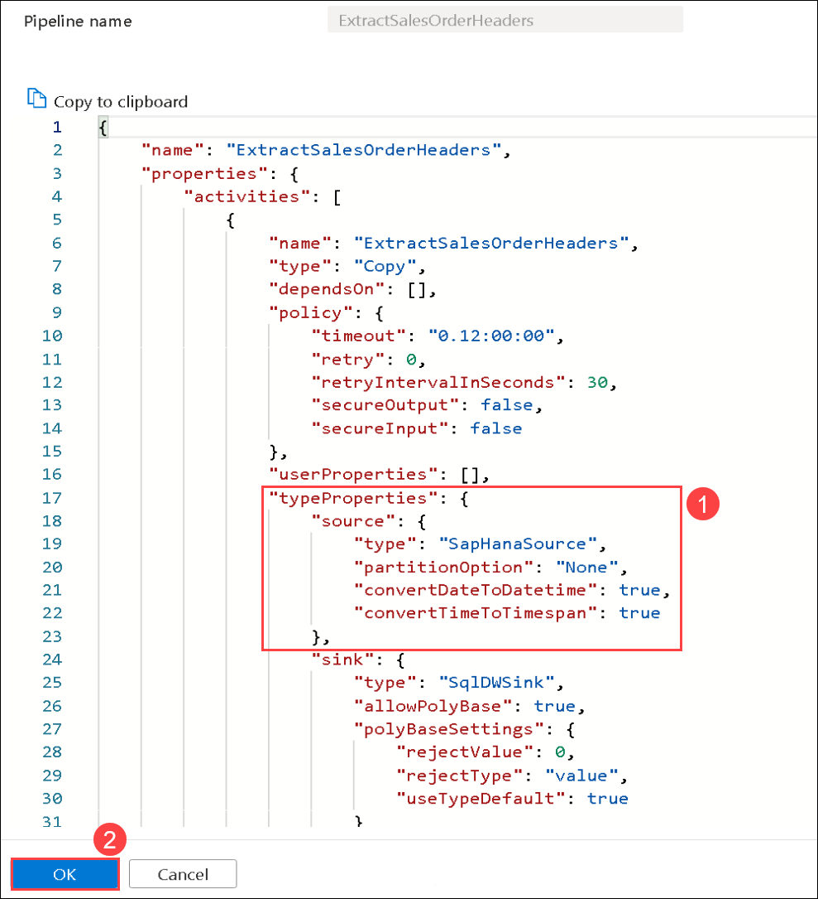

10. In the **Settings** **(1)** blade, check the box for **Enable staging** **(2)** and use the existing staging account linked service **sapdatasynwsSUFFIX** **(3)** to the Synapse Data Lake. Click on **Browse** **(4)** to the staging directory **sap-data-adls/staging** **(5)**, which was already created by the Terraform script.

    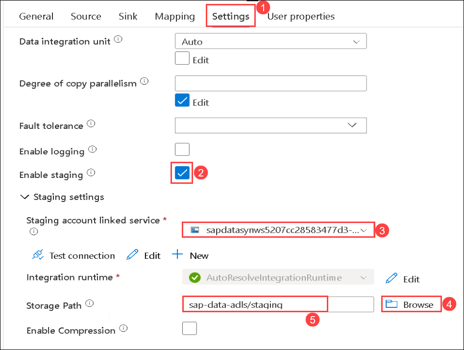

11. Now click **Publish all** at the top of the Synapse studio. In the Publish all pane, click on **Publish** to confirm.

    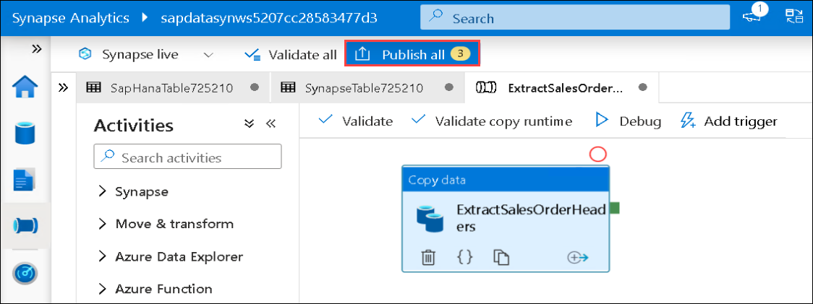

    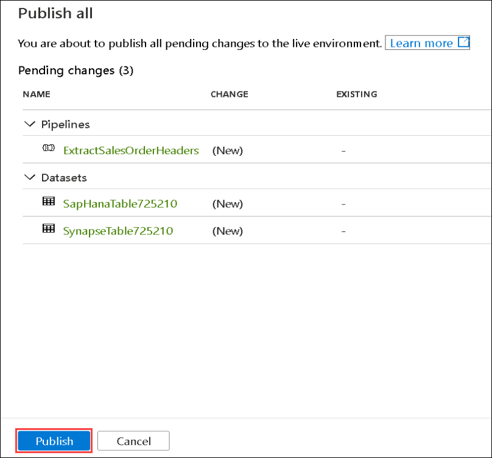

12. Once the Publish completed. click on **Add trigger** **(1)** and select **Trigger now** **(2)** to trigger the pipeline. In the Pipeline run pane, click on **Ok** to confirm.

    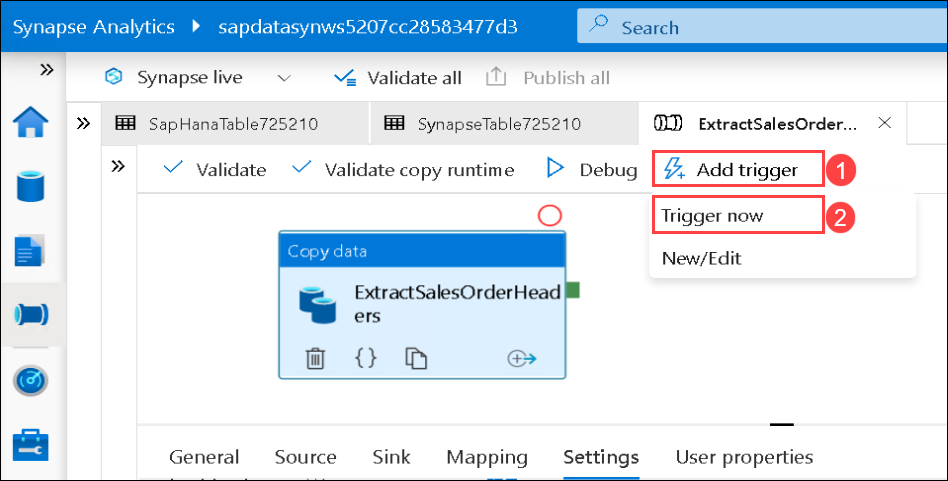
    
    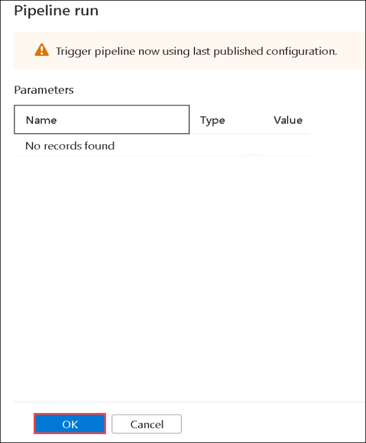

13. Swith to **Monitor** **(1)** from the left-menu, click on **Pipeline runs** **(2)** under Integration and then monitor the triggered **ExtractSalesOrderHeaders** pipeline is **Succeeded**.

    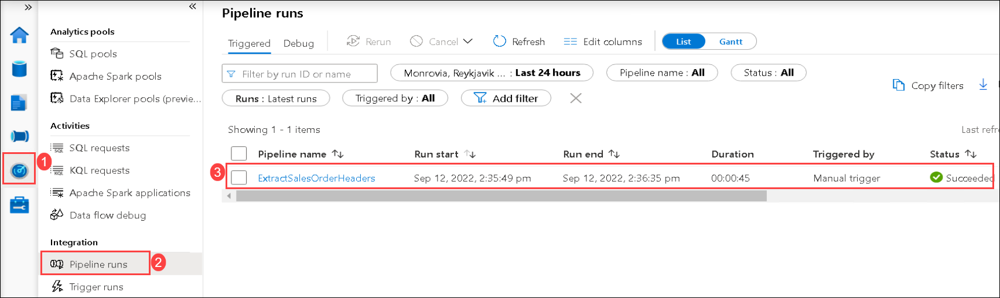

14. Check the result in Synapse using SQL. You can do this via the **Develop** **(1)**, click on ```+``` **(2)** and select **SQL script** **(3)** to create a new SQL script.

    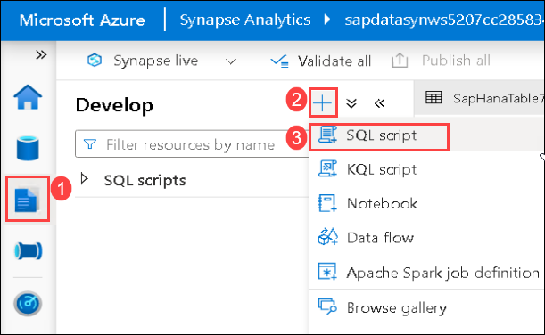

15. Enter the below SQL script into the codespace **(1)** and change the SQL pool ```Connect to``` **sapdatasynsql** **(2)**. Then click on **Run** **(3)** and explore the **Results** **(4)**.

    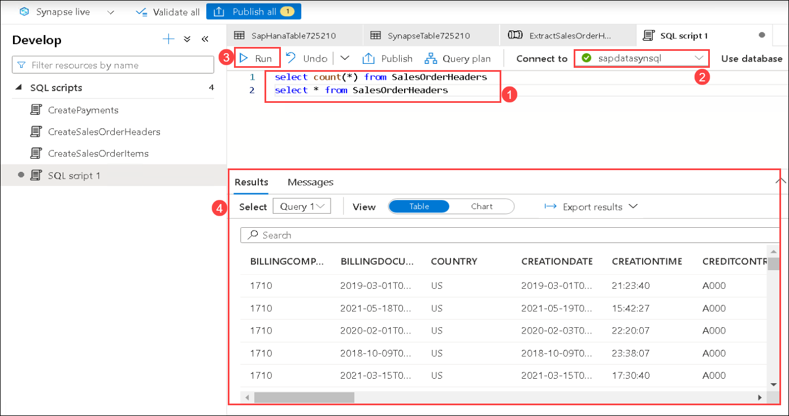
    
### Task 7: Create a Integration DataSet for the CosmosDB Payments data

1. Now, click on **Data** from the left-menu of Synapse studio and select **Linked**.

   

2. An Azure Synapse is deployed with an underlying Azure Data Lake Storage Gen2 linked service which was already created by the Terraform script. Click on down arrow of **Azure Data Lake Storage Gen2** **(1)**, followed by click on down arrow of **sapdatasynwsSUFFIX** **(2)** and then double-click on **sap-data-adls (Primary)** **(3)**. Ensure that you are inside the **sap-data-adls >staging** **(4)** directory.

   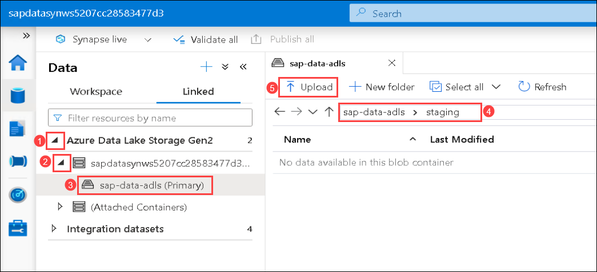

3. In the Upload Files pane, click on **Browse** **(1)** icon and navigate to ```C:\LabFiles``` directory and select the **paymentData_CAL2021.csv** **(2)** file from the local disk. Then click on **Upload** **(3)**.

   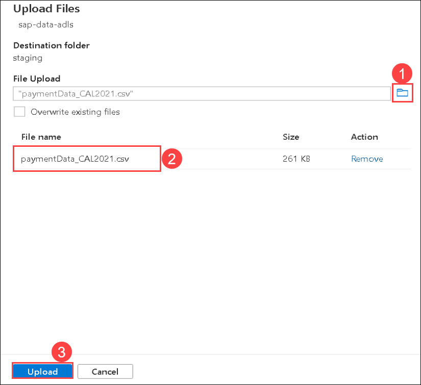
   
4. Once File upload completed, select the **paymentData_CAL2021.csv** **(1)** file and click on **New integration dataset** **(2)**.

   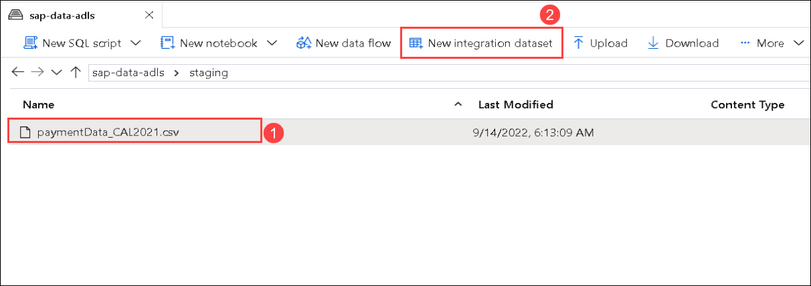
   
5. In the New integration dataset pane, enter the name as **PaymentDataset<inject key="DeploymentID" enableCopy="false"/>** **(1)** and for Format select **DelimitedText** **(2)** from the drop-down. Leave default for Import schema and click on **Create** **(3)**.

   

6. From the **PaymentDataset<inject key="DeploymentID" enableCopy="false"/>** integration dataset pane, select **Semicolon(;)** **(1)** for **Column delimiter** and ensure to **check box** **(2)** for **First row as header**. Then click on **Preview data** **(3)** to see the the payments data.

   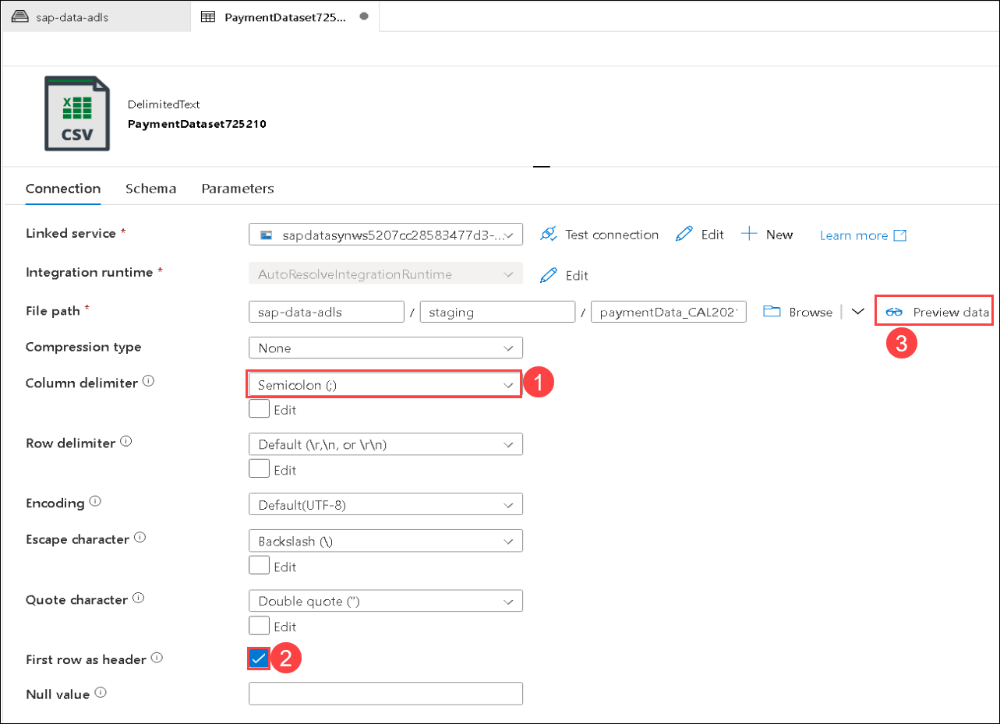
   
7.    


