# Exercise 4: Power BI Visualization

In this exercise you will be setting up the powerBI reports for the extracted data in the last exercise. You will be using [PowerBI Desktop](https://powerbi.microsoft.com/en-us/desktop/) for this.

### Task 1: Setup & Importing Data to Power BI

1. Navigate to the **microhack-<inject key="DeploymentID" enableCopy="false"/>-rg** resource group in the Azure portal and open the Synapse workspace named **sapdatasynwsSUFFIX** from the resources.

   
   
2. In the **Overview** of **sapdatasynwsSUFFIX** Synapse workspace, copy the **Dedicated SQL endpoint** and paste it in notepad for later use.

   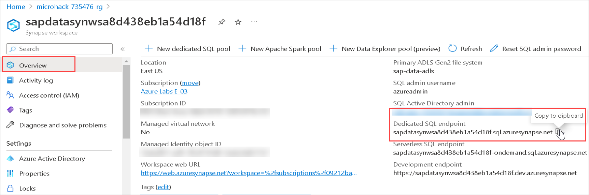
   
3. Open the **Power BI Desktop** application from the LabVM Desktop.

   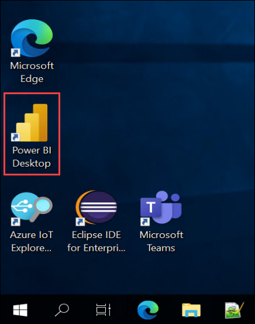
   
4. On the splash screen, select the **Get Data** item.

   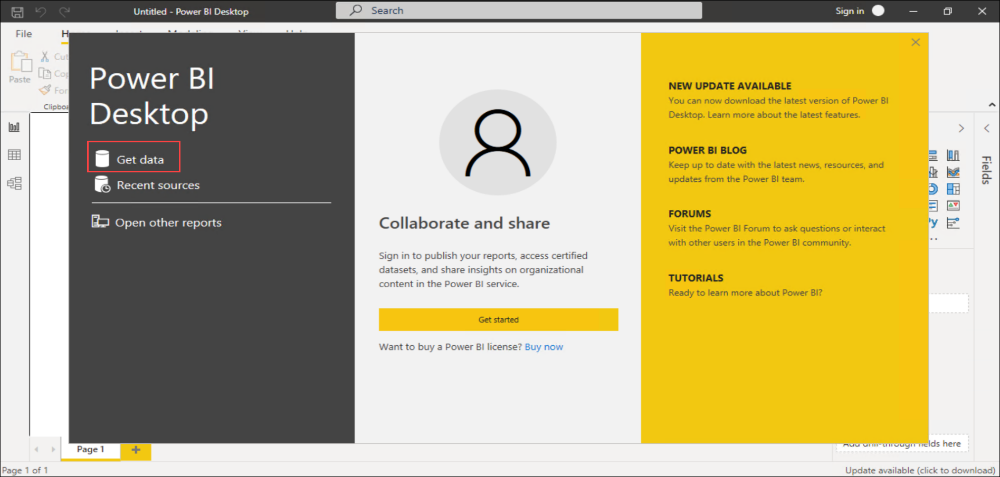
  
5. In the **Get data** pane, search for **Synapse** **(1)** and select **Azure Synapse Analytics (SQL DW)** **(2)**. Then click on **Connect** **(3)**.

   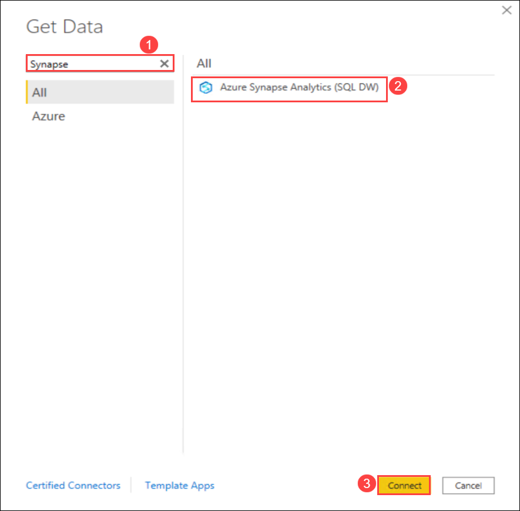

6. On the SQL Server database dialog, enter the below values:

    | Field | Value |
    |-------|-------|
    | Server **(1)** | Enter the **Dedicated SQL endpoint** value recorded in the earlier steps. |
    | Database **(2)** | **sapdatasynsql** |
    | Data Connectivity mode **(3)** | Select **Import**. |
    
   After adding all the above values, click on **Ok** **(4)**.
   
   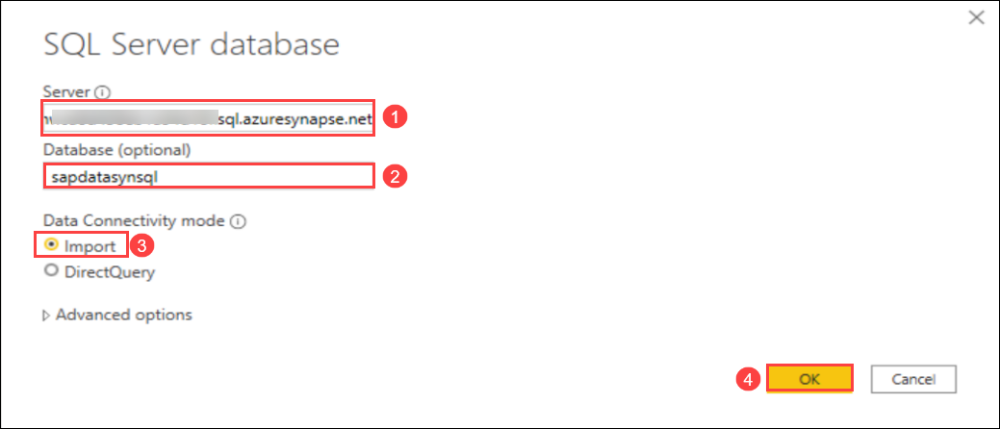
   
7. An authentication dialog displays, select **Microsoft account** **(1)** from the left menu and then select the **Sign in** **(2)** button.

   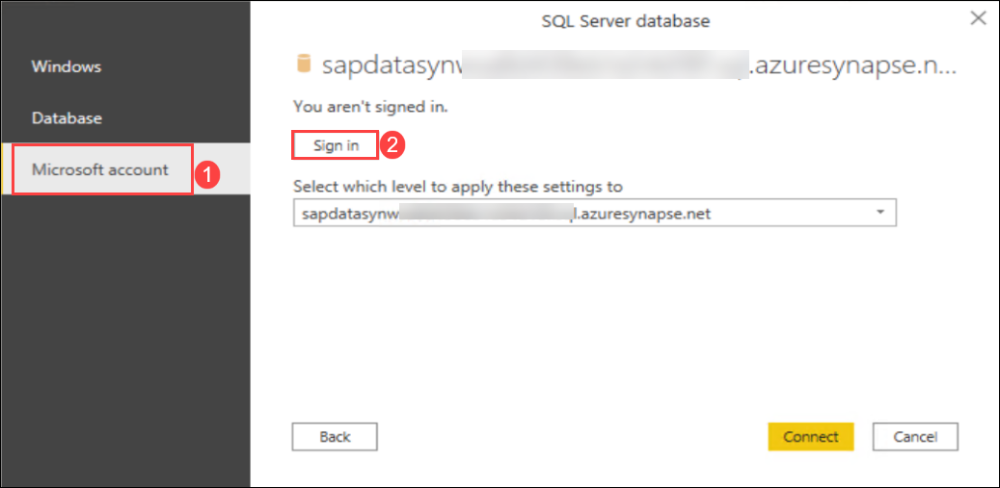
   
8. You will see the Sign in dialog apperas, enter the following username, and, then click on **Next**.

   * Email/Username: <inject key="AzureAdUserEmail"></inject>

   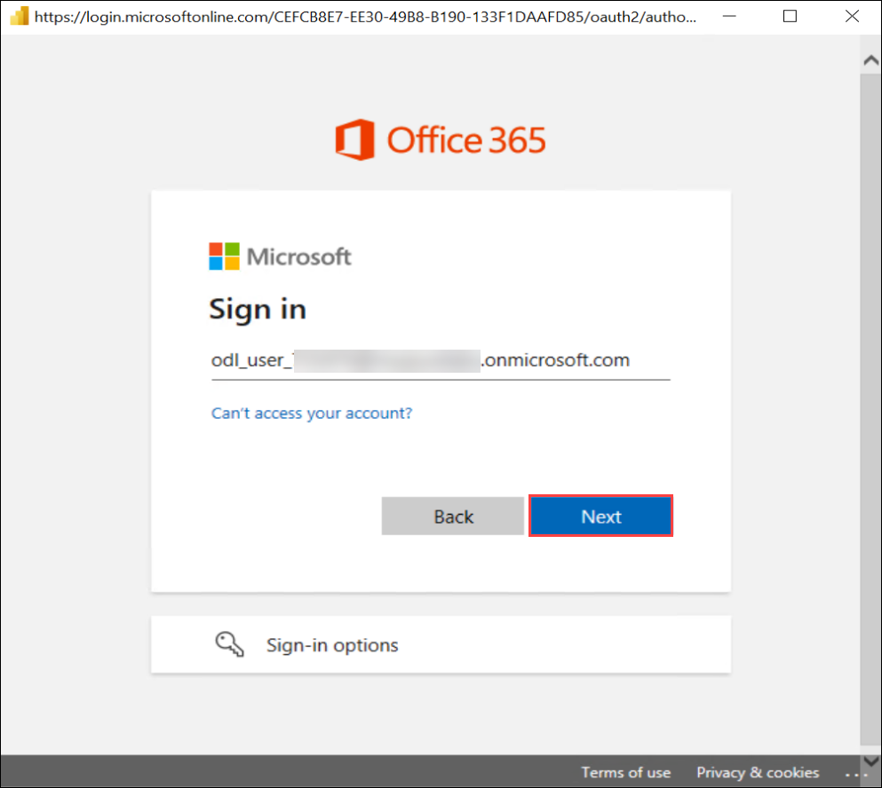
   
9. Now enter the following password and click on **Sign in**. 

   * Password: <inject key="AzureAdUserPassword"></inject>

   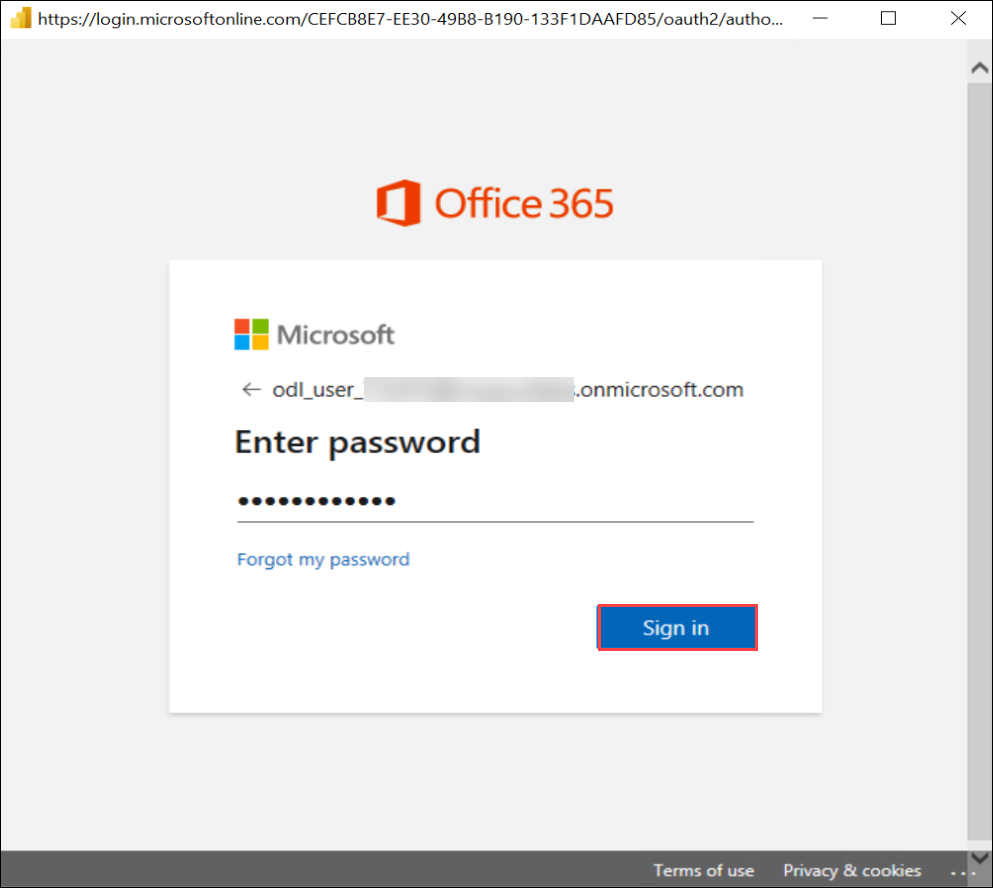
   
10. Once signed in, select the **Connect** button on the dialog.

    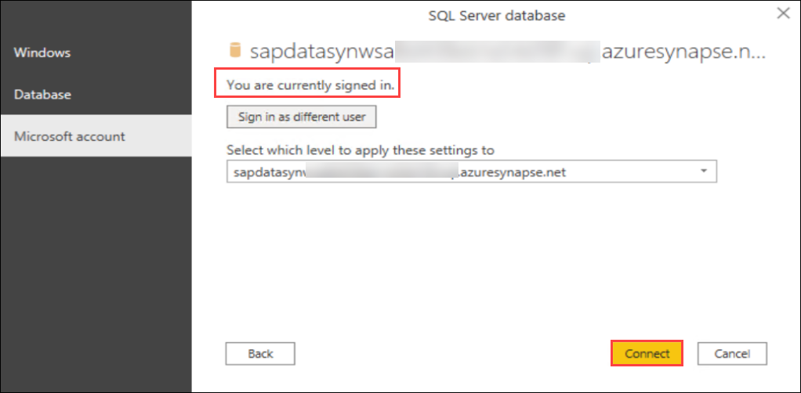
    
11. On the Navigator dialog, **check the box** next to all three tables and then select the **Transform Data** button.

    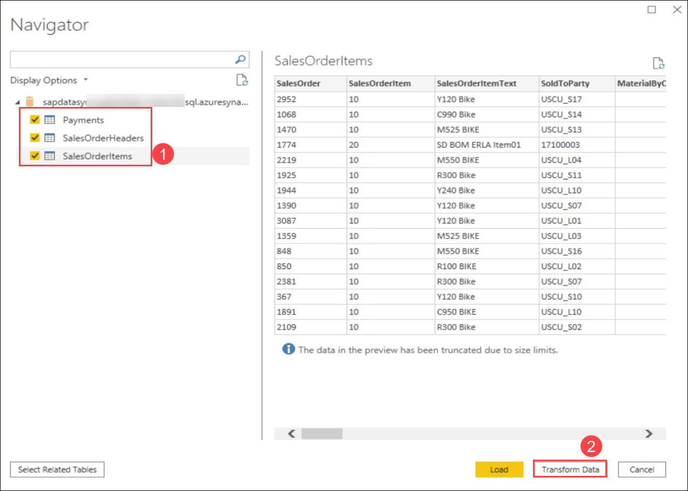
    
12. Once the data is transformed, you will be seeing the Power Query editor window as shown below:

    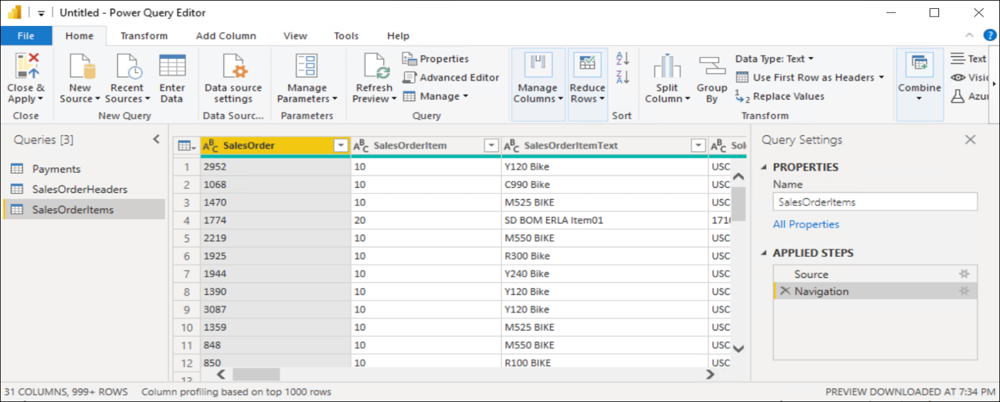

13. The columns in the tables representing sales order numbers were incorrectly interpreted as strings by Power BI. In the Power Query editor screen, select **SalesOrderItems** **(1)** from the Queries pane, then right-click on the **SalesOrder** **(2)** field and expand the **Change Type** **(3)** item and choose **Whole Number** **(4)**.

    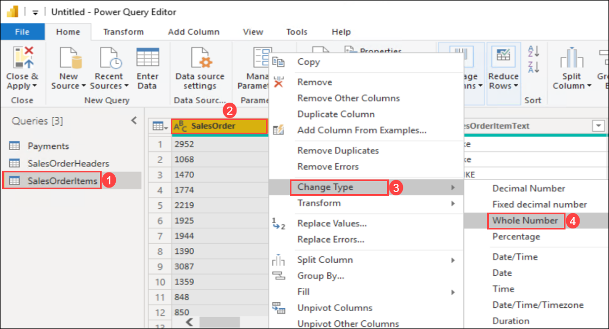
    
14. Repeat the previous step, this time changing the type of the following table columns to Whole Number.

    | Table (Queries pane) | Column |
    |-------|-------|
    | SalesOrderHeaders | SALESDOCUMENT |
    | Payments | SalesOrderNr |
    
    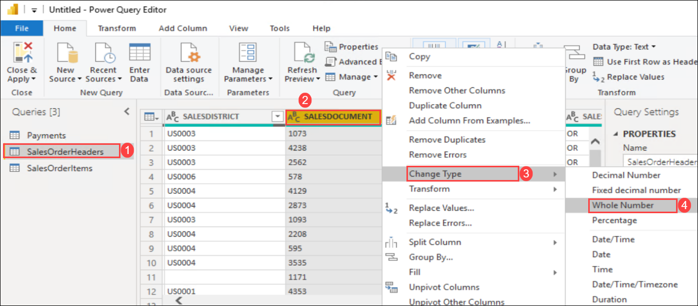
    
    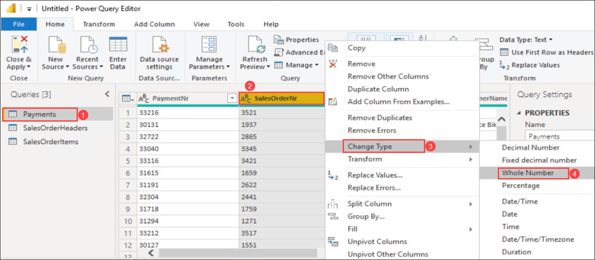
    
15. Select **Close & Apply** in the Power Query editor toolbar.

    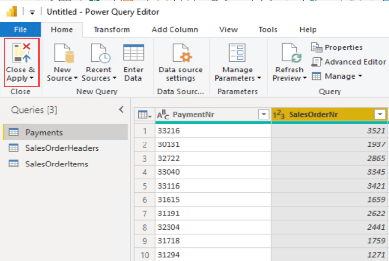
    
16. Once the data loading is completed, you will be able to see all the three tables under the Fields in Power BI Desktop application.

    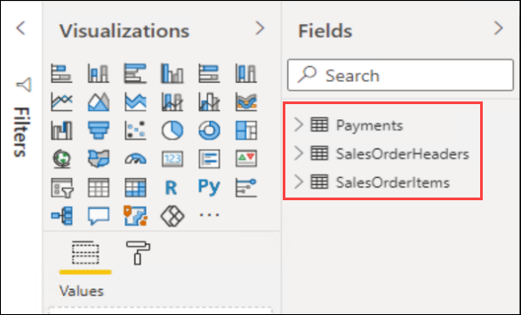
  
   
   
   
   
   
   
  
