# Exercise 5: Predict Incoming Cashflow

Azure Machine Learning is a cloud service for accelerating and managing the machine learning project lifecycle. Machine learning professionals, data scientists, and engineers can use it in their day-to-day workflows: Train and deploy models, and manage MLOps. To learn more about Azure Machine Learning refer: `https://learn.microsoft.com/en-us/azure/machine-learning/overview-what-is-azure-machine-learning`

Machine learning (ML) models are used for making predictions or identifying patterns in data that are not immediately visible to human analysts. These models can be used to solve a wide range of business problems, including customer segmentation, fraud detection, and predictive maintenance.

The process of creating an ML model involves training the model on historical data and then using the trained model to make predictions on new, unseen data. The accuracy and reliability of the predictions depend on the quality of the training data, the selection of the ML algorithm, and the tuning of the model hyperparameters.

Automated ML provides a way to streamline the process of creating ML models by automating many of the tedious and time-consuming tasks involved in the process. By automating the process, data scientists and analysts can focus on higher-level tasks such as feature engineering, model selection, and performance evaluation.

Deploying the best-trained model as a web service makes it easy to integrate the model into existing applications or workflows and to make real-time predictions on new data. This can help organizations make better decisions based on data-driven insights and can lead to improved efficiency, productivity, and profitability.

In summary, ML run, and the best-trained model are essential components of the machine learning pipeline and enable organizations to make accurate and reliable predictions on new data.

In this exercise, you will be creating **Automated ML Run** and deploying **best-trained model** that predicts incoming cash flow based on historical payment delays for previous sales. You will also test the best model using the **SalesPaymentFull** data which is the integrated data of **SalesOrdersHeaders** and **Payments** and also you will review the test end results.

The best model is selected based on the error between the predicted **Payment Offset** and the **Actual offset**. The model with the least error is selected. You can find more refernces about how automated ML works from here: `https://docs.microsoft.com/en-us/azure/machine-learning/concept-automated-ml#how-automated-ml-works`

### Task 1: Create a View in Synapse Workspace

In SQL, a view is a virtual table based on the result-set of an SQL statement.

A view contains rows and columns, just like a real table. The fields in a view are fields from one or more real tables in the database. A view always shows up-to-date data! The database engine recreates the view, every time a user queries it.

1. Navigate to browser tab in which **Synapse Studio** is open. From the Synapse Studio, click on **Develop** **(1)** from the left-menu. Click on```+``` **(2)** and select **SQL script** **(3)** to create a new view.

   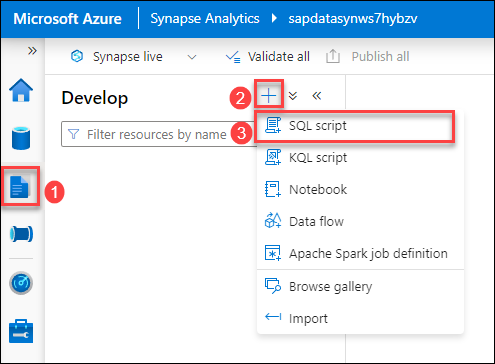
   
2. In the Properties, enter the Name as **CreateSalesPaymentsFull** **(1)** and change the SQL pool ```Connect to``` **sapdatasynsql** **(2)**. Then copy the code below and paste it in the codespace **(3)** and click on **Run** **(4)**.

   ```sql
   CREATE VIEW [dbo].[SalesPaymentsFull]
	        AS SELECT s.[SALESDOCUMENT]
      , s.[CUSTOMERNAME]
      , s.[CUSTOMERGROUP]
      , s.[BILLINGCOMPANYCODE]
      , s.[BILLINGDOCUMENTDATE]
      , p.[PaymentDate] as PAYMENTDATE
      , s.[CUSTOMERACCOUNTGROUP]
      , s.[CREDITCONTROLAREA]
      , s.[DISTRIBUTIONCHANNEL]
      , s.[ORGANIZATIONDIVISION]
      , s.[SALESDISTRICT]
      , s.[SALESGROUP]
      , s.[SALESOFFICE]
      , s.[SALESORGANIZATION]
      , s.[SDDOCUMENTCATEGORY]
      , s.[CITYNAME]
      , s.[POSTALCODE]
      , DATEDIFF(dayofyear, s.BILLINGDOCUMENTDATE, p.PaymentDate) as PAYMENTDELAYINDAYS
    FROM [dbo].[SalesOrderHeaders] as s
   JOIN [dbo].[Payments] as p ON REPLACE(LTRIM(REPLACE(s.[SALESDOCUMENT], '0', ' ')), ' ', '0') = p.[SalesOrderNr]
   ```
   
   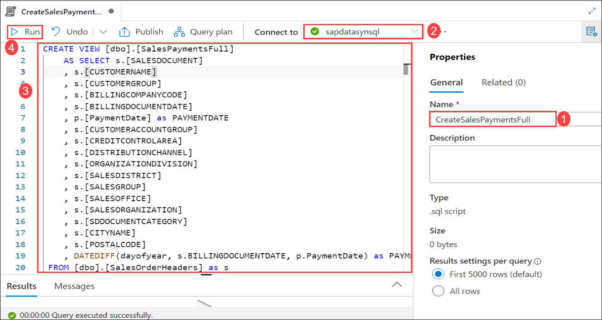
   
3. From the **Data** **(1)** tab, click on **Workspace** **(2)** and select **sapdatasynsql** SQL database **(3)**. You will see the created **dbo.SalesPaymentsFull** view under **Views** **(4)**. If you are not able to see, click on eclipse **(...)** button next to **Views** and select **Refresh**.

   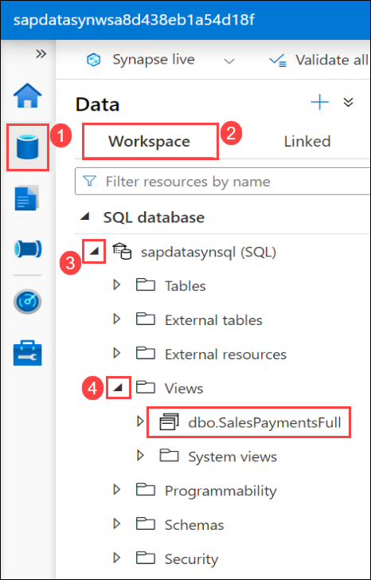
   
4. You can now test the view by executing SQL. From **Develop** **(1)**, click on ```+``` **(2)** and select **SQL script** **(3)** to create a new SQL script.

   
   
5. Enter the below SQL script into the codespace **(1)** and change the SQL pool ```Connect to``` **sapdatasynsql** **(2)**. Then click on **Run** **(3)** and explore the **Results** **(4)**.

    ```bash
    select * from SalesPaymentsFull
    ```

    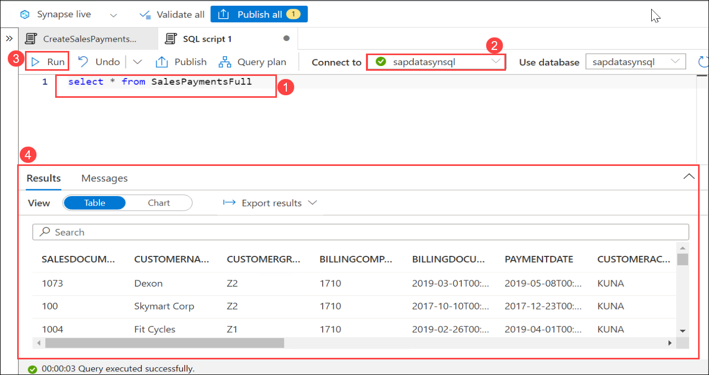   
   
### Task 2: Configure the Data store in ML studio

1. Navigate to the **microhack-rg-<inject key="DeploymentID" enableCopy="false"/>** resource group in the Azure portal and open the Azure Machine Learning workspace named **sap-data-ml-ws** from the resources.

   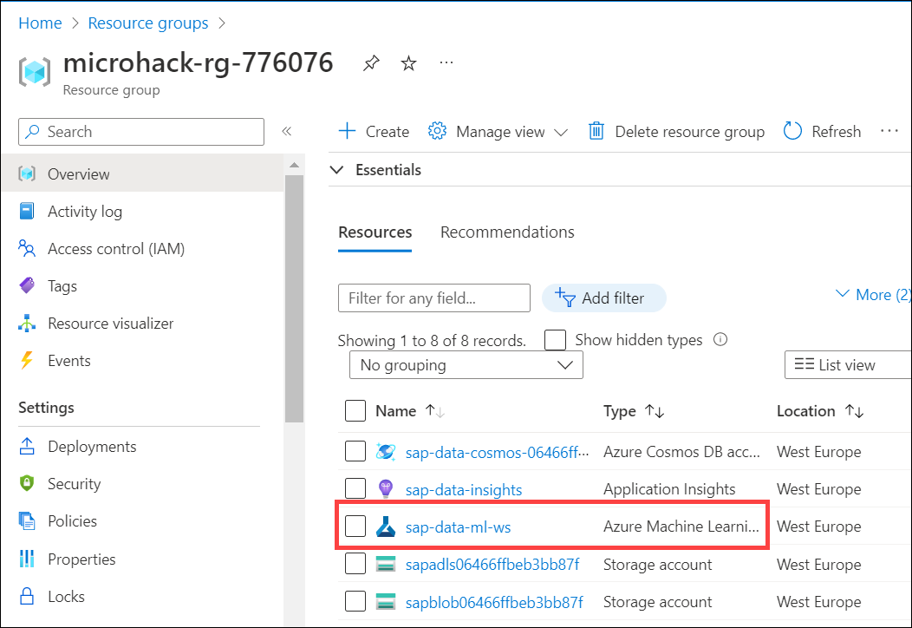
   
2. Once you are in Overview page of **sap-data-ml-ws** Azure Machine Learning workspace, click on **Networking(1)** under Settings, select **All networks(2)** for Public network access, and click **save(3)**. 

	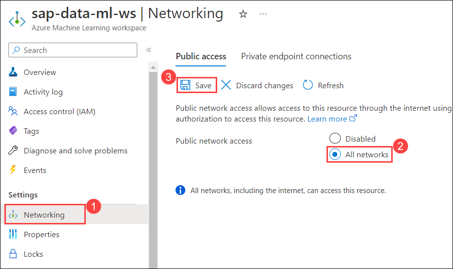

3. Navigate back to **Overview(1)** page of **sap-data-ml-ws** Azure Machine Learning workspace, click on **Launch studio(2)**. You will be navigated to Microsoft Azure Machine Learning Studio.

   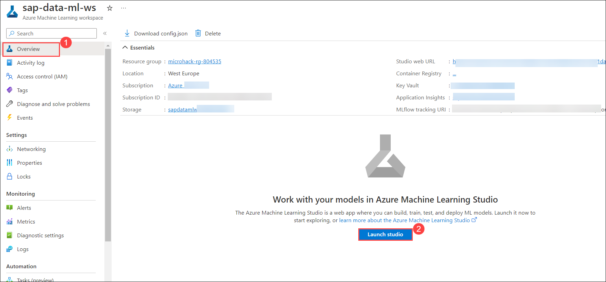
   
4. From **Machine Learning Studio**, scroll-down to **Assets** from left-menu. Click on **Data (1)** then **Datastores** **(2)**.

   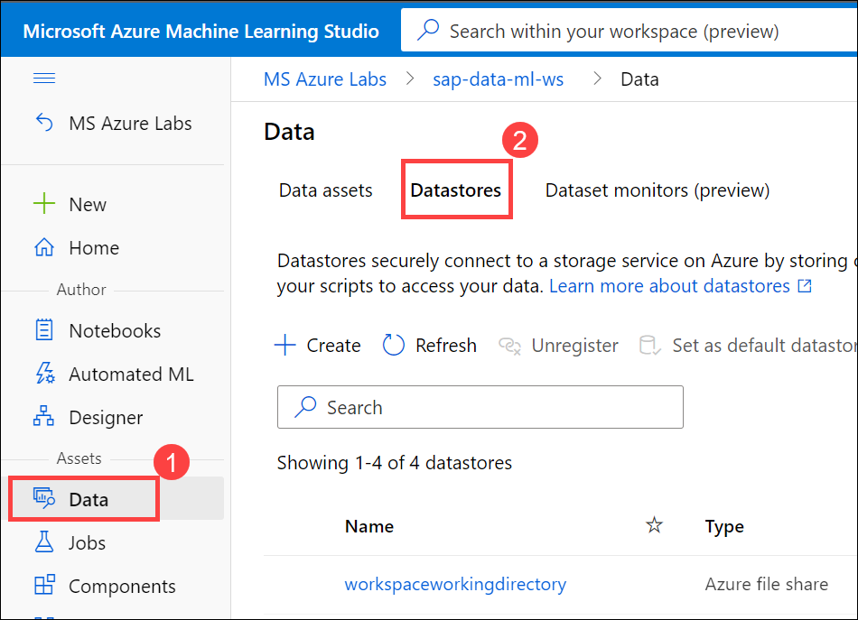
   
5. On the **Datastores** **(1)** tab and select **+ Create** **(2)** to create a new datastore.

   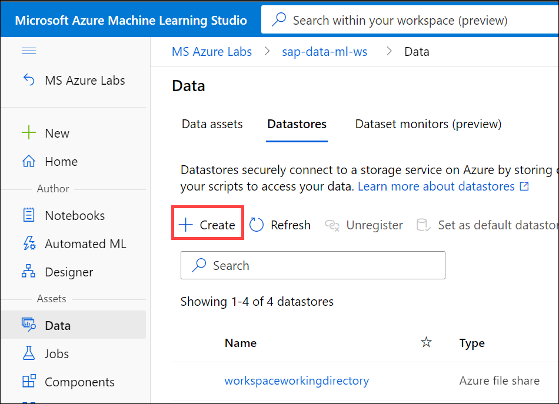
   
6. In the Create datastore pane, enter the following values in the respective fields and click on **Create** **(11)**.

   | Field                         | Value                        |
   |------------------------------ |----------------------------- |
   | Datastore name (1)            | **sap_data_ml_ds**           |
   | Datastore type (2)           | **Azure SQL Database**       |
   | Account Selection method (3)  | select `Enter Manually`      |
   | Enter your Synapse Workspace name as Server Name (4) | **sapdatasynwsSUFFIX** |
   | Enter your Synapse SQL Pool as Database Name (5) | **sapdatasynsql** |
   | Select your Subscription (6)  | Select the subscription in which **microhack-rg-<inject key="DeploymentID" enableCopy="false"/>** resource group is deployed |
   | Enter your resource group name (7) | **microhack-rg-<inject key="DeploymentID" enableCopy="false"/>** |
   | Authentication Type (8) | **SQL Authentication** |
   | Enter UserId (9)        | **azureadmin**         |
   | Enter Password (10)     |  **Sapdata!pass123**   |
   
   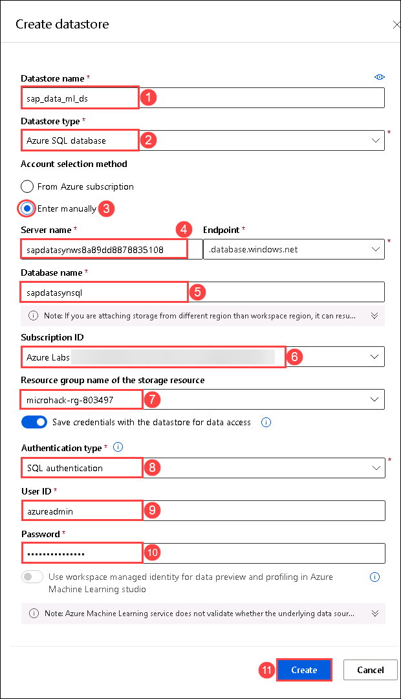
   
7. Once the Datastore is Successfully created, you will be able to see the **sap_data_ml_ds** listed under Datastores.

   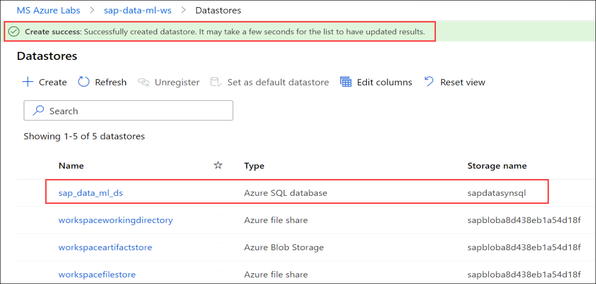    

### Task 3: Configure the Automated ML Run

1. In the left menu, click on **Automated ML** **(1)** and select **New Automated ML Run** **(2)**.

   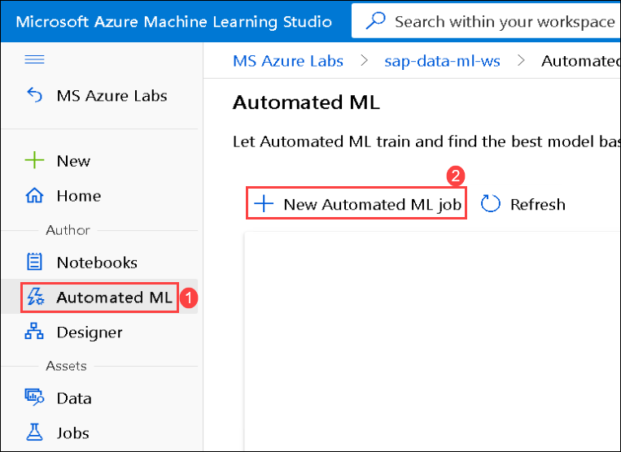
   
2. On the **Select data asset** step, click on **Create**.

   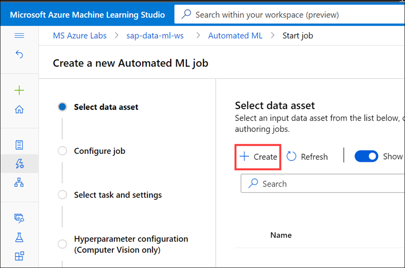
   
3. On the **Set the name and type for your data asset** blade,  name the dataset as **SalesPaymentsView** **(1)** then click on **Next** **(2)**.

   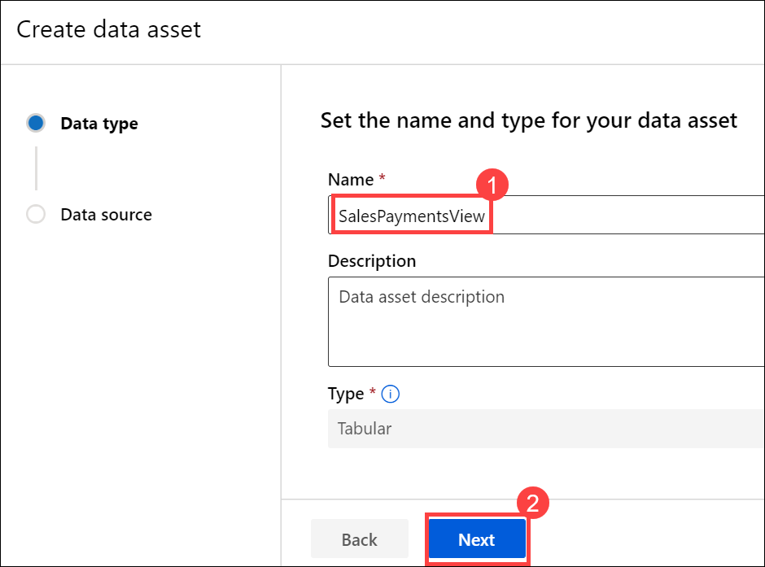
   
1. On the **Choose a source for your data asset** blade, select **From SQL databases** **(1)** then click on **Next** **(2)**.

   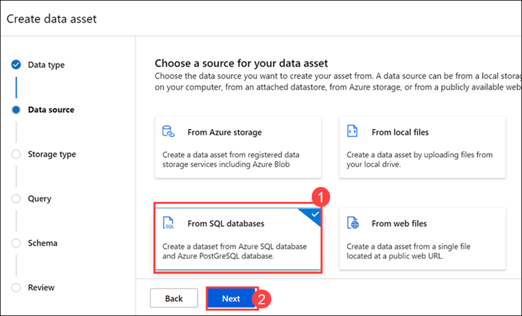

1. On the **Select a datastore** blade, select the **sap_data_ml_ds** **(1)** datastore then click on **Next** **(2)**.

   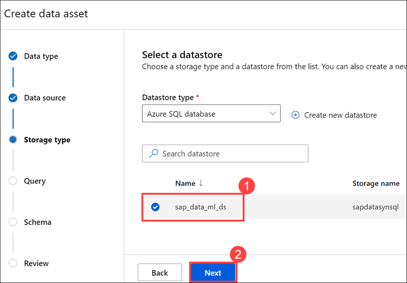
   
4. On the **Query the database** blade, add the below SQL query **(2)** in the editor and click on **Run query** to get all the data from the view defined above. Click on **Next** **(3)**. 

   ```sql
   select * from SalesPaymentsFull
   ```  
   
   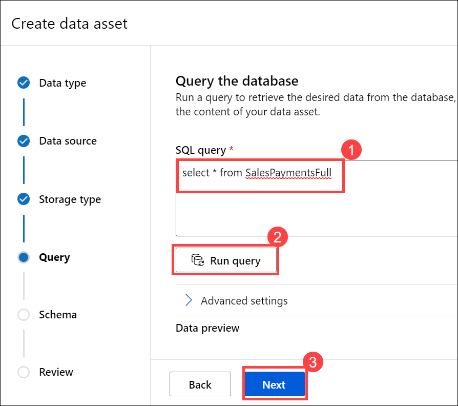

6. On the **Schema** step, toggle the following **fields off** to exclude them from the dataset and then select **Next**:

    - SALESDOCUMENT
    - BILLINGDOCUMENTDATE
    - PAYMENTDATE
    - SALESGROUP
    - SALESOFFICE

   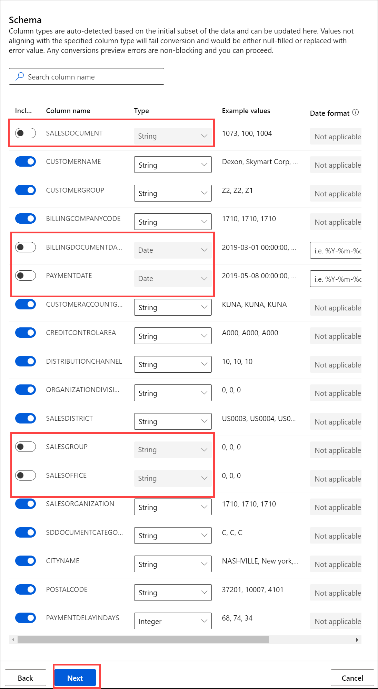
   
7. On the **Review** blade, review the details and click on **Create**.

   
   
   > Note: If you are not able to see the datset, click on **Refresh** on the **Select data asset** blade to fetch the recent data.

8. On the Select data asset step, select **SalesPaymentsView** **(1)** from the list and select **Next** **(2)**.

   
   
9. On the Configure job step, enter the values mentioned below:

    | Field | Value |
    |-------|-------|
    | Experiment name (1)     | Check for **Create new**   |
    | New experiment name (2) | Enter **sap-data-ml-experiment** |
    | Target column (3) | Select **PAYMENTDELAYINDAYS** |
    | Select compute type (4) | Select **Compute cluster** |
    | Select Azure ML compute cluster (5) | Click on **+ New** |
   
   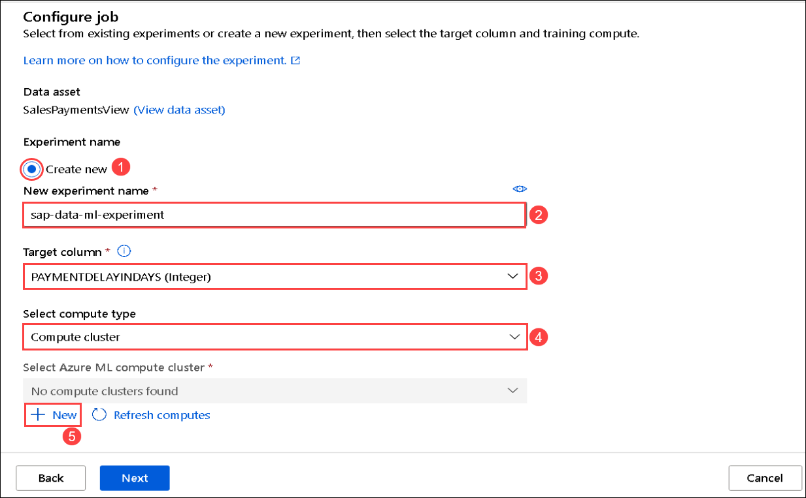
   
10. In the Create compute cluster blade Virtual machine step, accept the default values and select **Next**.

     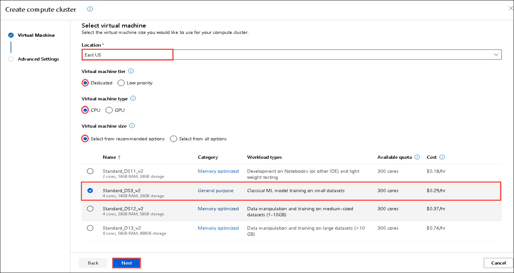
     
11. In the Create compute cluster blade Advanced settings, enter the below mentioned values and then select **Create** **(3)**. It takes a few moments for the cluster to be provisioned.

    | Field | Value |
    |-------|-------|
    | Compute name (1) | Enter **sap-data-ml-vm** |
    | Maximum number of nodes (2) | Enter `3` |
    
    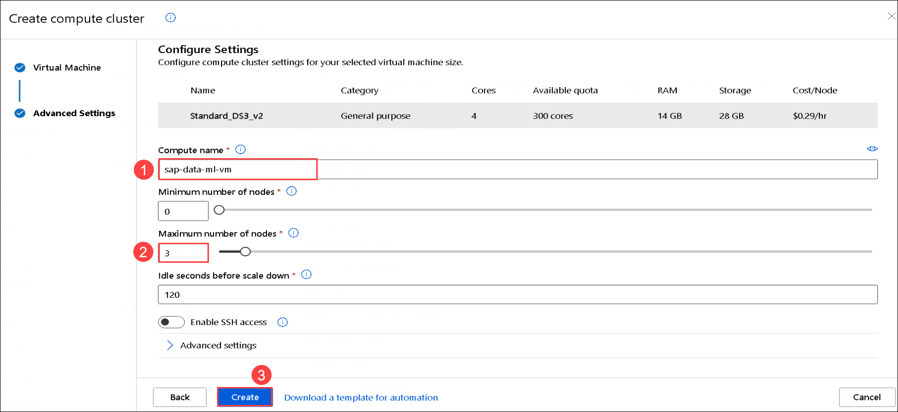
    
12. Once the compute cluster is created successfully, you will be navigated back to the Configure job step. Select the **sap-data-ml-vm** **(1)** computer cluster For Select Azure ML compute cluster from the drop-down and select **Next** **(2)**.

    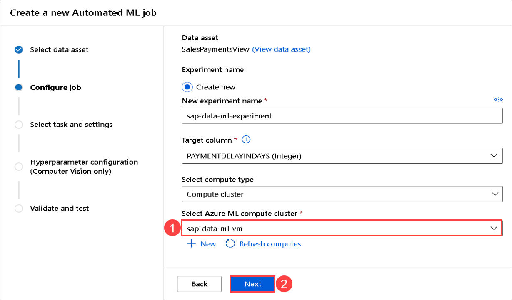
     
13. In the Select task and settings step, select **Regression** **(1)**, then select **View additional configuration settings** **(2)**.

    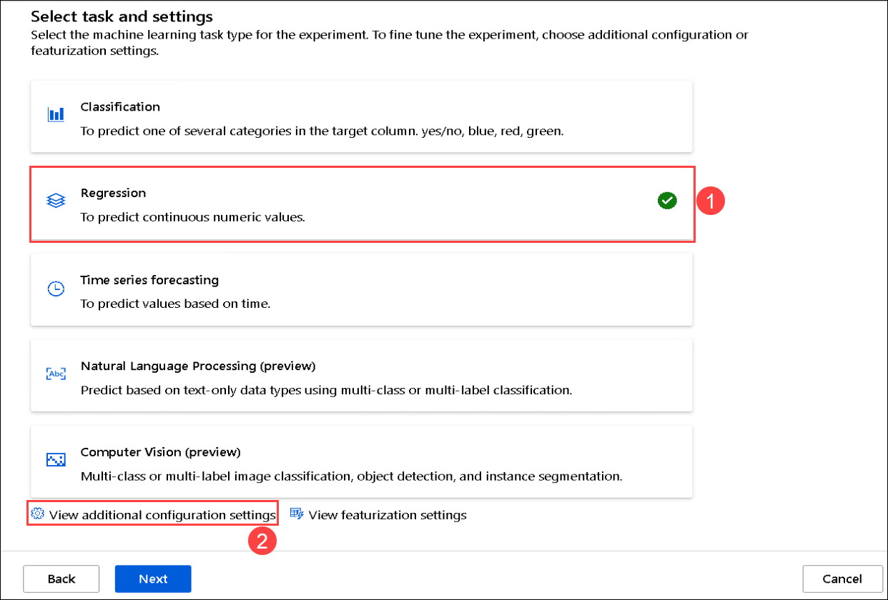
    
14. In the Additional configurations blade, select the Primary metric as **Normalized root mean squared error** **(1)**, then expand the **Blocked models** **(2)** drop down, check the following items, and select **Save** **(3)**. 
     > Info: This will reduce the time to train the model. Make sure that the **DecisionTree** and **XGBoostRegressor** are unchecked.

     - ElasticNet
     - GradientBoosting
     - KNN
     - LassoLars
     - SGD
     - RandomForest
     - ExtremeRandomTrees
     - LightGBM
     - FastLinearRegressor
     - OnlineGradientDescentRegressor    
   
    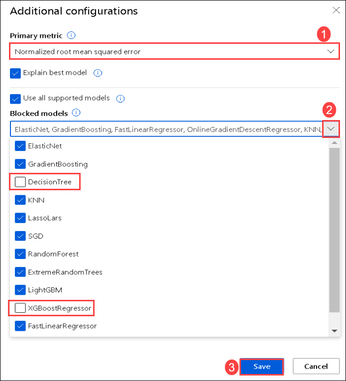
    
15. Select **Next** on the Select task and settings step. On the Validate and test step, select **Finish**.

    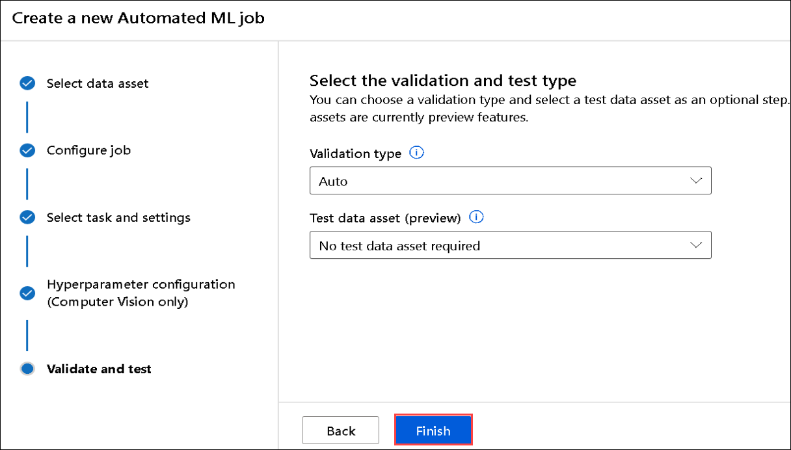
    
16. The job has started creating and has opened in the browser. Use the **Refresh** button to monitor the current state.

    > **Note**: Training will take approximately 15-20 minutes.

    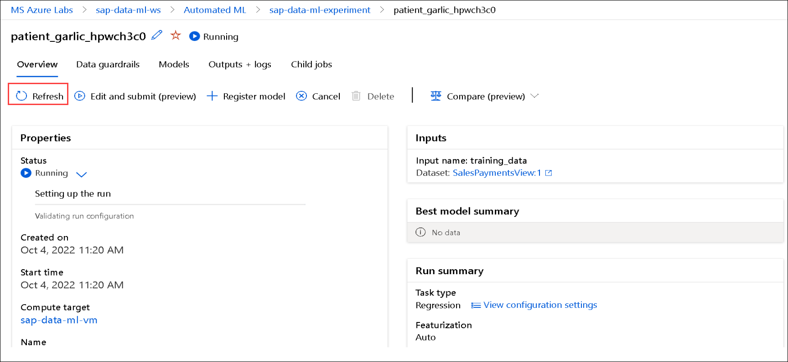
    
17. During the run you can follow-up on the tested models via **Models** tab.

    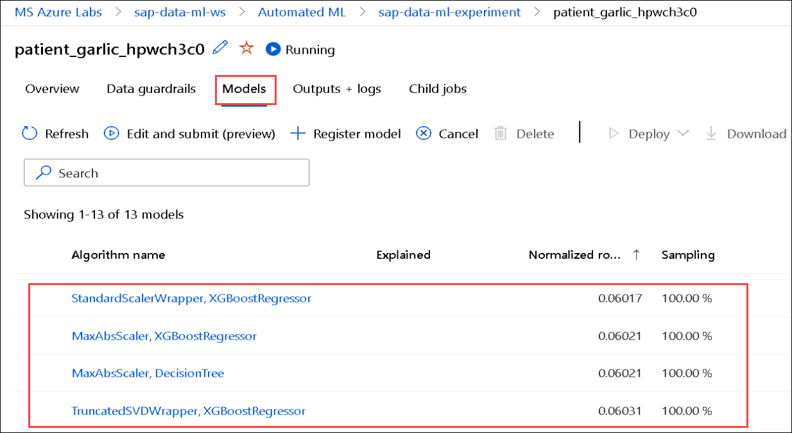
    
### Task 4: Deploy the best trained Model

1. Once the Automated ML job indicates a **Completed** status **(1)**, scroll-down to Best model summary card on the screen and select the hyperlink beneath the **Algorithm name** **(2)** heading.

   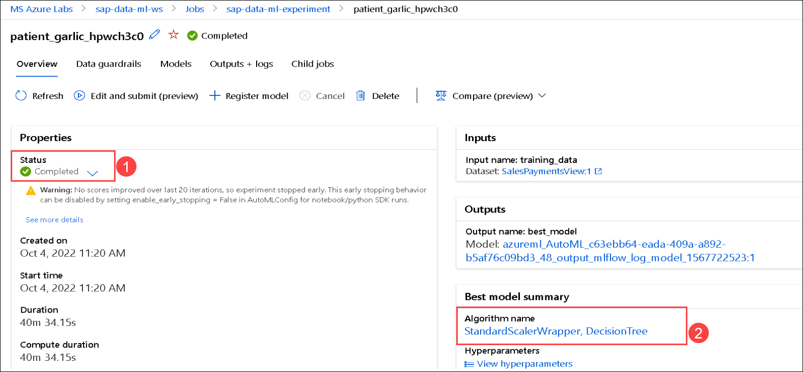
    
2. You can navigate into the different sections and visualize the information about this algorithm. Then on the Model screen, expand the **Deploy** **(1)** item in the toolbar menu and select **Deploy to web service** **(2)**.

   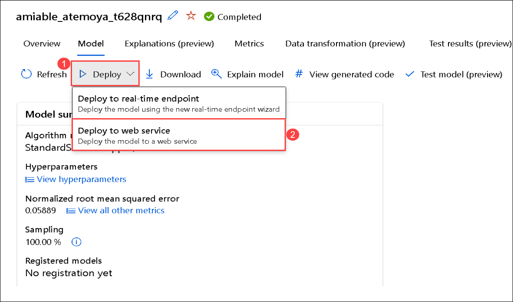
   
3. On Deploy a model blade, enter the below values and then select **Deploy** **(3)**.

    | Field | Value |
    |-------|-------|
    | Name (1) | Enter **sap-data-ml-model** |
    | Compute type (2) | Select **Azure Container Instance** |
    
   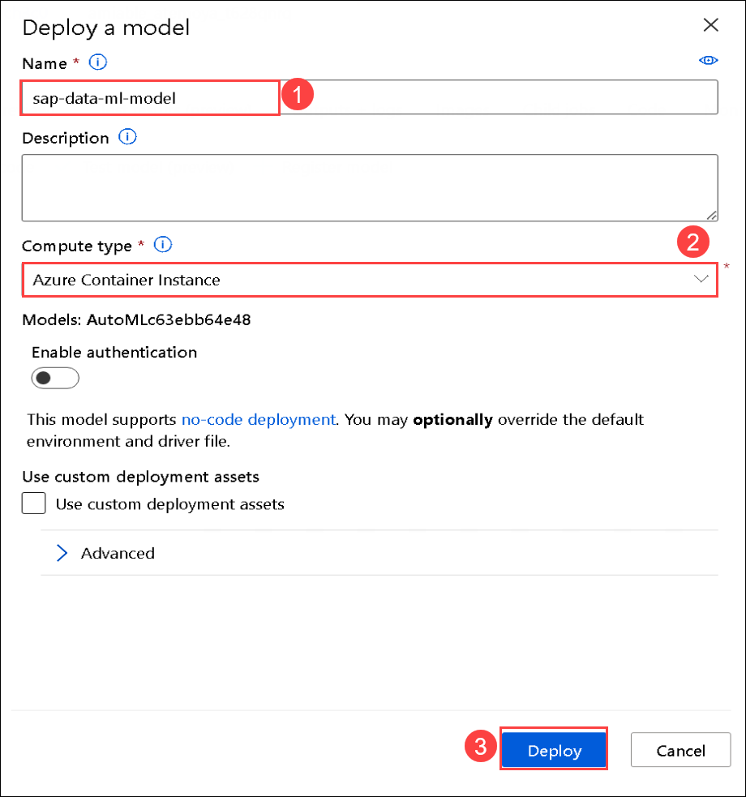
   
4. In the Model screen, monitor the Deploy status at the bottom of the Model summary card. It will indicate a **Completed** status within a few minutes.

   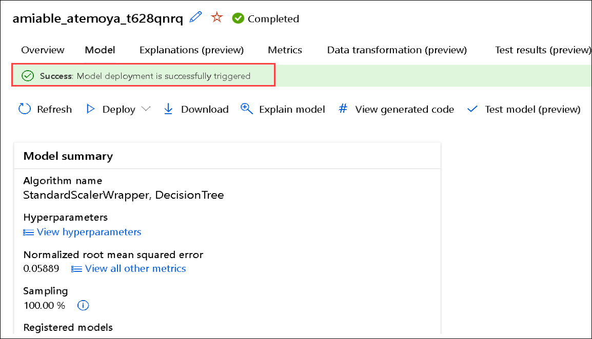
   
### Task 5: Test the Payment Delay/Offset Prediction

1. Navigate to **Endpoints** **(1)** section from left-menu, under **Real-time endpoints** **(2)** select **sap-data-ml-model** **(3)**.

   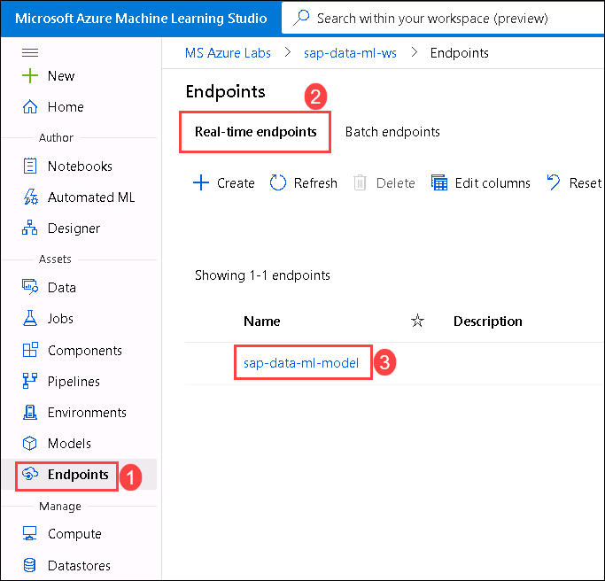
   
2. On the **sap-data-ml-model** endpoint screen, select the **Test** **(1)** tab. Replace the contents of the input data with the below given code **(2)** and select **Test** **(3)**. Verify the **Test result** **(4)**.

   ```json
    {
        "Inputs": {
            "data": [
            { 
                "CUSTOMERNAME": "Westend Cycles",
                "CUSTOMERGROUP": "Z1",
                "BILLINGCOMPANYCODE": 1710,
                "CUSTOMERACCOUNTGROUP": "KUNA",
                "CREDITCONTROLAREA": "A000",
                "DISTRIBUTIONCHANNEL": 10,
                "ORGANIZATIONDIVISION": 0,
                "SALESDISTRICT": "US0003",
                "SALESORGANIZATION": 1710,
                "SDDOCUMENTCATEGORY": "C",
                "CITYNAME": "RALEIGH",
                "POSTALCODE": "27603"
            },
            { 
                "CUSTOMERNAME": "Skymart Corp",
                "CUSTOMERGROUP": "Z2",
                "BILLINGCOMPANYCODE": 1710,
                "CUSTOMERACCOUNTGROUP": "KUNA",
                "CREDITCONTROLAREA": "A000",
                "DISTRIBUTIONCHANNEL": 10,
                "ORGANIZATIONDIVISION": 0,
                "SALESDISTRICT": "US0004",
                "SALESORGANIZATION": 1710,
                "SDDOCUMENTCATEGORY": "C",
                "CITYNAME": "New York",
                "POSTALCODE": "10007"
            }
            ]
        },
        "GlobalParameters": 1.0
   }
   ```
   
   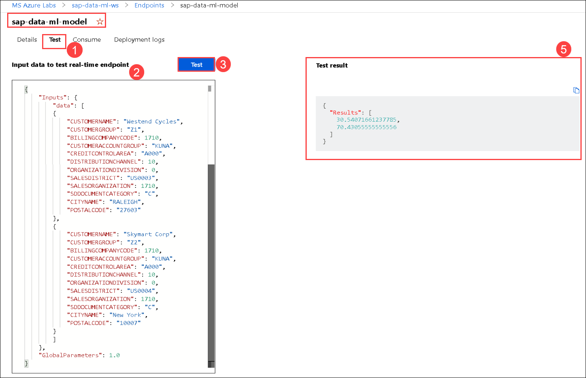
   
  >**Info :**

  - In this exercise, you have used the best model to forecast the Payment delay in days for SalesOrderHeaders data.
  - To forecast the Payments that have been paid for SalesOrderHeaders data, we integrated the SalesOrderHeaders and Payments data and created a new view called **SalesPaymentFull**.
  - As part of the pre-requisite, the SalesPaymentFull View has been already created and published in the Synapse Workspace.

       - To explore on SalesPaymentFull view, navigate to synapse workspace-> click on Data ->click on Workspace- >and select sapdatasynsql SQL database. You will see the created dbo.SalesPaymentsFull view under **Views**.

  - In the above step, you have inserted the values of SalesPaymentsFull to test the best model.
  - Once, the test has been run successfully, you were provided with the values in the Test result box.
  - These values will include the **predicted payment delay in days** for SalesOrderHeaders data.
 
 >**Note :** Make sure to run the **Validations** before moving to next exerise.
 
### Task 6: Automated ML - Best Model Additional Info (Optional)

1. Navigate to **Automated ML** **(1)** section from left-menu, click on the created Automated ML job **(2)**.

   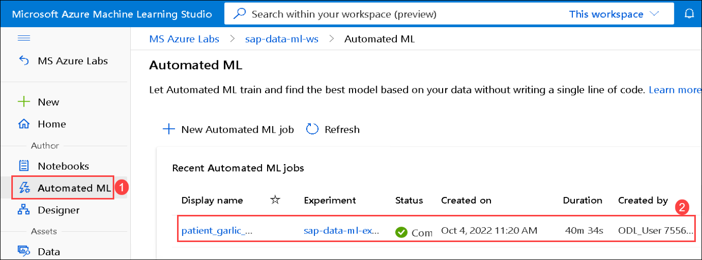
   
2. In the Automated ML job pane, scroll-down to the Best model summary card on the screen and select the hyperlink beneath the **Algorithm name** heading.

   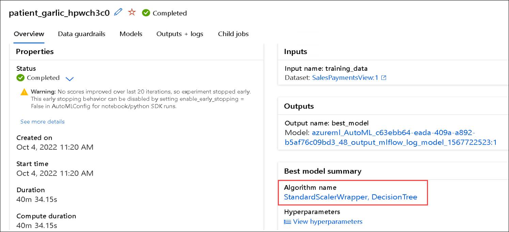
   
3. From the Best Model pane, select **Explanations (preview)** **(1)**. Select an **Explanation ID** **(2)** and click **Aggregate Feature Importance** **(3)**.

   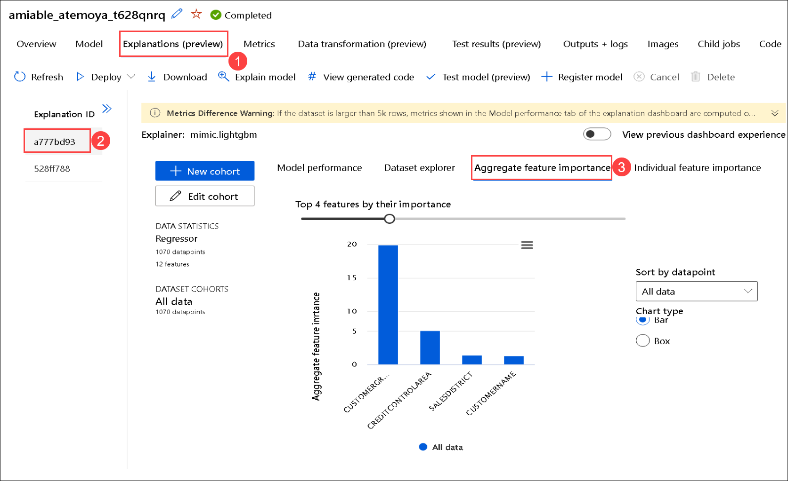
   
   From the above view, you can see that **CUSTOMERGROUP** was the most important feature to determine the offset.
   
## Summary

In this exercise, you have covered the following:

* Created Automated ML Run and deployed best-trained model.
* Tested the best-trained Model and reviewed the results.   
