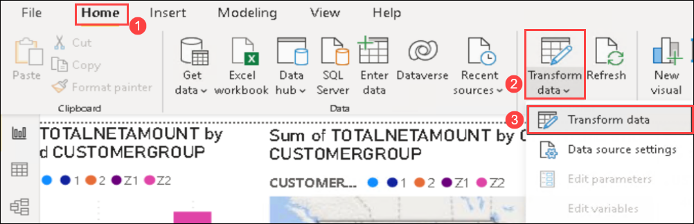
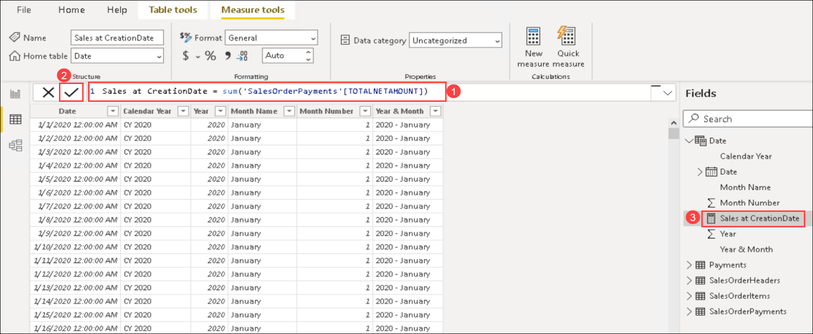
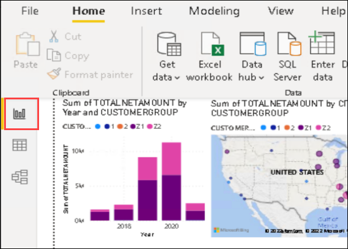
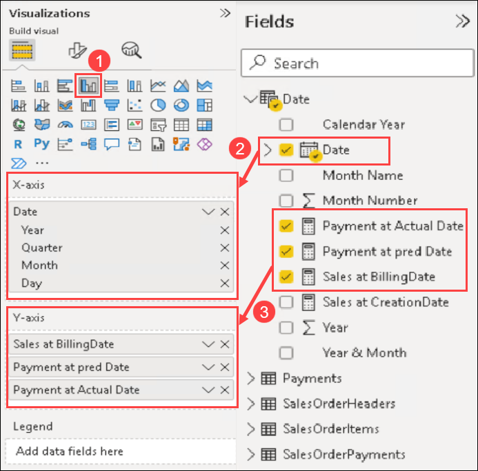
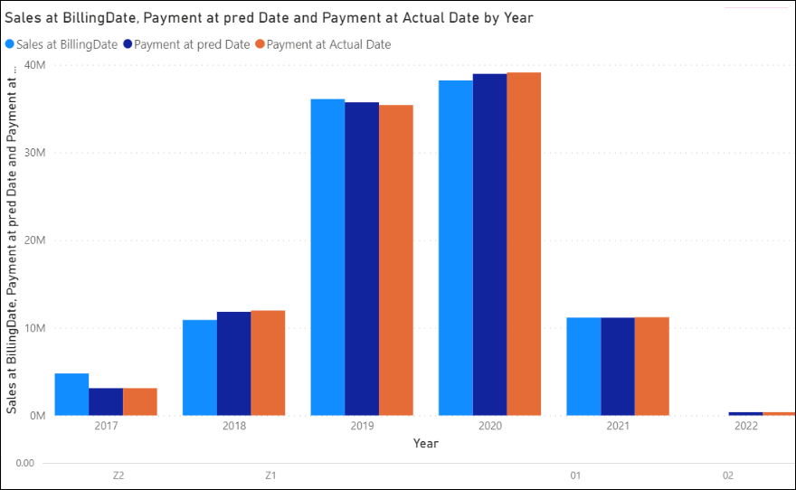

# Exercise 6: Integrate Azure Machine Learning and PowerBI

In this exercise, you will integrate the Azure Machine Learning Model within PowerBI. The Azure Machine Learning exposes a REST interface which you can integrate in PowerBI.

### Task 1: Add Machine Learning info to the PowerBI Datamodel

1. On the Power BI report from **Home** **(1)** tab toolbar menu, expand the **Transform data** **(2)** item. Select **Transform data** **(3)**.

   
   
2. In the Power Query Editor window, select the **SalesOrderPayments** **(1)** table from the Queries pane and select the **Azure Machine Learning** **(2)** item from the Home toolbar menu.

   
   
3. In the Azure Machine Learning Models dialog, select the **AzureML.sap-data-ml-model** **(1)** item and select **OK** **(2)**. This will add an additional column to the table with the predicted offset.

   
   
4. In the Power Query Editor, with the SalesOrderPayments table selected in the Queries pane, scroll all the way to the right of the displayed table. Right-click on the **AzureML.sap-data-ml-model** **(1)** field menu and choose **Rename** **(2)**. Rename the field to **predOffset** **(2)**.

   

5. Right-click the **predOffset** **(1)** column, expand the **Change Type** **(2)** option, and select **Whole Number** **(3)**.

   
   
6. On the Power Query Editor, select the **Add Column** **(1)** tab, select **Custom Column** **(2)**.

   
   
7. In the Custom Column dialog, name the new column **predPaymentDate** **(1)** and set the formula given below **(2)** and select **OK** **(3)**.

    ```vb
    Date.AddDays([BILLINGDOCUMENTDATE], [predOffset])
    ```   
    
   
   
8. Right-click the new **predPaymentDate** **(1)** column and expand the **Change Type** **(2)** option and choose **Date** **(3)**.

   
   
9. Select the **Home** **(1)** tab then **Close & Apply** **(2)**.

   
   
### Task 2: PowerBI Report Creation   

In this Task, you will now display the Sales & predicted payment forecast in PowerBI. Since you want to display the Sales and Payment figures aggregated by different days (BILLINGDOCUMENTDATE, predPaymentDate), you need to create a `calendar` table with the timeslots by which you wish to aggregate.

* Create Date Table

1. In Power BI, select the **Data** item from the left menu.

   
   
2. From the **Table tools** **(1)** menu, select **New table** **(2)**.

   

3. In the **formula textbox** **(1)**, paste the following and select the **checkmark** **(2)** button to execute the formula and create the table.

   ```vb
   Date= 
   VAR MinYear = YEAR ( MIN ( 'SalesOrderPayments'[CREATIONDATE]) )
   VAR MaxYear = YEAR ( MAX ( 'SalesOrderPayments'[predPaymentDate] ) )
   RETURN
   ADDCOLUMNS (
   FILTER (
   CALENDARAUTO( ),
   AND ( YEAR ( [Date] ) >= MinYear, YEAR ( [Date] ) <= MaxYear )
   ),
   "Calendar Year", "CY " & YEAR ( [Date] ),
   "Year", YEAR ( [Date] ),
   "Month Name", FORMAT ( [Date], "mmmm" ),
   "Month Number", MONTH ( [Date] ),
   "Year & Month", YEAR([Date]) & " - " & FORMAT ( [Date], "mmmm" )
   )
   ```
   
   

* Create Relationships

4. From the left menu, select the **Models** **(1)** option. Create relationships between the `Date` table and `SalesOrderPayments` table using drag and drop to the following table.fields **(2)**:

   * Date.Date - SalesOrderPayments.BILLINGDOCUMENTDATE
   * Date.Date - SalesOrderPayments.CREATIONDATE
   * Date.Date - SalesOrderPayments.PaymentDate
   * Date.Date - SalesOrderPayments.predPaymentDate

   
   
* Create new Measures

5. Select the **Data** **(1)** from the left-hand menu once more, and in the Table tools menu select the **New measure** **(2)** button.

   
   
6. In the formula textbox paste the following code **(1)**, then select the **checkmark** **(2)** button to execute the formula and create the measure. Verify the new measure displays in the Fields pane.

   ```vb
   Sales at CreationDate = sum('SalesOrderPayments'[TOTALNETAMOUNT])
   ```   
   
   
   
7. Repeat steps 5 and 6 and create new measures with the following formulas:

    ```vb
    Sales at BillingDate = CALCULATE(sum(SalesOrderPayments[TOTALNETAMOUNT]),USERELATIONSHIP('Date'[Date],SalesOrderPayments[BILLINGDOCUMENTDATE]))
    ```

    ```vb
    Payment at Actual Date = CALCULATE(sum('SalesOrderPayments'[PaymentValue]), USERELATIONSHIP('Date'[Date],SalesOrderPayments[PaymentDate]))
    ```

    ```vb
    Payment at pred Date = CALCULATE(sum('SalesOrderPayments'[PaymentValue]), USERELATIONSHIP('Date'[Date], SalesOrderPayments[predPaymentDate]))
    ```

8. After adding all the four measures, verify it from the Field section under Date table.

   
   
### Task 3: Create Sales and Payment Forecast report     
    
1. From the left menu, select the **Report** item.

   
   
2. In the Visualizations pane, 

   - Select **Clustered Column Chart** **(1)**. 
   - Drag-and-drop the **Date.Date** field to the **X-axis** **(2)** box.
   - Drag-and-drop the **Date.Sales at Billing Date**, **Date.Payment at pred Date**, and **Date.Payment at actual Date** to the **Y-axis** box.
  
   
   
3. In the below picture you can judge how well your `forecasted` payment values are compared to the past actual payment values.

   


## Summary

In this exercise, you have covered the following:

* Integrated the Azure Machine Learning Info to Power BI.
* Created Sales and Payment Forecast report.
