# Exercise 7: Create a workflow to export the PowerBI Sales report and Share it to Teams

## Overview

Power Automate is a tool that helps users create workflows between desired applications to synchronize files, get notifications, and collect data. This intelligent cloud-based solution uses triggers and actions to create chain reactions within a workflow so that repetitive, manual, and time-consuming tasks are accomplished without human intervention.

> You can find complete information about Power Automate here: `https://docs.microsoft.com/en-us/power-automate/`.

### Task 1: Create Instant cloud flow

In this task, you will create instant cloud flow in Power Automate.

1. Open a new browser tab and navigate to the below URL to open the Power Automate Portal.

   ```
   https://flow.microsoft.com/en-us/
   ```
   
1. Now, select the **Sign in** option from the right-top to sign in to the Power Automate Portal.

   
   
1. On the **Welcome to Power Automate** window, choose your **Country/Region** and click on **Get Started** to agree with the terms and conditions.

   

1. Select **My flows** **(1)** from the left hand side menu then click on **+ New flow** **(2)** and select **Instant cloud flow** **(3)** from the drop=down.

   
   
1. In Choose how to trigger this flow pane, click on **Skip**.

   
   
1. Enter the title of the flow as **ExportPBIReport-to-Teams**.

   
   
1. Now, search for **Schedule** **(1)** and select **Recurrence** **(2)** under Triggers.

   
   
1. In the **Recurrence** update the **Interval** **(1)** to `1` and **Frequency** **(2)** to `Hour` then click on **+ New step** **(3)**.

   
   
1. In Choose an operation, search for **Power BI** **(1)** and select **Power BI** **(2)**.

   
   
1. Now, search for **Export** **(1)** and select **Export To File for Power BI Reports** **(2)** under Actions.

   
   
1. In Export To File for Power BI Reports, enter the below given values:

     | Field              | Value                      |
     |------------------- |--------------------------- |
     | Workspace (1)      | **My Workspace**           |
     | Report (2)         | **sap-final-report**       |
     | Export Format (3)  | select `PDF`               |
   
   
     
   
1. Click on **Export To File for Power BI Reports** to minimize and then click on **+ New step**.

   
    
   
1. Open a new browser tab and navigate to the below URL to open the **Encodian Signup** page.

   ```
   https://www.encodian.com/apikey
   ```
   
1. Enter your personal details for the ask as shown below screenshot then click on **Submit** to activate the free trial account.

   
   
1. Once you click on **Submit**, you can see the API Key as shown in the below screenshot. Copy the **API Key** and save it in notepad. You will be using it in the next steps.

    
   
1. Navigate back to the **Microsoft Power Automate** tab, search for **Encodian** **(1)** and then select **Encodian** **(2)** in Choose an operation.

    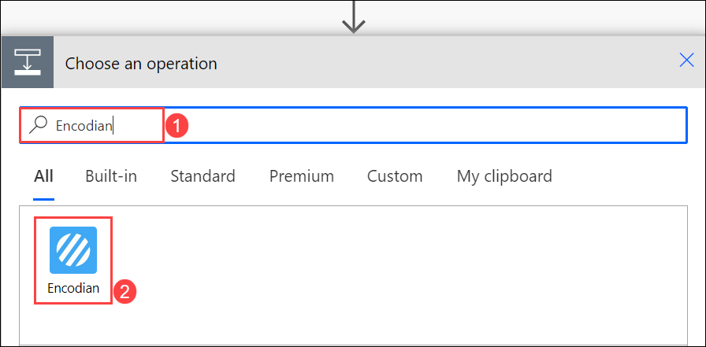
   
1. Now, search for **Convert PDF to Images** **(1)** and select **Convert PDF to Images** **(2)** under Actions.

   
   
1. In Encodian step, enter the Connection name as **SAP-Encodian** **(1)** and paste the **Encodian API Key** **(2)** which you have copied in the earlier steps. Click on **Create** **(3)**.

   
   

1. On **Convert PDF to Images** filed, enter te below instaructions:

    - File Content : Click inside the edit box of **File Content** and select **File Content** from the dynamic content list appears on the right side of the designer.
    
      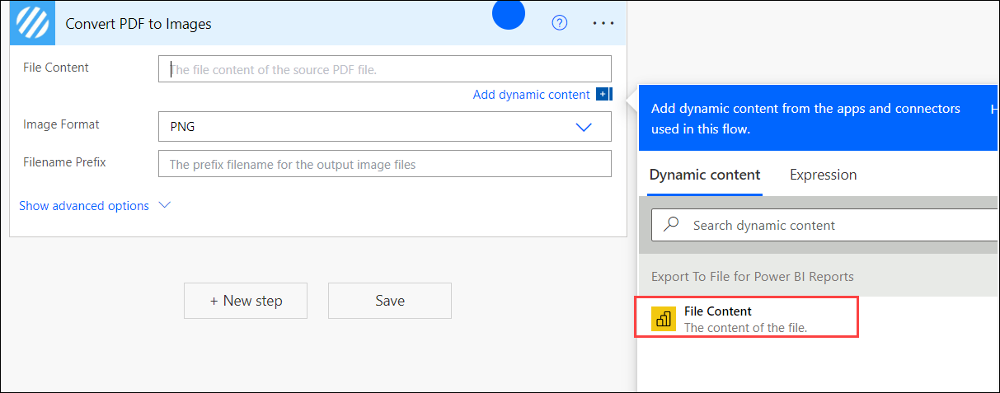
    
    - Image Format : Select **PNG** from drop-down list.
    - Filename Prefix : Enter **Sales data**

     

1. Now click on **New step**.

    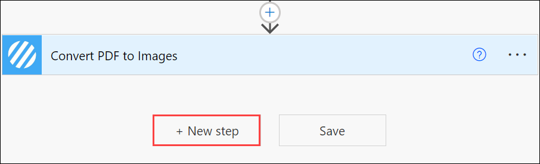
    
1. Serch for **Apply to each (1)** in the search bar and select **Apply to each (2)** from Actions tab.

    

1. Click inside the edit box of **Select an output from the previous step** and seach for **Documents (1)** in the dynamic content list appears on the right side of the designer, then select **Documents (2)**.

    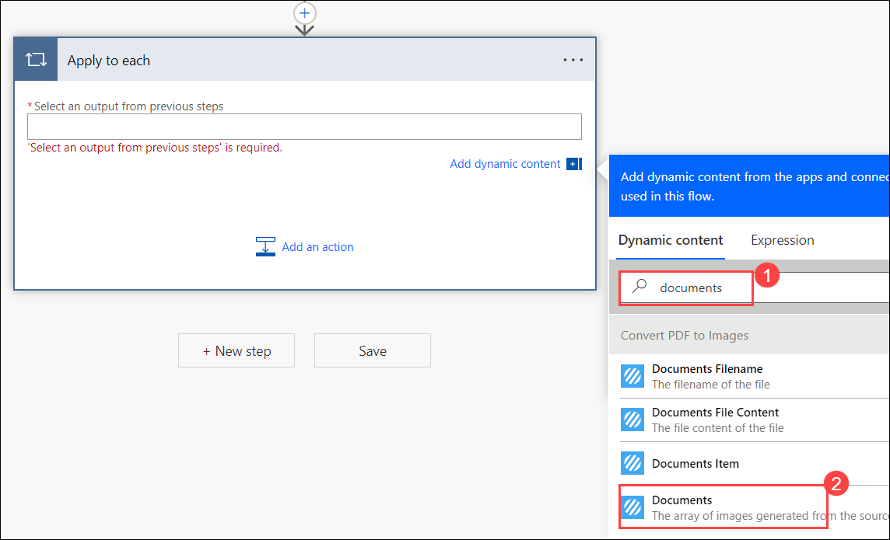
    
1. After selecting the **Documents**, click on **Add an Action**.

    
    
1. Now, serach for **Create file (1)** in search bar and select **Create file (2)** from Actions tab.

    
    
1. Under **Create file** field, follow the below instructions:

     - Folder path : Enter **/Images/Sales Data**
     - File Name : Enter **Sales Data.PNG**
     - File Content :  Select **Documents File Content** from the dynamic content list appears on the right side of the designer.

     
     
 1. Click on **Add an action**

    
    
 1. Search for **Get file thumbnail (1)** and select **Get file thumbnail (2)** from Actions tab.

    
    
 1. Under **Get file thumbnail** field, follow the below instructions :

     - File : Select **Id (1)** from the dynamic content list appears on the right side of the designer.
     - Thumbnail Size : Select **Large (2)** from the drop-down list.
     - Click on **Add an action (3)**.

     
     
1. Now, search for **Start and wait for an Approval (1)** in the search bar and select **Start and wait for an Approval** **(2)** from Actions tab.

     
     
1. Click on **Create** to create a connection for Approval.

    
    
1. On **Start and wait for an approval** field, follow the below instructions:

    - Approval type : Select **Approve/Reject - First to respond (1)** from the drop-down list.
    - Title : Enter **Request to Access PowerBI report (2)**
    - Assigned to : Enter **<inject key="AzureAdUserEmail"></inject> (3)** and select it.
    - Click on **Add an Action (4)**.

    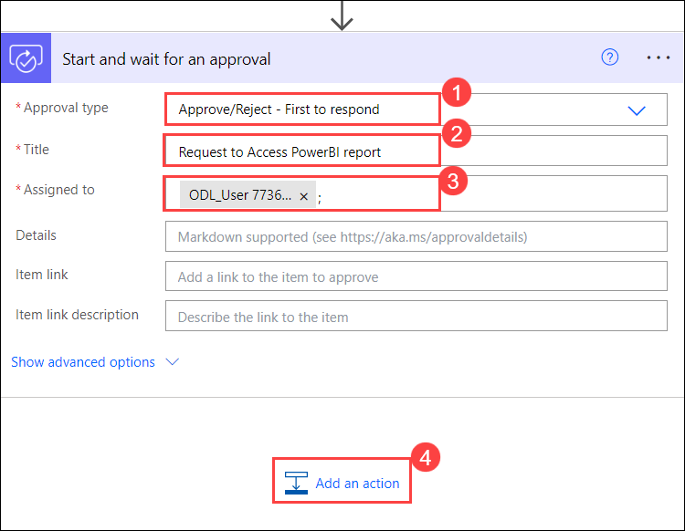
  
1. Serch for **Apply to each (1)** in the search bar and select **Apply to each (2)** from Actions tab.

    
    
1. Click inside the edit box of **Select an output from the previous step** and seach for **Responses (1)** in the dynamic content list appears on the right side of the designer, then select **Responses (2)**.

    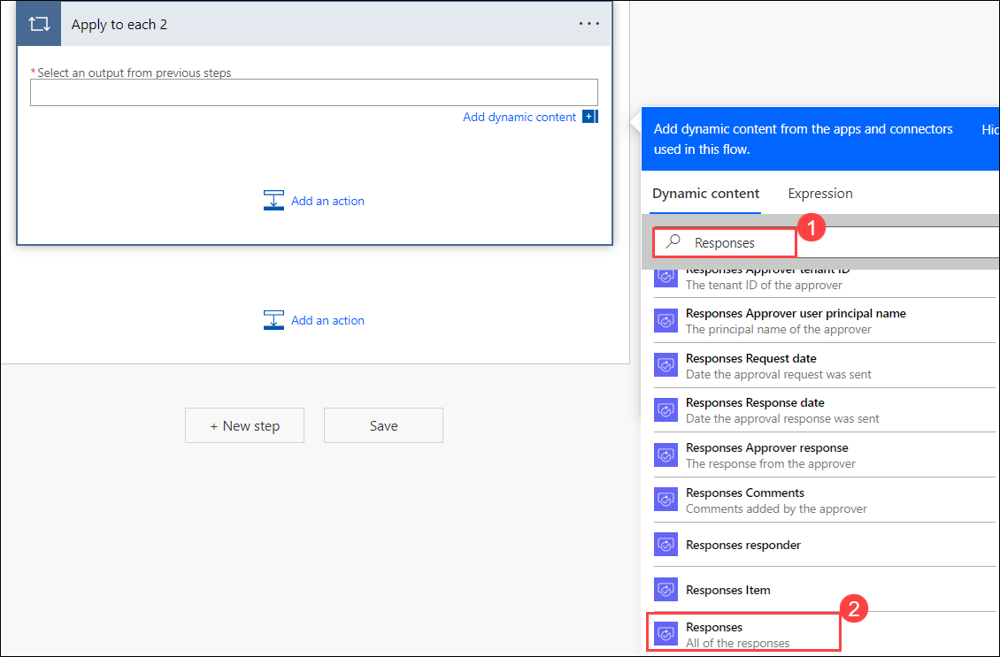
    
1.  Now, click on **Add an action**
    
    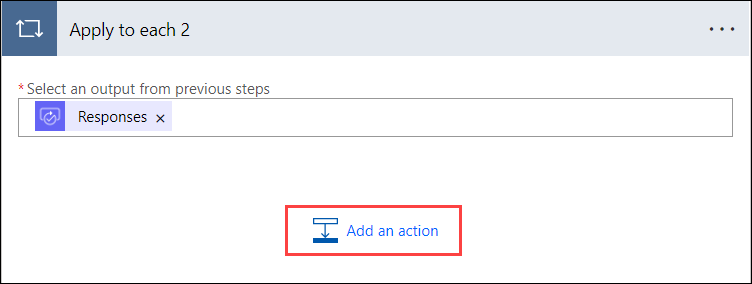

1. Search for **Condition** in the search bar and select **Condition** from Actions tab.

    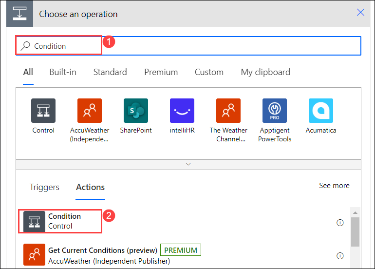
    
1. Under **Condition** filed, follow the below instructions: 

    - Select inside the **Choose a value** box which is at the left side of **is equal to** box and search for **Responses Approver Response** in the dynamic content list appears on the right side of the designer, then select **Responses Approver Response (2)**.

      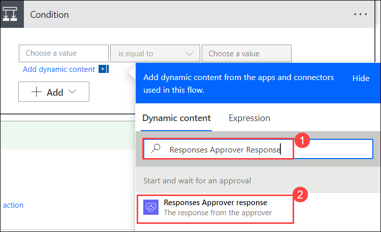
    
    - Select inside the **Choose a value** box which is at the right side of **is equal to** box and enter **Approve**

       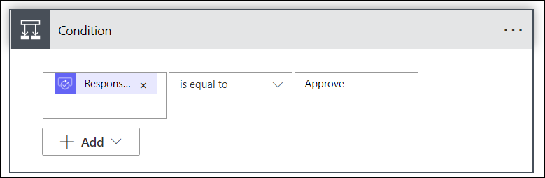
       
1. Select **Add an action** under **If Yes** to add a new action.

    
    
1. Search for **Microsoft Teams (1)**, in the search bar and select **Microsoft Teams (2)**.

    
    
1. Search for **Post a message in chat or channel (1)** in the search bar and select it **(2)** from actions tab.

    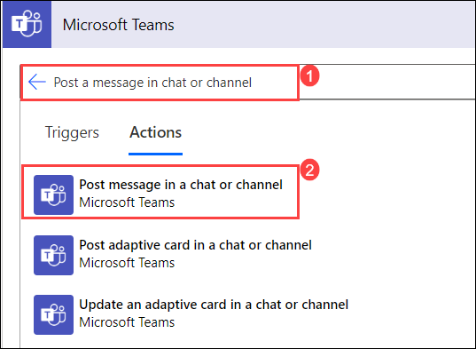
    
1. Under **Microsoft Teams** field, follow the below instructions:

     - Post as : Select **Flow bot** from the drop-down list.
     - Post in : Select **Channel** from the drop-down list.
     - Team : Selct **SAP on Azure-<inject key="DeploymentID" enableCopy="false"/>** from the drop-down list
     - Channel : Select **SAP Channel** from the drop-down list.
     - Message : Click inside the message box and enter the following content.
         
        ```
        <p>
        <i> Sales Order Data </i>
         <br>
        </p>
        ```
        
      > After adding the content, notice that few values are to be replaced in the content with values from the dynamic content list.

1. Remove **Relace with URL** which is next to **img src** and select **URL** from the dynamic content list.

    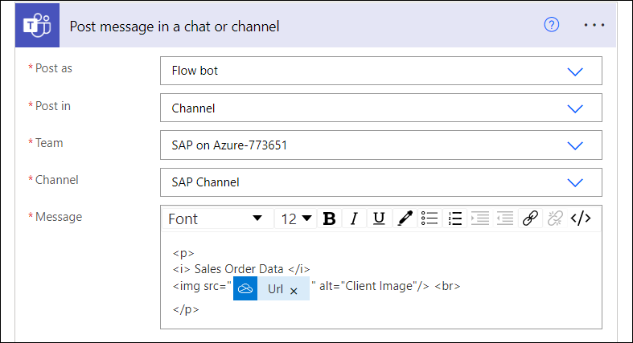
    
1. Select **Save** which is at the top right corner to save the flow.

1. Now, click on **Test** which is at the top right corner to the test the flow manually.

1. On the **Test Flow** page, select **Manually (1)** and click on **Test (2)**

    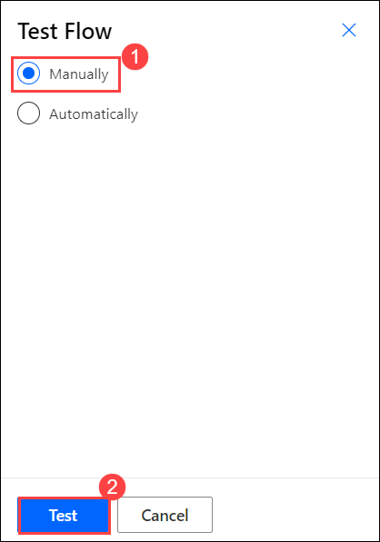

1. Click on **Run flow**.

   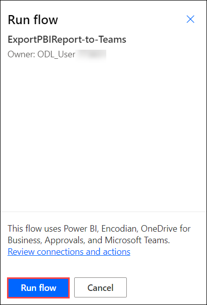

1. After successfully triggering the flow, click on **Done**.

   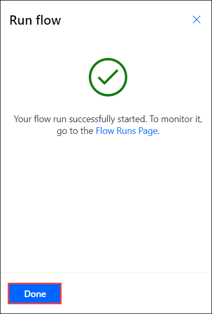
   
1. 
### Task 2: Import the workflow in Power Automate

In this task you will import the workflow into Power Automate and will enable the created conenctions in the previous task to share the Power BI reports to Microsoft Teams.

1. Select **My Flows (1)** from the left-hand side menu, click on **Import (2)** and click on **Import Package(Legacy)** **(3)**.

   
   
1. On the **Import package** blade, click on **Upload** to choose the package file to import.

   
   
1. In the Virtual Machine, navigate to this path **C:\LabFiles** **(1)** and select the **ExportPBIReport-to-Teams_20221014121145.zip** **(2)** file and click on **Open** **(3)** to select the file.

   
   
1. Once the zip file is uploaded, you will be presented with the below page that provides information about the package and its related resources.

   
   
1. Now, select **Update** that is next to **ExportPBI** flow under **Review Package Content** to import the flow.

   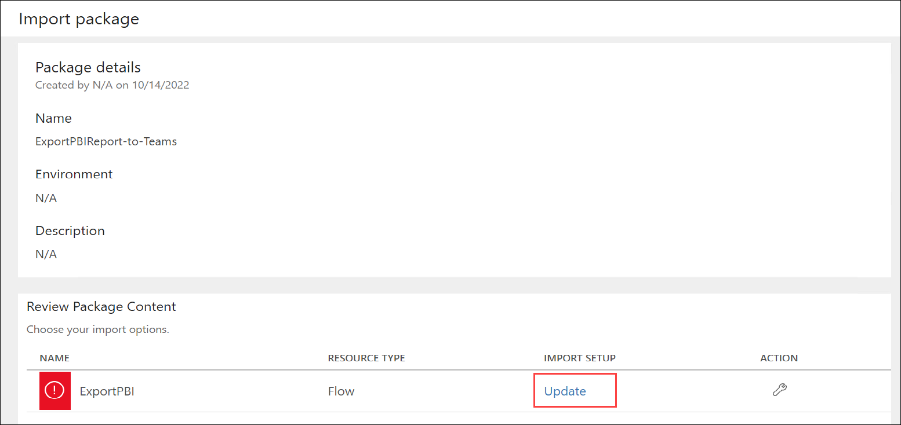
   
1. On the **Import setup** blade, enter the following information.

      1. **Setup**: Select **Create as new (1)** from the dropdown.
      2. **Resource name (2)**: Enter `ExportPBI`
      3. Click on **Save (3)**

   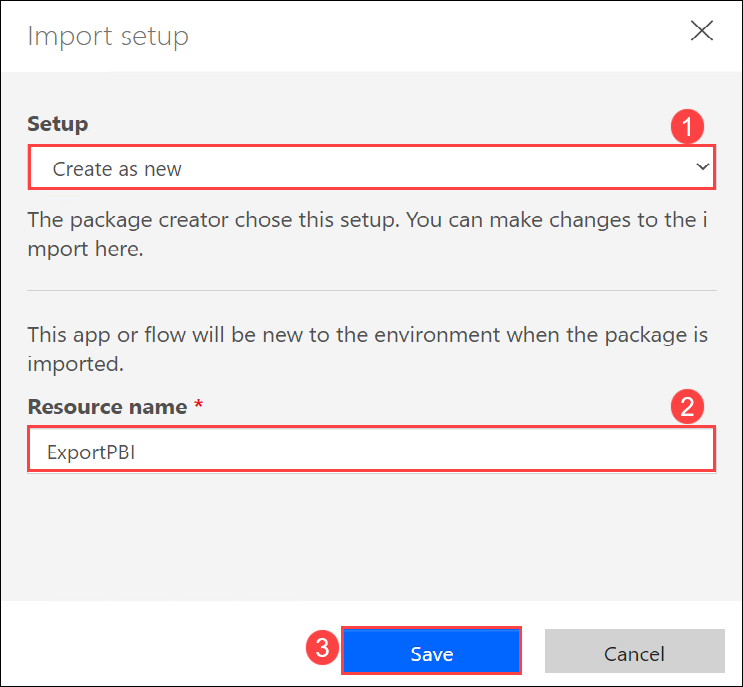
   
1. Then, click on **Select during import** that is next to **<inject key="AzureAdUserEmail"></inject>** under **Related resources** to select the Power BI Connection.

   
   
1. On the **Import setup** blade, select the **Select during import** **(1)** and select the **<inject key="AzureAdUserEmail"></inject>** resource **(2)** and click on **Save** **(3)**.

   

1. Repeat the steps 7 and 8 to select the remaining four connections (**Encodian**, **One Drive for Business**, **Approvals**, and **Microsoft Teams**).
    
1. After providing all the information, your screen will look like the below screenshot. Then click on **Import** to import the workflow.

   
    
1. Once the flow is imported, you will be presented with the below page. Click on **Open flow**.

      
   
1. Notice that workflow is opened in a new browser tab, review all triggers and actions present in the flow.       

    
   
1. Now, expand the **Export To File for Power BI Reports** action, click on **X** that is next to **Report**  to select the PowerBI report that you created in the previous exercise.

   
   
1. Select **SAP-IoT-Data** report from the dropdown for **Report** field.

   
   
1. Expand the **Start and wait for an approval** action that is present under **Apply to each** control, remove the existing email/username present in the **Assigned to** field and enter the below username to send the Approval.

      * Email/Username: <inject key="AzureAdUserEmail"></inject>

      
      
1. Now, expand **Apply to each 2 (1)** action and click on **Condition (2)** action.

    
    
1. Now, expand the **Post message in a chat or channel** action that is present under **Apply to each 2** control, and follow the below mentioned instructions:

  - Click on **X** next to **Team** and select **SAP on Azure-<inject key="DeploymentID" enableCopy="false"/>**
  - Click on **X** next to **Channel** and select **SAP Channel**

    
    
1. Now, click on **Save** to save the flow.

   
   
1. Select **My Flows (1)** from the left-hand side menu and select the **ExportPBI (2)** flow you created in the previous steps.

    
    
1. Select the **ellipsis icon (1)** option and then click on **Turn on (2)** to make the flow available to use.

    
    
1. Now, click on **ExportPBI**.

   
 
1. You can observe the flow has been triggered automatically once the it is turned on. You can find the triggered flow on the **28-day run history** tile.

    
    
1. Select **Approvals** from the left-hand side menu and hover the curser on **Request to Access Power BI report** then click on **:heavy_check_mark:** to approve.

    

1. On **Respond :  Approve** page, click on **Confirm**.

    
    
1. Once you get the notification stating that the **Response successfully recorded**, click on **Done**.

    

1. Now switch back to **My flows (1)** and click on **ExportPBI (2)**.

   
   
1. Review that the run status under **28-day run history** tile has been changed to **Succeeded** state. Open the flow and review it.

   

### Task 3: Review the PowerBI report in teams

In this task, you will review the Power BI report is being sent to Microsoft Teams by Power Automate flow.

1. Launch the **Microsoft Teams** application by clicking on the Microsoft Teams shortcut on the virtual machine desktop.

1. You can use the below credentials to sign in to the Teams account.

   * Email/Username: <inject key="AzureAdUserEmail"></inject>
   * Password: <inject key="AzureAdUserPassword"></inject>

1. On the **Stay Signed in to all your Apps** pop-up, uncheck the **Allow my organization to manage my device** option.

   

1. Now, click on **No, sign in to this app only** to sign in to **Microsoft Teams** application.

   

1. Select **Teams** from the left-hand side menu to view the available teams.

1. Review the messages which are being sent as a part of the Power Automate flow run into the **SAP on Azure-<inject key="DeploymentID" />** teams channel.

   
   

## Summary

In this exercise, you have covered the following:

* Created Connections in Power Automate.
* Imported the workflow in Power Automate.
* Reviewed the PowerBI report in teams
