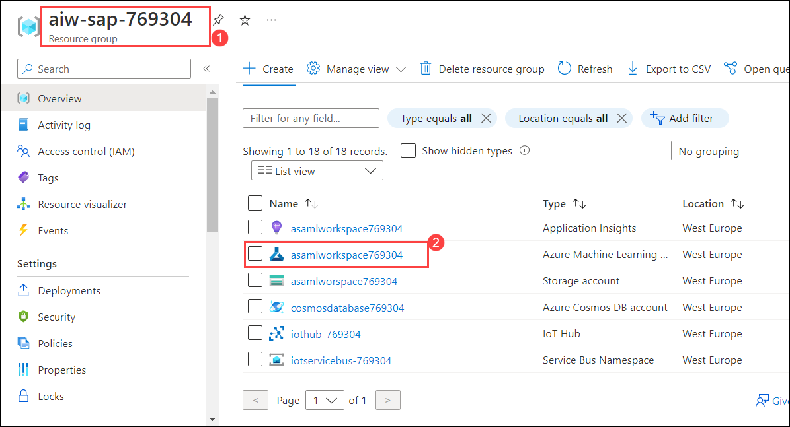
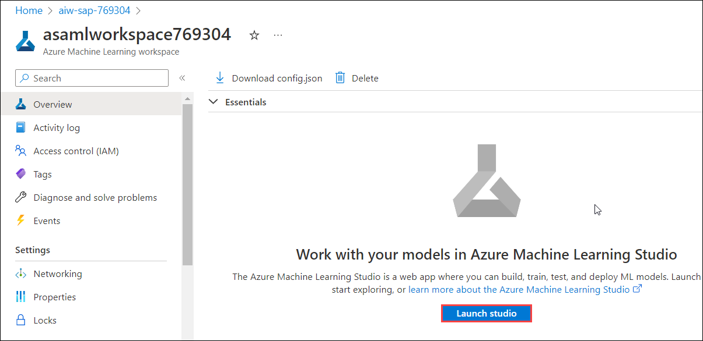
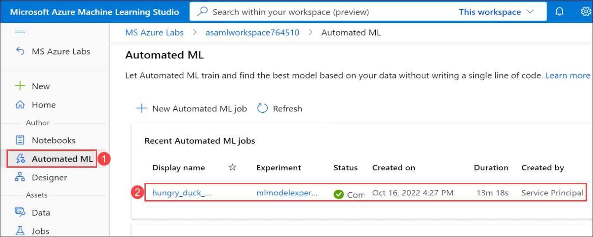
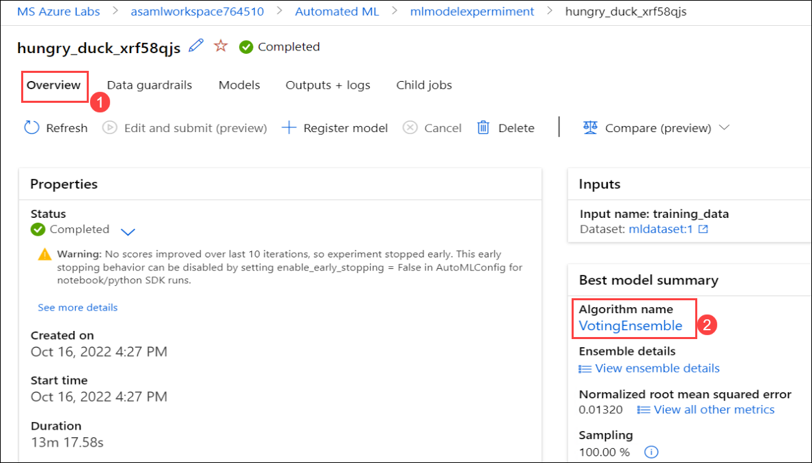
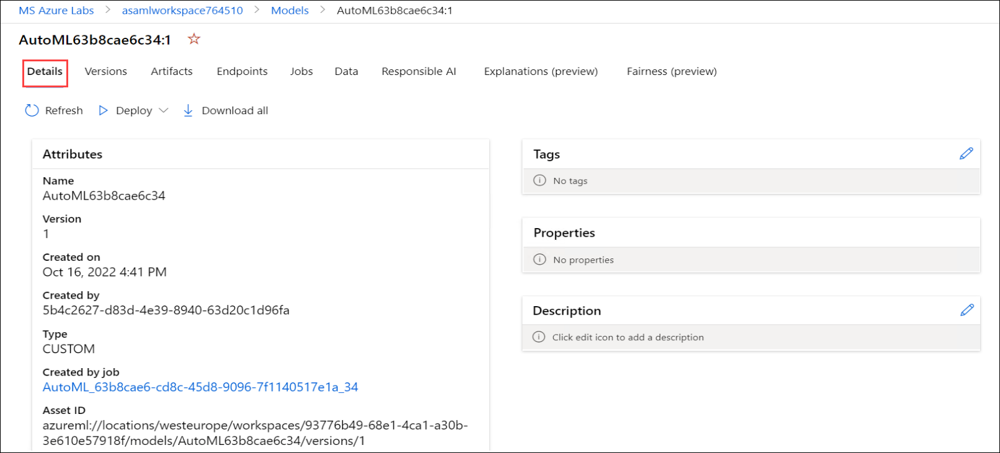
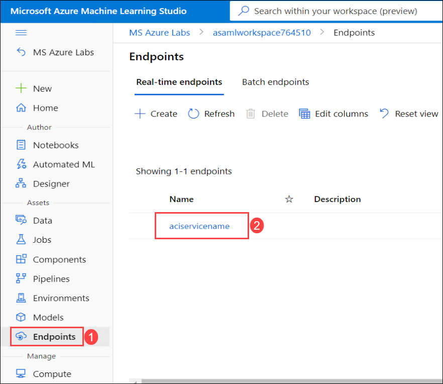

# Exercise 5: Predict Incoming Cashflow

Azure Machine Learning is a cloud service for accelerating and managing the machine learning project lifecycle. Machine learning professionals, data scientists, and engineers can use it in their day-to-day workflows: Train and deploy models, and manage MLOps. To learn more about Azure Machine Learning refer: `https://learn.microsoft.com/en-us/azure/machine-learning/overview-what-is-azure-machine-learning`

In this exercise, you will be reviewing the pre-deployed **Automated ML Run** and **best-trained model** that predicts incoming cash flow based on historical payment delays for previous sales. You will also test the best model using the **SalesPaymentFull** data which is the integrated data of **SalesOrdersHeaders** and **Payments** and also you will review the test end results.

The best model is selected based on the error between the predicted **Payment Offset** and the **Actual offset**. The model with the least error is selected. You can find more refernces about how automated ML works from here: `https://docs.microsoft.com/en-us/azure/machine-learning/concept-automated-ml#how-automated-ml-works`
 
This exercise includes the following tasks:

1. Review the Automated ML Run and best-trained Model
2. Test the Payment Delay/Offset Prediction

### Task 1: Review the Automated ML Run and best-trained model

In this task, you will be reviewing the pre-deployed **Automated ML Run** and **best-trained model** that predicts incoming cash flow based on historical payment delays for previous sales.

1. Navigate to the **aiw-sap-<inject key="DeploymentID" enableCopy="false"/>** resource group in the Azure portal and open the Azure Machine Learning workspace named **asamlworkspace<inject key="DeploymentID" enableCopy="false"/>** from the resources list.

   
   
2. From the **Overview** tab of **asamlworkspace<inject key="DeploymentID" enableCopy="false"/>** Azure Machine Learning workspace, click on **Launch studio**. You will be navigated to Microsoft Azure Machine Learning Studio.

   
   
3. Select **Automated ML** **(1)** from the left menu of AML studio and then click on **Pre-deployed Automated ML job** **(2)** available under recent automated ml jobs.

   
   
4. Review the Automated ML job details such as **Status**, **Inputs**, and **Best Model**. 

   

5. From the **Best model summary** card on the **Overview** **(1)** tab, select the hyperlink beneath the **Algorithm name** **(2)** which will take you to the model details blade.
  
   
   
6. From the **Model** **(1)** tab, select the hyperlink beneath the **Registered models** **(2)** under Model summary to review the best-trained model.

   
   
7. Now, you can review the best-trained model details from the **Details** tab.

     

### Task 2: Test the Payment Delay/Offset Prediction

In this task, you will test the best trained model and review the results.

1. Navigate to **Endpoints** **(1)** section from left-menu, select **aciservicename** **(2)** under **Real-time endpoints**.

   
   
2. On the **aciservicename** endpoint screen, select the **Test** **(1)** tab. Select the editor type as **JSON editor** **(2)**. Replace the contents of the input data with the below-given code **(3)** and select **Test** **(4)**. Verify the **Test result** **(5)**.

   >**Info :**  
   - Here, you will be using the SalesPaymentFull data for testing the best model.
   - SalesPayementFull is the combined data of SalesOrdersHeaders and Payments data.
   - SalesPayementFull table is created and published in the Synapse Workspace as a part of pre-requisits.
   
    ```json
    {
       "data": [
       {
            "SALESDOCUMENT":"110",
            "CUSTOMERNAME": "Westend Cycles",
            "CUSTOMERGROUP": "Z1",
            "BILLINGCOMPANYCODE": 1710,
            "BILLINGDOCUMENTDATE":"2017-10-10T00:00:00.0000000",
            "PAYMENTDATE":"2017-11-11T00:00:00.0000000",
            "CUSTOMERACCOUNTGROUP": "KUNA",
            "CREDITCONTROLAREA": "A000",
            "DISTRIBUTIONCHANNEL": 10,
            "ORGANIZATIONDIVISION": 0,
            "SALESDISTRICT": "US0003",
            "SALESGROUP": 0,
            "SALESOFFICE" : 0,
            "SALESORGANIZATION": 1710,
            "SDDOCUMENTCATEGORY": "C",
            "CITYNAME": "RALEIGH",
            "POSTALCODE": "27603"
       },
       {
            "SALESDOCUMENT":"1088",
            "CUSTOMERNAME": "Skymart Corp",
            "CUSTOMERGROUP": "Z2",
            "BILLINGCOMPANYCODE": 1710,
            "BILLINGDOCUMENTDATE":"2019-03-01T00:00:00.0000000",
            "PAYMENTDATE":"2019-05-12T00:00:00.0000000",
            "CUSTOMERACCOUNTGROUP": "KUNA",
            "CREDITCONTROLAREA": "A000",
            "DISTRIBUTIONCHANNEL": 10,
            "ORGANIZATIONDIVISION": 0,
            "SALESDISTRICT": "US0004",
            "SALESGROUP": 0,
            "SALESOFFICE" : 0,
            "SALESORGANIZATION": 1710,
            "SDDOCUMENTCATEGORY": "C",
            "CITYNAME": "New York",
            "POSTALCODE": "10007"
        }
      ]
   }
   ```
   
   

  >**Info : **

  - In this exercise, you have used the best model to forecast the Payment delay in days for SalesOrderHeaders data.
  - To forecast the Payments that have been paid for SalesOrderHeaders data, we integrated the SalesOrderHeaders and Payments data and created a new view called **SalesPaymentFull**.
  - As part of the pre-requisite, the SalesPaymentFull View has been already created and published in the Synapse Workspace.

       - To explore on SalesPaymentFull view, navigate to synapse workspace-> click on Data ->click on Workspace- >and select sapdatasynsql SQL database. You will see the created dbo.SalesPaymentsFull view under **Views**.

  - In the above step, you have inserted the values of SalesPaymentsFull to test the best model.
  - Once, the test has been run successfully, you were provided with the values in the Test result box.
  - These values will include the **predicted payment delay in days** for SalesOrderHeaders data.


## Summary

In this exercise, you have covered the following:

* Reviewed the Automated ML Run and best-trained model.
* Tested the best-trained Model and reviewed the results.
