# Exercise 6: Import a workflow to export the PowerBI Sales report and Share it with Teams

## Overview

Power Automate is a tool that helps users create workflows between desired applications to synchronize files, get notifications, and collect data. This intelligent cloud-based solution uses triggers and actions to create chain reactions within a workflow so that repetitive, manual, and time-consuming tasks are accomplished without human intervention.

> You can find complete information about Power Automate here: `https://docs.microsoft.com/en-us/power-automate/`.

In this exercise, you will establish connections for Power BI, One Drive for Business, Approvals, Microsoft Teams, and Encodian in Power Automate. You will also import and trigger a flow to export the Power BI report and share it with Teams. The workflow execution is described below.

  * Whenever you trigger the flow manually, the flow will export the report from **Power BI Workspace** to PDF format.
  * Now, the flow will convert the Power BI report from PDF to PNG format.
  * In the next step, it will send an approval request to **Approver** to share the Power BI report with Teams.
  * You can either approve or reject the request to share Power BI reports with Teams.
     - If you **Approve** the request, the condition you have added to the flow will be true and the Power BI report will be shared with Microsoft Teams.
     - If you **Reject** the request, the condition will not be met and the report will not be added to the Teams.
  

### Task 1: Create Connections in Power Automate

Power Automate uses connections to make it easy for you to access your data while building flows. Power Automate includes commonly used connections, including SharePoint, SQL Server, Power BI, Microsoft 365, OneDrive for Business, Approvals, Encodian, Salesforce, Excel, Teams, Dropbox, Twitter, and more.

In this task, you will create connections in Power Automate and use them in the next task while building workflow.

1. Open a new browser tab and navigate to the below URL to open the Power Automate Portal.

   ```
   https://flow.microsoft.com/en-us/
   ```
   
1. Now, select the **Sign in** option from the right-top to sign in to the Power Automate Portal.

   
   
1. On the **Welcome to Power Automate** window, choose your **Country/Region** and click on **Get Started** to agree with the terms and conditions.

   

1. Select **More** from the left-hand side menu and click on **Connections**.

    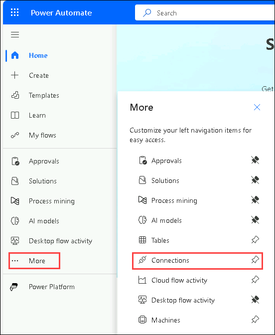

1. You will be presented with the Connections page, click on **+New connection** to create a connection.

   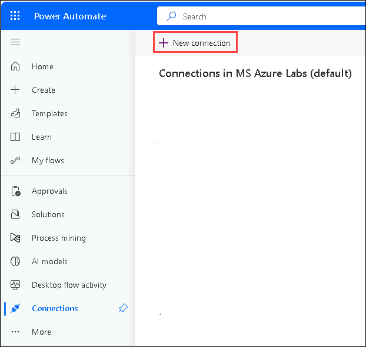

1. Now, type **Power BI** **(1)** in the search bar available at the top right corner and select **Power BI** **(2)**.

   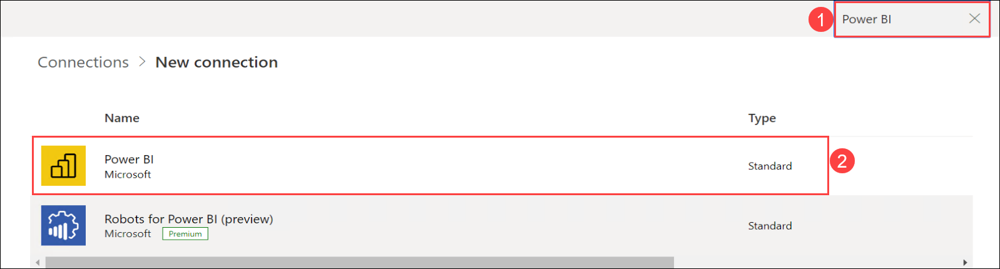

1. On the **Power BI** pop-up, click on **Create** and use the below credentials to complete the **Sign-in** process and create the connection.

      * Email/Username: <inject key="AzureAdUserEmail"></inject>
      * Password: <inject key="AzureAdUserPassword"></inject>

   

1. Open a new browser tab and navigate to the below URL to sign in to OneDrive.

   ```
   https://onedrive.live.com/about/en-ca/signin/
   ```
   
   >**Info:** To establish the connection for OneDrive in Power Automate, you need to sign in to OneDrive to avoid the authorization failure error(s). 
   
1.  Complete the **Sign-in** process using the below credentials.

      * Email/Username: <inject key="AzureAdUserEmail"></inject>
      * Password: <inject key="AzureAdUserPassword"></inject>

1. Wait until OneDrive set up is complete and close the browser tab by clicking on **X**.

1. Now, navigate back to the browser tab in which **Power Automate** is open and repeat the steps from **5 to 7** to add the following **connections**:

   - OneDrive for business
   - Approvals
   - Microsoft Teams

1. Open a new browser tab and navigate to the below URL to open the **Encodian Signup** page.

   ```
   https://www.encodian.com/apikey
   ```
   
   > **Info:** Since the size of the PDF report is larger than expected for sharing through Power Automate flow, you are using Encodian connector to convert the Power BI report from PDF to PNG format in this scenario.
   
1. Enter your personal details for the ask as shown below screenshot then click on **Submit** to activate the free trial account.

   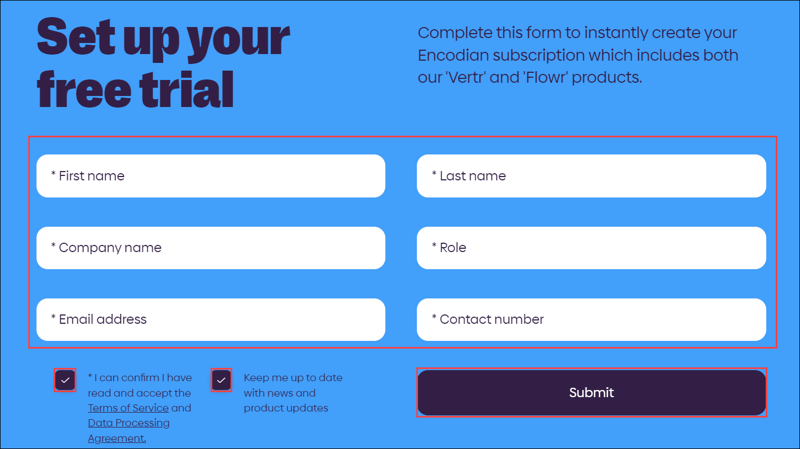
   
1. Once you click on **Submit**, you can see the API Key as shown in the below screenshot. Copy the **API Key** and save it for creating an Encodian connection.

   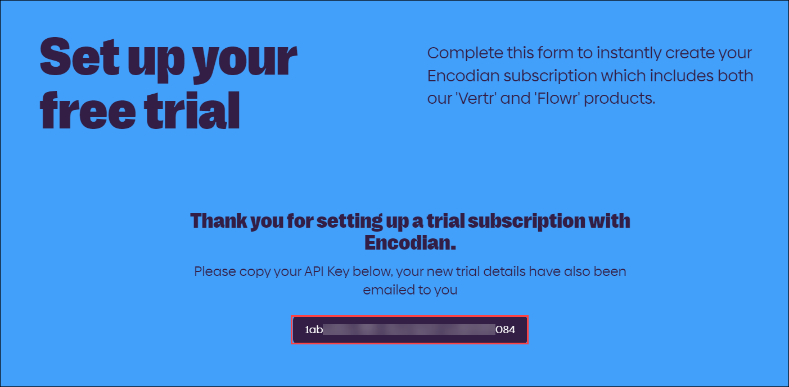
   
1. Navigate back to the **Microsoft Power Automate** tab and click on **+ New connection** to create a connection.

   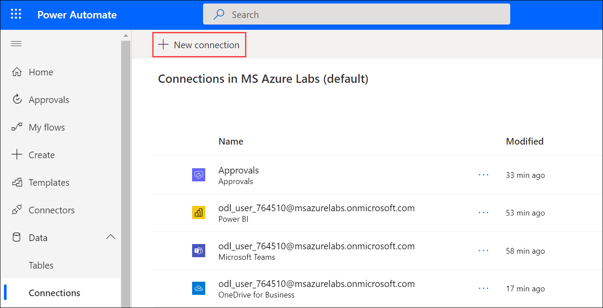
   
1. Now, type **Encodian** **(1)** in the search bar available at the top right corner and select **Encodian** **(2)**.

   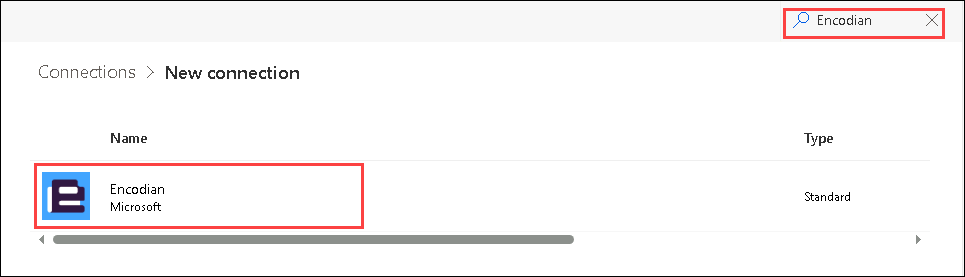

1. On the **Encodian** pop-up, enter the **API Key** that you have copied in the previous steps, and then click on **Create**.

   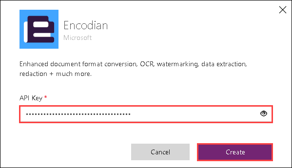
   
1. Verify all the five connections which you have added as shown in the below screenshot.

   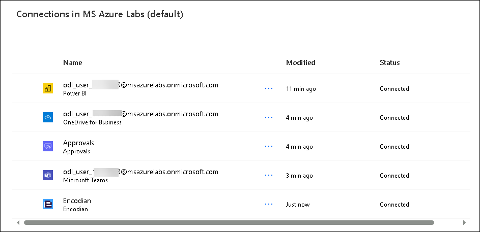 
   
### Task 2: Import the workflow in Power Automate

In this task, you will import the workflow into Power Automate and will enable the created connections in the previous task to share the Power BI reports to Microsoft Teams.

1. Select **My Flows (1)** from the left-hand side menu, click on **Import (2)** and click on **Import Package(Legacy)** **(3)**.

   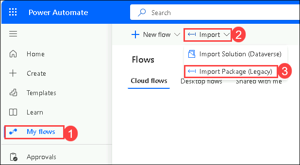
   
1. On the **Import package** blade, click on **Upload** to choose the package file to import.

   
   
1. In the Virtual Machine, navigate to this path **C:\LabFiles** **(1)** and select the **ExportPBIReport-to-Teams_20221014121145.zip** **(2)** file and click on **Open** **(3)** to select the file.

   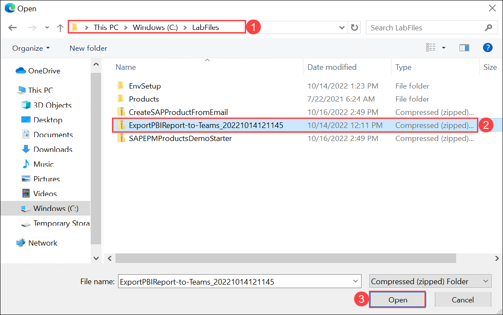
   
1. Once the zip file is uploaded, you will be presented with the below page that provides information about the package and its related resources.

   
   
1. Now, select **Update** that is next to **ExportPBI** flow under **Review Package Content** to import the flow.

   
   
1. On the **Import setup** blade, enter the following information.

      1. **Setup**: Select **Create as new (1)** from the dropdown.
      2. **Resource name (2)**: Enter `ExportPBI`
      3. Click on **Save (3)**

   
   
1. Then, click on **Select during import** that is next to **<inject key="AzureAdUserEmail"></inject>** under **Related resources** to select the Power BI Connection.

   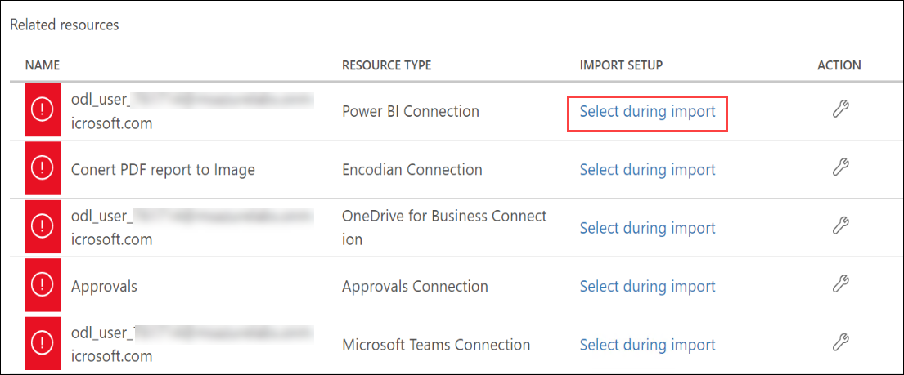
   
1. On the **Import setup** blade, select the **Select during import** **(1)** and select the **<inject key="AzureAdUserEmail"></inject>** resource **(2)** and click on **Save** **(3)**.

   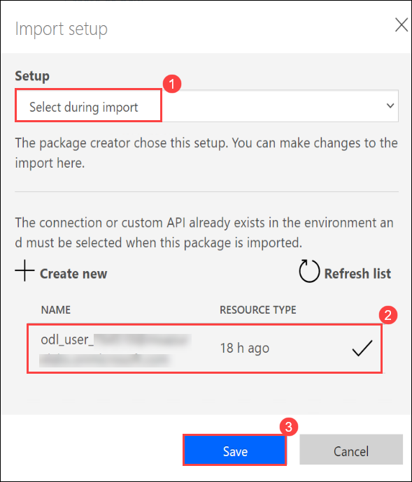

1. Repeat steps 7 and 8 to select the remaining four connections (**Encodian**, **One Drive for Business**, **Approvals**, and **Microsoft Teams**).
    
1. After providing all the information, your screen will look like the below screenshot. Then click on **Import** to import the workflow.

   
    
1. Once the flow is imported, you will be presented with the below page. Click on **Open flow**.

   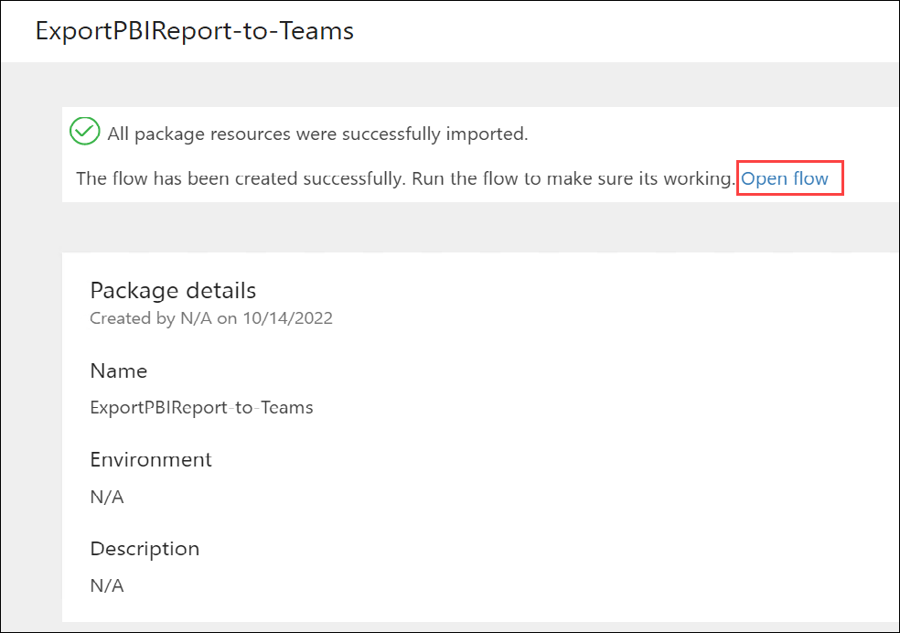   
   
1. Notice that workflow is opened in a new browser tab, review all triggers and actions present in the flow.       

   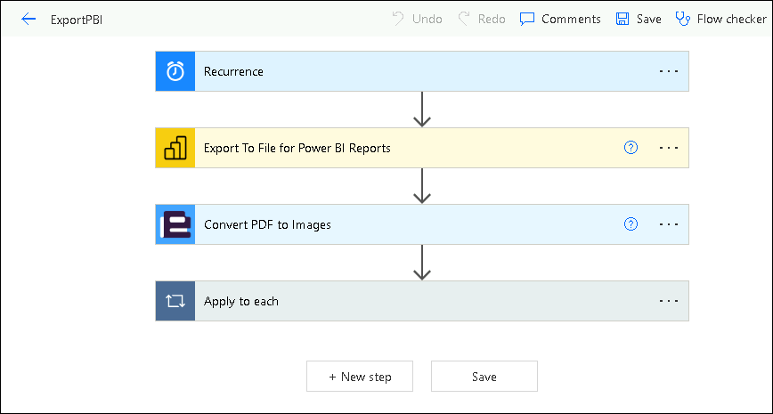
   
1. Now, expand the **Export To File for Power BI Reports** action, and click on **X** that is next to **Report**  to select the PowerBI report that you created in the previous exercise.

   
   
1. Select the **SAP-IoT-Data** report from the dropdown for the **Report** field.

   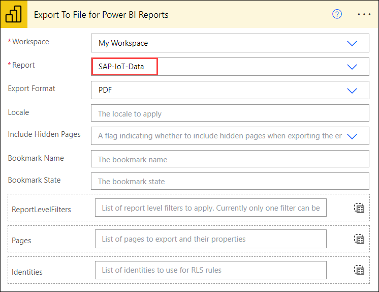
   
1. Expand the **Start and wait for an approval** action that is present under **Apply to each** control, remove the existing email/username present in the **Assigned to** field and enter the below username to send the Approval.

      * Email/Username: <inject key="AzureAdUserEmail"></inject>

     
      
1. Now, expand **Apply to each 2 (1)** action and click on **Condition (2)** action.

   
    
1. Now, expand the **Post message in a chat or channel** action that is present under **Apply to each 2** control, and follow the below-mentioned instructions:

    * Click on **X** next to **Team** and select **SAP on Azure-<inject key="DeploymentID" enableCopy="false"/>**

      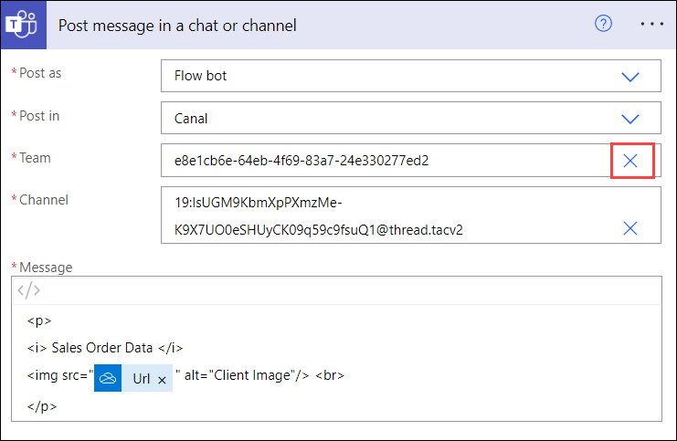
      
      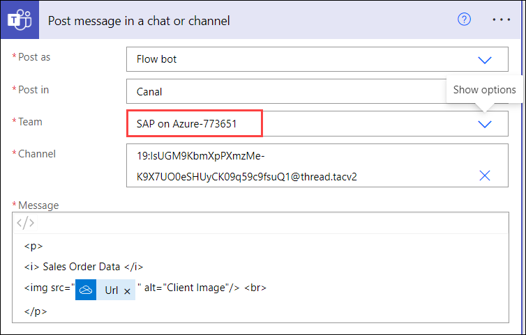
      
    * Click on **X** next to **Channel** and select **SAP Channel**

      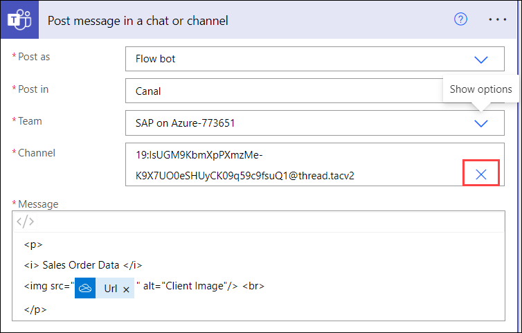
      
      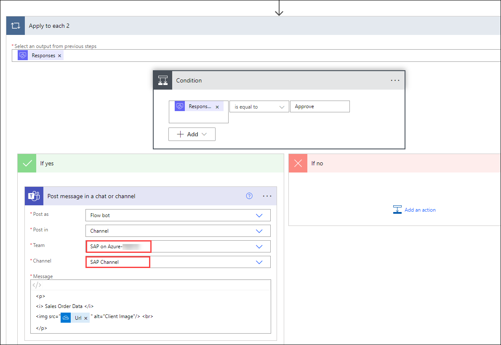
    
1. Now, click on **Save** to save the flow.

   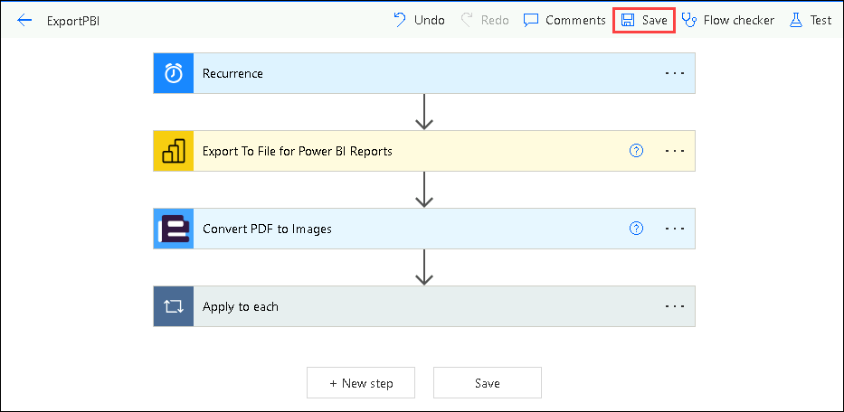
   
1. Select **My Flows (1)** from the left-hand side menu and select the **ExportPBI (2)** flow you created in the previous steps.

   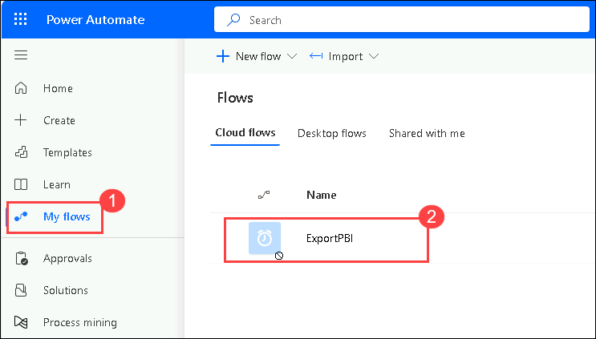
    
1. Select the **ellipsis icon (1)** option and then click on **Turn on (2)** to make the flow available to use.

   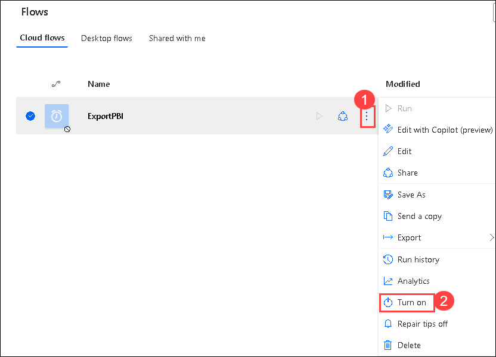
    
1. Now, click on **ExportPBI**.

   
 
1. You can observe the flow has been triggered automatically once it is turned on. You can find the triggered flow on the **28-day run history** tile.

   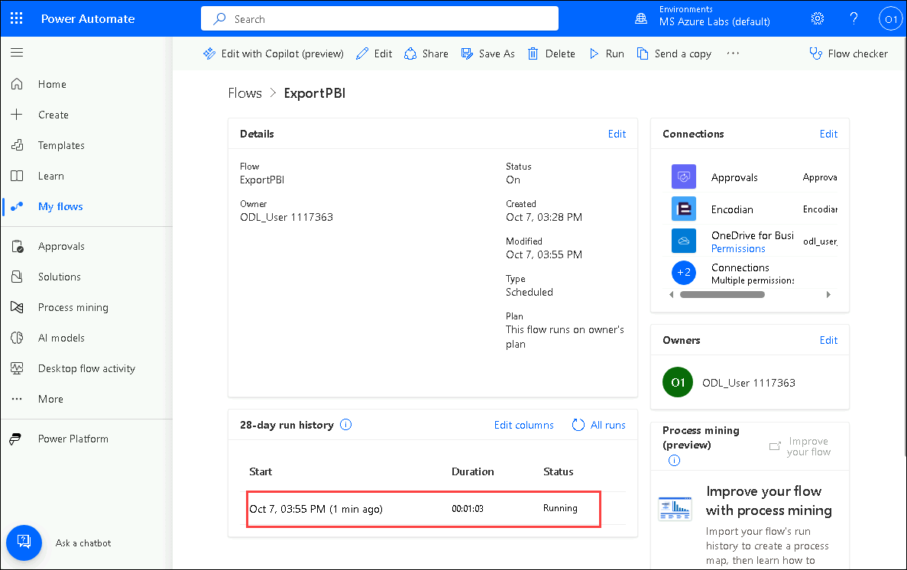
    
1. Select **Approvals** from the left-hand side menu and hover the cursor on **Request to Access Power BI report** then click on **&#9745;** to approve.

   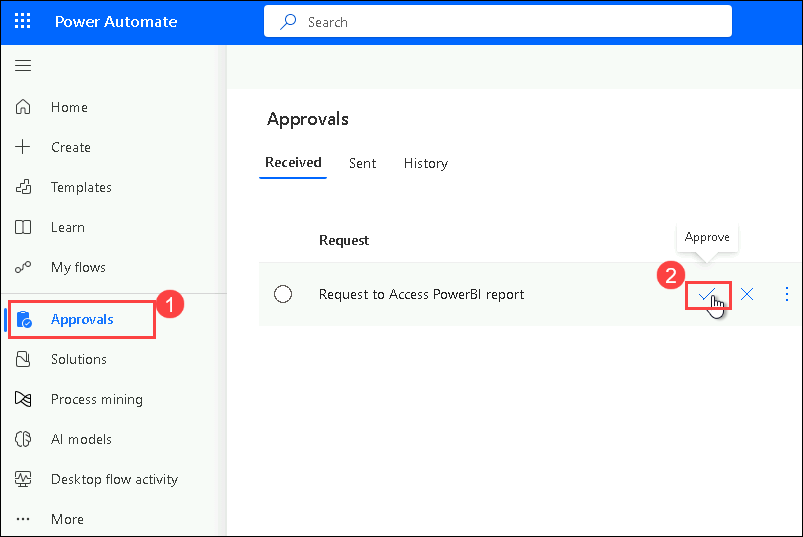

   >**Note:** Refresh the page, if you don't receive the Approval request.
  
1. On the **Respond:  Approve** page, click on **Confirm**.

   
    
1. Once you get the notification stating that the **Response successfully recorded**, click on **Done**.

   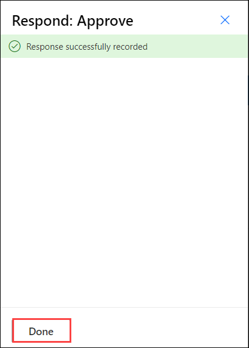

1. Now switch back to **My flows (1)** and click on **ExportPBI (2)**.

   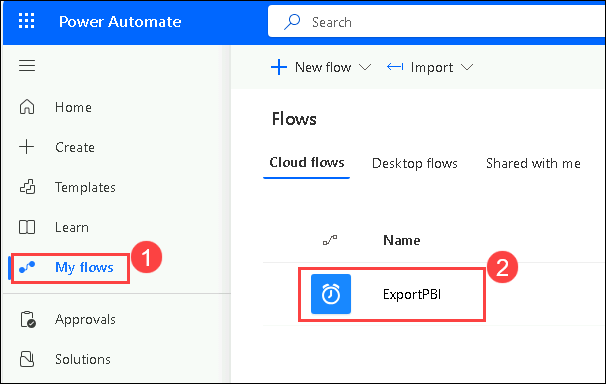
   
1. Review that the run status under the **28-day run history** tile has been changed to the **Succeeded** state. Open the flow and review it.

   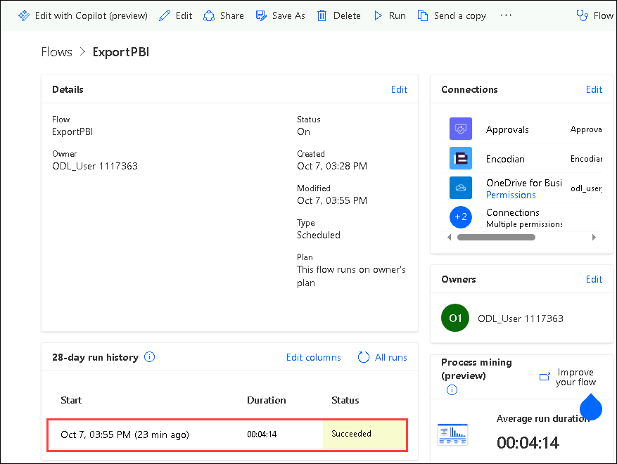

### Task 3: Review the PowerBI report in teams

In this task, you will review the Power BI report that is being sent to Microsoft Teams by Power Automate flow.

1. Launch the **Microsoft Teams** application by clicking on the Microsoft Teams shortcut on the virtual machine desktop and click on **Get Started**.

1. You can use the below credentials to sign in to the Teams account.

   * Email/Username: <inject key="AzureAdUserEmail"></inject>
   * Password: <inject key="AzureAdUserPassword"></inject>

1. On the **Stay Signed in to all your Apps** pop-up, uncheck the **Allow my organization to manage my device** option.

   

1. Now, click on **No, sign in to this app only** to sign in to the **Microsoft Teams** application.

   

1. Select **Teams** from the left-hand side menu to view the available teams.

1. Review the messages which are being sent as a part of the Power Automate flow run into the **SAP on Azure-<inject key="DeploymentID" />** teams channel.

   
   

## Summary

In this exercise, you have covered the following:

* Created Connections in Power Automate.
* Imported the workflow in Power Automate.
* Reviewed the PowerBI report in teams
